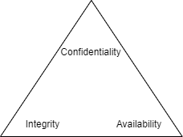

= Information Security Triad: Confidentiality, Integrity, and Availability

Author: Dr. Jim Marquardson

Changelog

* 2022-04-12 Initial Version
* 2022-04-15 Additional cases added

The information security triad is composed of *confidentiality*, *integrity*, and *availability*. Virtually any topic in cybersecurity will apply to one or more of the elements in the information security triad. It can be useful to think about a given topic and decide whether it refers to confidentity, integrity, and/or availability.

== Learning Objectivies

You should be able to:

* List the elements of the information security triad
* Discuss how confidentiality is supported by access controls and encryption
* Discuss how integrity is supported by access controls and hashing
* Discuss how availability is supported by several methods, including redundancy
* Evaluate a scenario and determine if confidentiality, integrity, and/or availability have been harmed

== Confidentiality

Confidentiality is all about protecting sensitive data. Access to some data should be restricted. For example, medical records should be kept private. Financial and education information is also protected. There can be serious legal consequences for failing to protect sensitive information.

Confidentiality is enforced through two primary measures: 1) *access controls*, and 2) *encryption*. Differentiated access to systems can be granted to users. For example, you can login to your bank, but you can only view your account information. A call center employee might have authority to view the accounts of all bank customers. Audits may be performed periodically to ensure that call center employees only access customer data in response to a customer concern, not merely about of curiousity.

With encryption, data is protected using secret keys. Only people with the right keys can read the data. Data can be protected on your device (e.g.; a hard drive or smart card), in transit (i.e.; going over the internet), or while the data is in use (i.e.; in your computer's memory). Encryption is not the ultimate solution to data confidentiality. At some point, the data must be decrypted, so encryption must be employed along with access controls to protect confidentiality.

== Integrity

In the context of cybersecurity, data integrity is maintained when information is only modified by people who are authorized. Imagine you have a Twitter account. You want to be the only person to produce tweets. If somebody else could edit your tweets, they could make them say something embarassing or worse. Access controls help maintain data integrity. 

Data integrity can be verified using a cryptographic concept called *hashing*. A hash is like a perfect data fingerprint. You can take the fingerprint of data many times. If the fingerprint ever changes, you know that the underlying data has been modified. When police officers gather forensic data from computers or smart phones, one of the first things they will do is generate a *hash* of every file on the device. In course, if the officers can show that none of the hashes have changed, the court can be sure that the officers did not change any files to modify the digital evidence.

In this context, integrity does *not* mean acting morally or ethically. In cybersecurity, integrity is all about data being whole and accurate.

== Availability

Information systems are involved in many aspects of our daily lives. Whether making a purchase, booking a flight, playing an online game, or streaming movies, we rely heavily on networked systems. But there are many things that can go wrong causing systems to crash. Power outages, hurricanes, hard drives crashing, and hackers are just some of the threats that might bring systems down. There are many ways to ensure availability of systems. Testing, *redundancy*, and active network defense are among many techniques for ensuring that systems are availble.

== Fictional Case: Stolen Data

Joe was an employee working for ABC Corp. Joe knew that a rival corporation, XYZ Corp, was working on a new product to compete with ABC Corp's top seller. To prove his worth to his company, Joe hacked into XYZ Corp's computer systems. Joe found a way to bypass the access controls to XYZ Corp's main file repository. Joe downloaded the XYZ Corp product schematics to share with his team members at ABC Corp. Joe did not delete or update any information or try to crash the file repository.

* Was confiendiality violated?
* Was integrity violated?
* Was availability vioalted?

== Fictional Case: Updated Grades

A high school student breaks into the school's grading system. The student bumps up each of her grades a full letter (e.g.; changing a C- to a B-). The student does not change or access any other student's grades.

* Was confiendiality violated?
* Was integrity violated?
* Was availability vioalted?

== Fictional Case: Hurricane Pike

Hurricane Pike was a class 3 hurricane that destroyed a health clinic's data in Georgia. The data was stored in the basement of a flooded building. The basement was locked, so the clinic is confident that no unathorized party accessed the data. 

* Was confiendiality violated?
* Was integrity violated?
* Was availability vioalted?

== Reflection

* How would the elements of the information security triad be relevant to:
** The military
** Small businesses
** A large corporation
** A non-profit organization
* Consider the technology you use. You likely have online banking, email, social media, and other accounts that store data in your own computer or online. What steps do you take to ensure the confidentiality, integrity, and availability of that data?