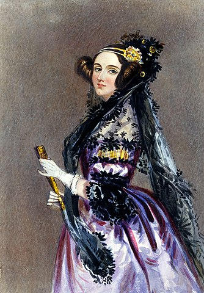

= Rise Of The Machines: A Brief History Of Computers

Information technology has touched almost all parts of life in the 21st century. We use technology to read the news, play music, share photos, get weather updates, book travel, and more. This chapter explores the rapid growth of information technology.

== Learning Objectives

You should be able to:

* Broadly explain major information technology advances
* Discuss how information technology changes influence life today, including:
** Mainframes
** Computer networks
** Personal computers
** Smartphones
** Internet of Things (IoT)
** Web 1.0
** Web 2.0

== In the Beginning

People have been interested in teaching machines to compute for centuries. In the early 1800s, Charles Babbage was fascinated by thinking machines and is credited with creating one of the first mechanical computers. Ada Lovelace became acquainted with Babbage and she had the foresight to see that computers could be used for much more than simple arithmetic. She developed sophisticated algorithms that could be carried out on these mechanical computers. Today, Ada Lovelace is credited as the first computer programmer.

.Ada Lovelace, public domain image from wikipedia.org/wiki/Ada_Lovelace

Over the next 200 years, thousands of technological improvements made our modern computing infrastructure possible. Below are just a few key milestone events:

* 1933: Alan Turing proposed a "universal computing machine" upon which all modern computers are based. Advances in hardware and software over the following decades made computers dramatically more powerful and easy to use. Alan Turing was one of the key scientists who helped crack the Nazi Enigma encryption device (as shown in the movie The Imitation Game, which you should definitely watch).
* 1939: First basic calculator released
** It did not do a whole lot, but it helped out the arithmetically challenged.
* 1947: Computer keyboard created
** Prior to keyboards, computers had to be configured by connecting cables or by uploading punchcards.
* 1950: Digital computers & central mainframes deployed
** Prior to digital computers, analog computers were common. But, analog computers were difficult to use and error-prone.
** Mainframe computers centralize computing on a few large, powerful devices. Client computers connect to the central mainframe.
* 1960s: ARPANET (precursor to the internet) is developed
** Initially, only universities and governmental agencies were connected. The lessons learned in ARPANET led to the internet.
* 1963: Computer mouse invented
** The mouse is a device we take for granted today, but it was a major milestone in computer usability.
* 1965: Fiber optic data transmission performed
** Fiber optic cable would eventually be deployed around the globe. Fiber optic cable is the backbone of the internet. When new networking cable is laid going long distances, it is virtually always fiber optic cable.
* 1970s: Personal computers (desktops and laptops)
** As computing components shrunk, smaller form-factor computers were possible. As the cost of computers dropped, it became feasible to buy powerful desktops rather than do all processing on a central mainframe.
* 1976: Apple II released
** The Apple II had a graphic user interface that made computers easier for novices to adopt.
* 1985: Windows 1.0 released
** Microsoft's first foray into the graphical operating system was Windows 1.0.
* 1991: The World Wide Web invented
** People could finally use web browsers to access the world wide web. At the beginning of the internet, there were many popular protocols that let people interact. But, the world wide web caught on so much that "the web" and "the internet" almost became synonymous.
* 1991: Linux Torvalds starts the Linux project
** The start of Linux is a key milestone in open-source software. Billions of Linux systems have been deployed in recent years.
* 1997: First version of Wi-Fi released
** People began to see the value of being able to connect to a network without dragging around a network cable. Initial Wi-Fi speeds were slow from our current perspective, but since 1997, Wi-Fi speeds have increased to match wired connections in many instances.
* 2000: LG creates the first internet-connected refrigerator
** Connecting different types of devices to the internet is known as the "Internet of Things." The number of "smart" devices would increase drastically after the year 2000.
* 2004: Facebook launches
** Contributing content to Web 1.0 required significant technical skills. Facebook and other Web 2.0 companies made it easier for people to add their own content. Web 2.0 is sometimes referred to as the "read/write" web.
* 2005: YouTube launches
** Video content could be uploaded and shared with the world. Google would acquire YouTube in 2006.
* 2007: Initial Apple iPhone
** Smartphones were not so smart before the iPhone. The iPhone form factor has been copied endlessly since its release.
* 2009: Bitcoin launched
* 2016: Oculus Rift virtual reality headset launches
** The dream of virtual environment (the metaverse?) and augmented reality felt closer than ever.
* 2019: Quantum computing "supremacy" achieved
** Quantum computers solve certain problems very well, but they will never replace traditional computers. Quantum computing may become an important complement to traditional computers.

== Exercise

. List all of the things you have done today.
. For each event, describe any information technology and how you used it.

Examples could include listening to the radio, checking email, or texting somebody--all of which use information technology in some way.

== Reflection

* Has improved information technology come with any negatives? If so, what?
* What will be the major information technologies that will shape our society in the next 50 years?

