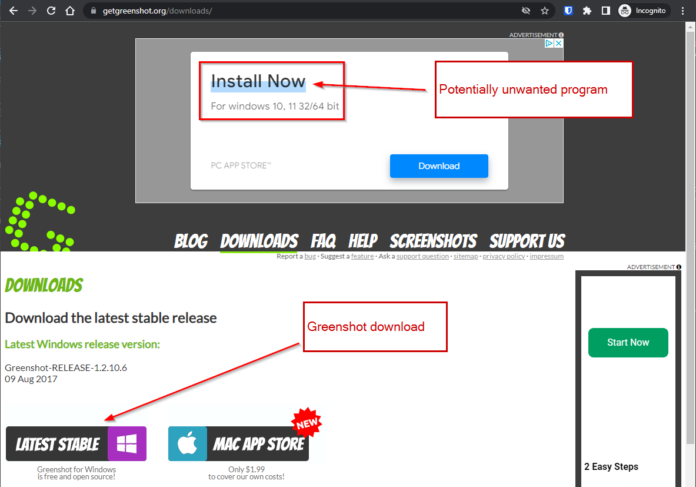
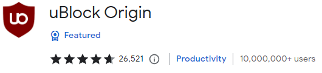
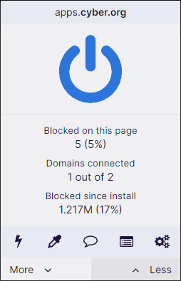

= Installing uBlock Origin

The internet can be a dangerous place. Unfortunately, attackers use advertisements to trick people into installing software that they did not intend to install. Installing advertisement-blocking plugins can help protect your system. uBlock Origin is a free, popular ad blocker.

== Learning Objectives

You should be able to:

* Explain why ad blocking can enhance cybersecurity
* Install the uBlock Origin browser plugin
* Disable and enable uBlock Origin for specific sites

== Evil Ads

Ad blockers are controversial browser extensions. Many people are reluctant to pay subscriptions for online services like newspapers, social media, and email. Service providers make money in part by collecting data about their users and showing their users advertisements. Ad blockers cut off a revenue stream. For this reason, some consider ad blockers a violation of the social contract between content creators and consumers.

Unfortunately, advertising platforms do not thoroughly vet the advertisements run on their platforms. For example, Facebook unwittingly distributed malware through its advertisements. By exploiting browser vulnerabilities, malware can be installed without the user doing anything except browsing a website. In another scenario, websites encourage users to download `potentially unwanted programs (PUPs)`.

A great tool for taking screenshots is Greenshot. The following is a screenshot that shows the Greenshot download page without running ad blockers. Notice that the first thing on the page is a link to a download. However, that download link is *not* for Greenshot--it is for a completely separate application. It is very likely that it is *NOT* the application you want to download.

.Greenshot Website with a Potentially Unwanted Program (PUP) Advertisement

The following screenshot shows the Greenshot download page while running an ad blocker. The link to download the PUP is gone.

.Greenshot Website with a Potentially Unwanted Program (PUP) Advertisement

== Install uBlock Origin

There are many ad blockers on the market. uBlock Origin is solid. Some ad blockers take payments from advertising companies to unblock their advertisements, but uBlock Origin does not do this.

. Do an internet search for `[browser] uBlock origin install`, replacing [browser] with your web browser, such as Firefox or Chrome. 
. Follow the link to the plugin repository for your browser. For example, if using Chrome, you should be taken to the Chrome store.
. Verify that you found the correct plugin. It should be named "uBlock Origin" and there should be millions of downloads. (Be wary of any plugin that only has a few hundred users.)
+
.uBlock Origin Plugin

. Add the plugin to your browser.

== Using uBlock Origin

Occasionally, ad blockers break websites. It may be necessary to disable it for the website to function.

. Navigate to a website.
. Click on the uBlock Origin icon in your browser's toolbar.
. Click the power button to disable uBlock Origin for the site.
+
.Power Button to Enable or Disable Ad Blocking

. Reload the page for the changes to take effect.
. Enable the plugin again by clicking the power button.

It is recommended that you use uBlock Origin (or a similarly trusted ad-blocking plugin) on your host machine.

== Challenge

* Ad blockers sometimes break sites. Practice turning uBlock on and off for different sites and compare the results.
* Determine which sites have the most ads blocked.

== Reflection

* Is blocking advertisements ethical?
