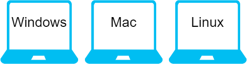
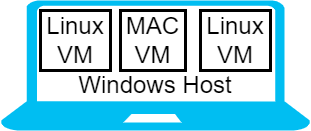
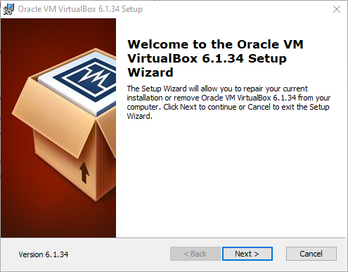
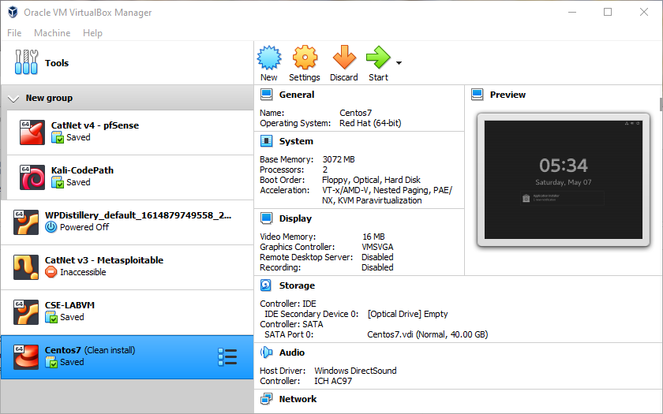
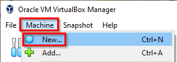
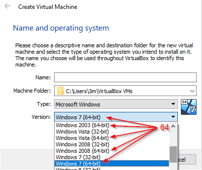

= Virtualization For Education

Author: Dr. Jim Marquardson

Changelog

* 2022-08-15 Initial Version

`Virtualization` is a computing technology that powers many systems. With virtualization, you can run several computer operating systems on one physical computer. In this chapter, you will learn more about virtualization and install VirtualBox--a popular, free virtualization platform.

== Learning Objectives

You should be able to:

* Describe virtualization
* List some of the benefits of virtualization
* Install VirtualBox

== Exercise Requirements

The exercise in this chapter requires a Windows, Mac, or Linux computer with the ability to install software. This lab will not work on Chromebooks, iPads, or similar devices because VirtualBox is not supported on those platforms.

== Virtualization Concepts

Suppose you have a laptop computer. We often refer to laptops by the operating systems that they run. We might say that we have a Windows laptop, Mac, or Linux computer. In these cases, we have 1 physical computer (i.e., the laptop), and one operating system (i.e., Windows, Mac, or Linux).

.Without virtualization: one operating system per device

Virtualization makes it possible to run multiple operating systems on one physical computer. Each operating system thinks it is the only operating system running on the computer. By default, the operating systems are distinct and hardly interact with each other. At its core, virtualization is a way to make better use of physical hardware.

In virtualization, a computer runs `virtual machines`. A virtual machine (`VM`) acts like a complete computer, but is really just a file running on the `host` computer. The host is the hardware and operating system that runs the virtual machines. Each virtual machine can be referred to as a `guest`. The figure below shows a Windows host (i.e., a Windows laptop) with three guest VMs. The guest VMs can be running any operating system supported by the virtualization software.

.With virtualization: a Windows laptop running 3 virtual machines

Cloud computing platforms like Amazon Web Service, Microsoft Azure, and Google Cloud Platform, use virtualization heavily in their data centers. They use more sophisticated virtualization platforms (like VMWare or Microsoft's Hyper-V), but the virtualization concepts are the same. In data centers, virtualization gives many benefits such as,

* decreased power consumption,
* more efficient use of floorspace,
* easier backup and restore of computer systems, and
* the ability to scale systems up and down when demands change.

It is likely that you do not have your own personal data center. But, you can simulate a data center on your computer with desktop virtualization software. `VirtualBox` is a popular open source program that can be downloaded for free on Windows, Linux, and Mac operating systems. VirtualBox lets you run virtual machines. The next section has instructions for installing VirtualBox.

== Exercise 1: VirtualBox Installation

In this section you will install VirtualBox. VirtualBox is supported on Windows, Mac, and Linux. The instructions here will address Windows. You will need to refer to the virtualbox.org website for more specific instructions if using a Mac or Linux computer.

. Go to https://www.virtualbox.org/wiki/Downloads.
. Download the latest version for your host. For example, if you are running Windows on your laptop, you download the latest version for Windows hosts.
. Once downloaded, launch the installation.
.. You should see an installation screen like the following:
+
.VirtualBox Installation

. Accept all of the defaults during the installation.
. You may be warned that your network connection will be interrupted. That should not cause any problems.
. You may be prompted to reboot your computer. It is a good idea to reboot.
. When your computer finishes rebooting, launch the `VirtualBox Manager.`
.. The VirtualBox Manager should look something like the following, though you will not have any Virtual Machines, yet.
+
.VirtualBox Manager

At this point, VirtualBox has been successfully installed.

== Exercise 2: Extension Pack Installation

VirtualBox works well with its base installation, but there is an optional Extension Pack that provides helpful features. These instructions will help you install the Extenion Pack.

. Go to https://www.virtualbox.org/wiki/Downloads. 
. In the VirtualBox Extension Pack section of the downloads page, click the link to download the extension pack for "all supported platforms."
. Once downloaded, open the file from either your browser, or by going to your downloads folder and double clicking the file. Installing VirtualBox previously should have registered the extention pack file type with VirtualBox, so you should be prompted to open the file with the VirtualBox Manager.
. Accept the prompt in the VirtualBox Manager to install the extention pack. The installation should go quickly.

You will not notice any changes in the VirtualBox Manager after the extension pack has been installed, but the new features should be working in the background.

== Exercise 3: Test VirtualBox Installation

This section will walk you through a quick check to ensure that VirtualBox has been installed correctly.

. Open the VirtualBox Manager.
. In the Machine menu, click New.
+
.Machine > New

. In the Type dropdown box, ensure that 64-bit operating system options are available.
+
.64-bit Versions Available

As long as you see 64-bit operating systems available, VirtualBox has been installed correctly and is ready to be used. If only 32-bit options are available, virtualization features will need to be enabled in your computer's BIOS. The method for enabling virtualization in the BIOS depends heavily on your computer's manufaturer and the BIOS version. You would need to find appropriate information online by searching for your laptop, such as "enable virtualization lenovo laptop."

== Reflection

* What is a virtual machine?
* How would virtualization help you learn to use different computer systems?
* Why would cloud computing companies use virtualization?

