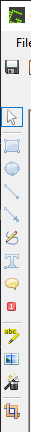
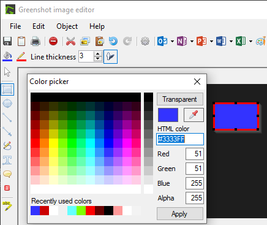
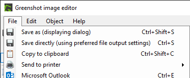

= Install Greenshot

Every operating system comes with basic screenshot tools. Greenshot is a free and open-source alternative to the built-in screenshot tools. Greenshot makes it easy to take and markup screenshots. Greenshot is also useful because some system administrators block the built-in screenshot tools, so it is helpful to have a standalone tool to take screenshots.

== Learning Objectives

You should be able to:

* Install Greenshot
* Copy screenshots to the clipboard
* Save screenshots to a folder on your computer

== Install Greenshot

. To avoid installing potentially unwanted programs (PUPs), it is encouraged that you use an ad blocker when downloading Greenshot.
. Open a browser and go to https://getgreenshot.org/.
. Click the `Downloads` link in the menu.
. Download the latest stable release.
. Launch the installer and complete the installation with the recommended defaults. For example, Greenshot is a good program to launch when your computer starts. But if you would rather start it manually when you need it, that's fine.

== Using Greenshot

. Launch Greenshot if it is not already running.
. Press the `PrtSc` button to activate Greenshot. If prompted, choose to capture a region.
.. In some cases, the `PrtSc` shortcut might be blocked by another application. In that case, right-click on the `G` icon in your system tray, and choose `Capture Region`.
. Select the part of your screen you want to capture.
. Choose `Open in image editor`.
. You can make changes to the screenshot, such as adding highlights, lines, or text.
+
.Markup Tools

. Instead of editing the pixels like a drawing program, Greenshot stores the edits as objects. This allows the edits to be tweaked and deleted without modifying the underlying screenshot.
. Add a rectangle.
. Change the fill of the rectangle by clicking on the bucket tool, selecting a color or "transparent" and clicking `Apply`.
+

. While the rectangle is selected, change the color of the rectangle's outline by clicking on the pencil icon. Again, select the new color and click `Apply`.
. Experiment with the other tools.
. When you are done tweaking your screenshot, the `File` menu has options to copy the image to the clipboard (if you are going to paste the screenshot in a different application) or to save the screenshot as a file.
.Greenshot File Menu

== Challenge

* Take a screenshot.
* Add highlighting.
* Edit the highlighting to expand and contract the size of the area highlighted.
* Add a rectangle with a green border and transparent background.
. Add a rectangle with a red border and black background.

== Reflection

* Why are screenshots helpful?
* How does Greenshot's feature set compare to your computer's built-in screenshot tools (e.g., the Snipping Tool or Snip & Sketch)?
