= Lab Setup

Author: Dr. Jim Marquardson

Changelog

* 2022-08-15 Initial Version

In this section you will create a virtual machine in VirtualBox. The virtual machine will be used for many labs. If you ever have to recreate your lab environment, you can use the instructions in this chapter. The operating system of the virtual machine will be Kali Linux--an operating system used by many cybersecurity experts for penetration testing.

== Learning Objectives

You should be able to:

* Explain why Kali Linux would be useful for cybersecurity researchers
* Install a Kali Linux virtual machine in VirtualBox
* Edit a virtual machine description in the VirtualBox Manager
* Login to a Kali Linux virtual machine in VirtualBox

== Kali Linux

There are many flavors of Linux. Each of these flavors is called a distribution. You might have the RedHat Linux distribution, Ubuntu Linux distribution, Mint Distribution, etc. These distributions share many of the same characteristics and work similarly under the hood, but they include different software and the user interface differs slightly.

Kali Linux is a distribution geared toward penetration testers and ethical hackers. Though unethical hackers might also use the tools in Kali for malicious purposes. Kali come with many cybersecurity tools installed by default, so professionals do not have to waste time downloading and installing hundreds of different tools.

More information can be found at https://www.kali.org/.

== Exercise: Install a Kali Virtual Machine

Note: Like all software, Kali has new updates and releases. In this lab, you might see small differences in version numbers in the text and screenshots (e.g., Kali 2022.1 and 2022.2). The instructions may have to be adapted slightly based on changes to Kali's website or the Kali operating system.

You should already have VirtualBox and the VirtualBox Guest Additions installed. If you do not have these, refer to the chapter on setting up virtualization on your computer. The remainder of this section will walk you though the Kali virtual machine creation. Note that the organization lf Kali's website may change over time, so the screenshots and exact links to click on may change.

. Try  the direct link: https://kali.download/virtual-images/kali-2022.2/kali-linux-2022.2-virtualbox-amd64.ova 
.. If this link does not work, or if you wanted the newest version of Kali, find the newer download using the steps below.
. Go to https://www.kali.org/get-kali/.
. Click on the `Virtual Machines` section.
+
.Kali Virtual Machines
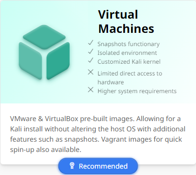
. Click the download link for the 64-bit version for VirtualBox.
+
.64-bit VirtualBox Version
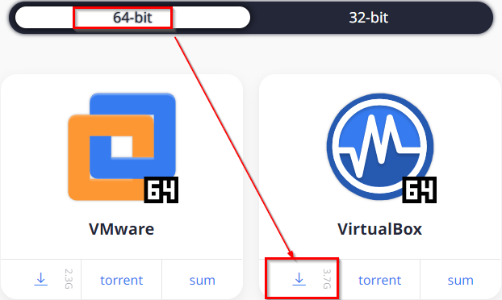
. Save the file wherever you want, but make sure to note the download location. For example, in the following screenshot a new folder named "kali" was created in the downloads folder, and the Kali file with a .ova file extension will be saved there.
+
.Download Folder
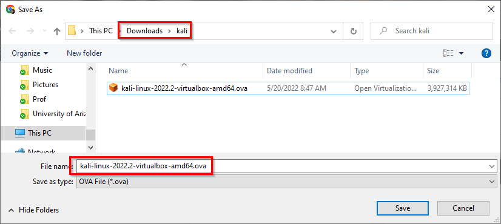
. The download will take several minutes. The file being downloaded is several gigabytes.
. When the file download has completed, launch the VirtualBox Manager.
. You might be tempted to click `New` to create a virtual machine. Don't do it. It will make you sad and will not work the way you think it will. Trust me.
. Click `File > Import Appliance` to start creating your Kali virtual machine.
. Navigate to the folder where you downloaded the Kali .ova file.
. Select the .ova file, then click open.
+
.Select the Kali .ova file
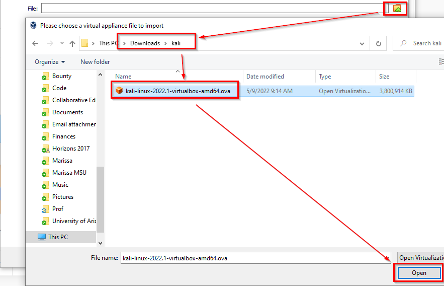
. Click `Next` to continue the import process.
. You will be shown the "Appliance settings." These are the settings that the makers of Kali configured. Keep them as is. Click the `Import` button.
+
.Appliance settings
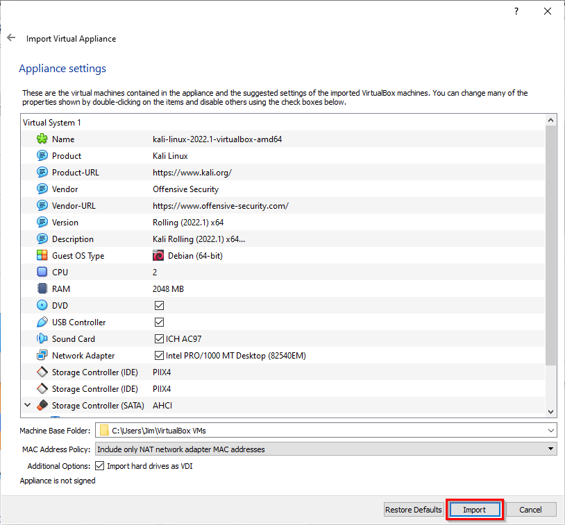
. You will be prompted to accept the open source software license. Click `Agree` to continue.
+
.Software License
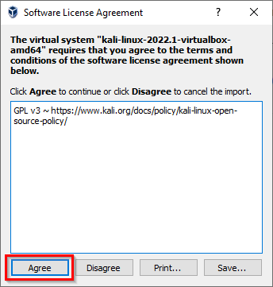
. Finally, the virtual machine will be created. Basically, the virtual machine is a file that stores the entire Kali operating system. This step can take several minutes depending on your computer hardware.
. The Kali virtual machine will now show up in the list of virtual machines.
. Ensure that Kali is selected, then click `Settings`.
+
.Virual machine settings option
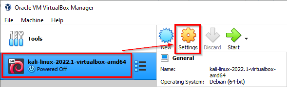
. In the `General` category, click the `Description` tab. Notice that the username and password are listed here: kali and kali. You could make changes to this description to add notes if you like. But at this point, you can leave the description as is. When you are done reviewing the description, click OK to save any changes you made (or cancel to close without saving any changes).
+
.Kali virtual machine description
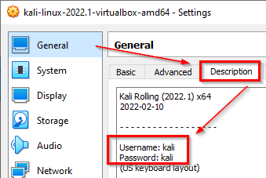
. Highlight Kali in the VirtualBox Manager, and click `Start`.
+
.Start the virtual machine
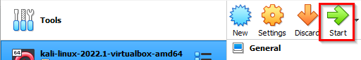
. It may take a few minutes for the virtual machine to boot. Lots of text will show up on the screen and various images will appear. Just be patient.
. At the login, enter `kali` for the username and `kali` for the password.
. To save disk space on your hard drive, you can delete the Kali .ova file you downloaded.

== Explore Kali

The Kali virtual machine will be used in many labs. The following screenshot shows just a few of the features that can help you get started using Kali.

.Kali interface
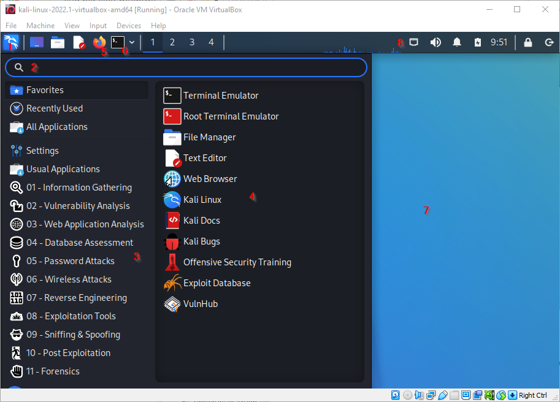

. The Kali dragon is like the Start menu in Windows.
. The search bar can be used to find application quickly.
. Applications are organized in various categories. Hovering your mouse over these categories will reveal different applications applicable to those categories.
. Applications that can be run.
. A regular web browser.
. A terminal used for entering text commands.
. The desktop.
. Network settings, sound settings, and where you can shut down the virtual machine from within Kali.

Take a few minutes to explore Kali's interface and the types of tools that you could run.

== Saving a Virtual Machine

The Kali virtual machine consumes a lot of memory and CPU resources on your computer, so it's best to close it when you're not using it.

. In the Kali window, choose `File > Close.`
+
.Close the virtual machine
image::file-close.png[close the virtual machine]
. When prompted, choose to save the machine state. This is like putting the virtual machine to sleep. The virtual machine will be saved on your hard drive. It should only take a few seconds to save the machine state.
+
.Save the machien state
image::save-state.png[save the machine state]
. You can now close the VirtualBox Manager.

== Troubleshooting

* After logging in, the Kali screen is just black.
** In the Kali window, drag the dots in the lower-right corner to resize the window. This basically forces Kali to redraw itself.
+
.Resize a virtual machine window
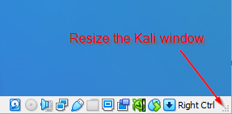
* I forgot my username and password.
** It's `kali` and `kali`, all lower case.
* If Kali is not booting and you see a message about a "BUG" and "CPU" being stuck, open the virtual machine settings in the VirtualBox Manager. Open the `System` tab, then the `Processor` tab, then ensure that the `Execution Cap` is 100%.
+
.Check Execution Cap
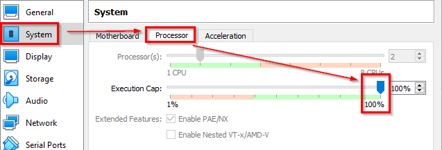

== Reflection

* How might using a Kali Linux virtual machine make your job evaluating cybersecurity easier?
* Did you really have a choice to disagree with the software license agreement?

