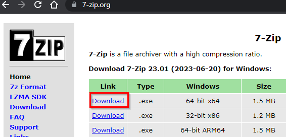
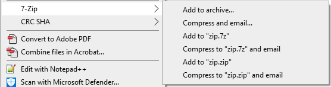
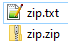
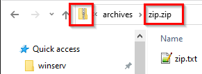
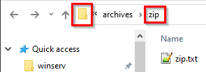

= Install 7-Zip

Microsoft Windows has built-in tools to create and extract .zip files. However, Windows cannot work with some common compression and archive formats that are popular on Linux. The free and open-source program 7-Zip supports many archive and compression formats. Some of these formats achieve higher compression ratios than .zip files.

== Learning Objectives

You should be able to:

* Install 7-Zip
* Extract a zip archive with 7-Zip
* Understand the difference between viewing a file inside an archive and viewing an extracted file

== Archives

The zip format has been around for decades. Zip files are used ubiquitously in modern computing. At a high level, the zip format works by finding repetitive data in files and substituting that data with smaller codes. The zip format can combine many files and folders into a single, compressed archive. Zip files are useful for distributing data over the internet or storing backups.

In the Linux world, the `tar` format is used to combine files and folders into a single file (a "tape archive"). The gzip and bzip compression protocols are used to make the tar file smaller. Microsoft Windows works with .zip files fairly well, but on Windows, 7-Zip is often necessary to work with .tar, .gz, and .gz archives.

== Installing 7-Zip

7-Zip is free and open source. If you are asked to pay to download it, you are in the wrong spot.

* Go to https://7-zip.org/.
* Download the latest 64-bit version.
+
.7-Zip Download

. Run the executable to start the installation.
. Accept the recommended installation folder (likely C:\Program Files\7-Zip\).

== Compressing with 7-Zip

7-Zip integrates with your operating system's menu when you right-click on files and folders. Sometimes rebooting is necessary to make the new right-click options show up after installing a new application. Try the steps below after installing 7-Zip. If 7-Zip is not available when right-clicking on files and folders, then try rebooting your computer.

. Create a new text file called zip.txt in an empty folder on your computer.
.. Start Notepad.
.. Add the text "This is compressed with the zip format". (The exact text does not matter.)
.. Save the file as zip.txt. 
. Right-click on zip.txt.
+
.Compress with 7-Zip

. Choose `Add to zip.zip`. Note that there are other compression formats available. The .7z compression format compresses data into smaller files, but it is less widely supported.
. There should now be two files in the folder.
.Text File and the Compressed Zip File

== Working with Compressed Files

Archives can be confusing. The main point of confusion is the difference between these two questions:

* Am I looking at the file inside the archive?
+
.Viewing Files in an Archive

** A few hints will tell you that you are looking inside an archive. First, the icon looks like it has a zipper, representing a zip file. Also, the address bar will show the file name with a .zip extension.
** Double-click zip.txt to open it. You can read it, but not make changes to it. This is not necessarily a problem, but something to be aware of.
* Am I looking at the extracted file?
** The following screenshot shows a file from the extracted zip.zip archive.
+
.Viewing Extracted Archive Files

** Notice that the Windows Explorer window shows a regular folder icon. Also note that the navigation shows a folder instead of a file with a .zip extension.
** Open the zip.txt file and make changes. Save the file. The changes should work.

Below is a table comparing actions that are possible when working with files extracted from an archive versus working inside an archive.

|========
|                                                                | Extracted Archive | In An Archive
| List files                                                     | Yes               | Yes
| Read files                                                     | Yes               | Yes
| Edit files                                                     | Yes               | No
| Run executables that do not require other files in the archive | Yes               | Yes
| Run executables that require other files in the archive        | Yes               | No 
|========

The bottom line is that you must know if you are working inside an archive, or working with files extracted from an archive. 

== Challenge

* Create a folder with 3 small text files.
** Compress the 3 text files into one .zip file.
* Compress the folder that contains the 3 small text files and the newly created .zip file.
* Compress and uncompress files using the .7z format.

== Reflection

* Why do we use .zip files?
* When would it be better to use the .7z format?
* Why are there so many different archive formats?
