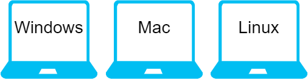
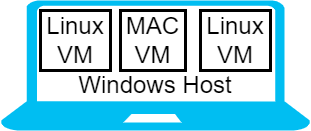

= Virtualization For Education

`Virtualization` is a computing technology that powers many systems. With virtualization, you can run several computer operating systems on one physical computer. In this chapter, you will learn more about virtualization and install VirtualBox--a popular, free virtualization platform.

== Learning Objectives

You should be able to:

* Describe virtualization
* List some of the benefits of virtualization

== Exercise Requirements

The exercise in this chapter requires a Windows, Mac, or Linux computer with the ability to install software. This lab will not work on Chromebooks, iPads, or similar devices because VirtualBox is not supported on those platforms.

== Virtualization Concepts

Suppose you have a laptop computer. We often refer to laptops by the operating systems that they run. We might say that we have a Windows laptop, Mac, or Linux computer. In these cases, we have 1 physical computer (i.e., the laptop), and one operating system (i.e., Windows, Mac, or Linux).

.Without virtualization: one operating system per device

Virtualization makes it possible to run multiple operating systems on one physical computer. Each operating system thinks it is the only operating system running on the computer. By default, the operating systems are distinct and hardly interact with each other. At its core, virtualization is a way to make better use of physical hardware.

In virtualization, a computer runs `virtual machines`. A virtual machine (`VM`) acts like a complete computer, but is really just a file running on the `host` computer. The host is the hardware and operating system that runs the virtual machines. Each virtual machine can be referred to as a `guest`. The figure below shows a Windows host (i.e., a Windows laptop) with three guest VMs. The guest VMs can be running any operating system supported by the virtualization software.

.With virtualization: a Windows laptop running 3 virtual machines

Cloud computing platforms like Amazon Web Service, Microsoft Azure, and Google Cloud Platform, use virtualization heavily in their data centers. They use more sophisticated virtualization platforms (like VMWare or Microsoft's Hyper-V), but the virtualization concepts are the same. In data centers, virtualization gives many benefits such as,

* decreased power consumption,
* more efficient use of floor space,
* easier backup and restore of computer systems, and
* the ability to scale systems up and down when demands change.

Likely, you do not have your own personal data center. But, you can simulate a data center on your computer with desktop virtualization software. `VirtualBox` is a popular open-source program that can be downloaded for free on Windows, Linux, and Mac operating systems. VirtualBox lets you run virtual machines. The next section has instructions for installing VirtualBox.

== Reflection

* What is a virtual machine?
* How would virtualization help you learn to use different computer systems?
* Why would cloud computing companies use virtualization?

