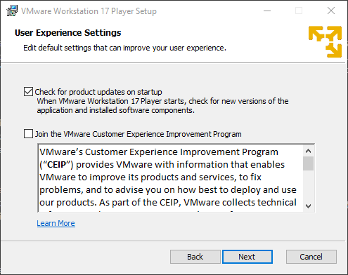
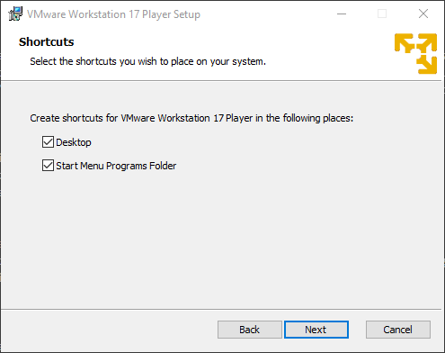
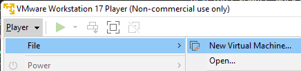
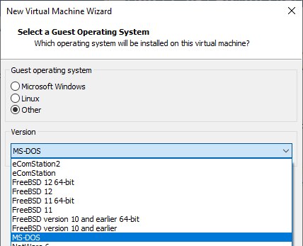

= Install VMWare Workstation Player

VMWare is a company that specializes in virtualization. The majority of its business is running virtual machines in data centers for large organizations, but VMWare also develops VMWare Workstation Player for virtualization on the desktop. Unlike VirtualBox, VMWare Workstation Player is proprietary software. However, VMWare Workstation Player is free for personal, non-commercial use.

== Learning Objectives

You should be able to:

* Install VMWare Workstation Player
* Evaluate VMWare Workstation Player features

== Download and Install VMWare Workstation Player

. The exact download page will change, so search the internet for:
+
----
vmware workstation player download
----
. Follow the links until you find the download for a version of `VMware Workstation Player for Windows 64-bit Operating Systems`.
. Download the file.
. Launch the file when the download has finished.
. Use the recommended settings to install the software.
. At one point, you will be prompted to install the enhanced keyboard driver. It's a good idea to check the box.
+
.Keyboard Driver

. You will likely want to install the shortcuts.
+
.VMWare Workstation Player Shortcuts

. After installation, you may be prompted to reboot. You can do that later. Or reboot. Up to you.
. Launch VMWare Workstation Player.
. Click `File > New Virtual Machine...` and explore the options.
+
.New Virtual Machine

. Without an operating system to install, you will want to check the option to install the operating system later.
. Explore the operating systems available for a new virtual machine.
+
.List of Supported Operating Systems

== Challenge

* Besides Oracle VirtualBox and VMWare Workstation player, what other virtualization platforms do people use?

== Reflection

* How does VMWare Workstation Player compare to other virtualization platforms?
* What are some problems a person might run into relying on proprietary software?
