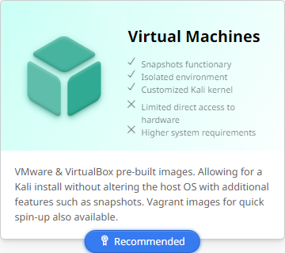
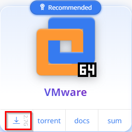
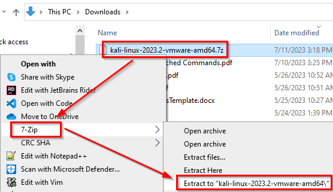
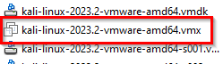
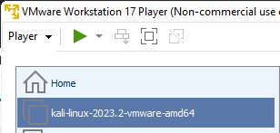

= Install Kali on VMWare Workstation Player

Kali is officially supported on VMWare Workstation Player. You can download a virtual machine that works with minimal work.

== Learning Objectives

You should be able to:

* Download a Kali Linux virtual machine for VMWare Workstation Player
* Extract the VMWare virtual machine from a compressed archive
* Open the virtual machine in VMWare Workstation Player

== Download and Extract

Because links change and organizations redesign their websites, you will search for the Kali download link. Make sure that you download the files from kali.org and not any other site.

. Search the internet for "kali download." Follow the link to kali.org.
. Select `Virtual Machines`.
+
.Choose Virtual Machines

. Click the download link for VMware 64. Save the file to your downloads folder.
+
.VMware Virtual Machine Download

+
The file should be named something like kali-linux-202X.X-vmware-amd64.7z. Note that it has a .7z file extension, so you will need 7-zip to extract this file.
. When the download finishes, open Windows Explorer and navigate to your downloads folder. 
. Don't double-click the .7z file. Instead, right-click and extract the files to a new folder.
+
.Extract .7z File to a Folder

. After the file has been extracted, you can save disk space by deleting the .7z file.
. Navigate into the new Kali folder. You may have to open another subfolder until you find the list of files.
. There will be one file that has a `.vmx` extension. Double-click this file to open the virtual machine in VMware Workstation Player. The .vmx file points to all of the other files in the folder.
+
.VMX File

. The Kali VM will boot. It may take a minute or two for it to finish booting.
. You can close the virtual machine by clicking the "X" at the top-right part of the menu and saving the machine state.
. Start VMWare Workstation Player.
. You should now see Kali Linux in your list of virtual machines.
+
.Kali Virtual Machine

. You can start the Kali VM by double-clicking it, or by selecting it and clicking the play button.

When not using your VM, it is best to suspend it so that it does not eat up your system resources like CPU and RAM.

== Challenge

* Find out what other platforms are supported by Kali. When would they be useful?

== Reflection

* Is there any downside to storing the Kali VM files in your downloads folder? Where would be a better place to put it?
* How difficult was it to create the Kali VM?