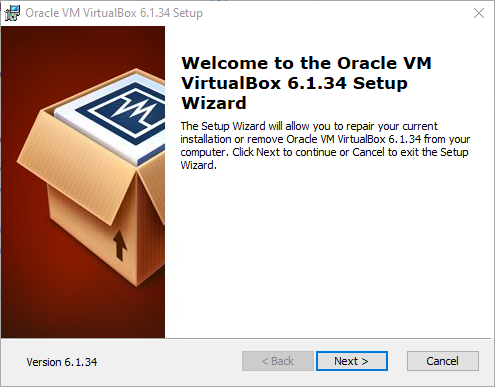
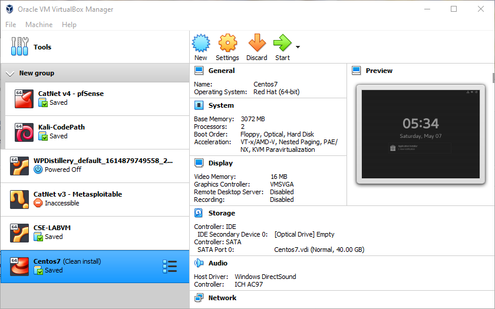
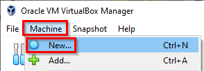
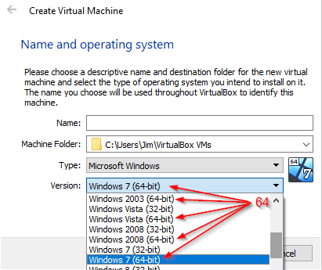

= TODO

TODO

== Learning Objectives

You should be able to:

* 
* 
* 

== Exercise 1: VirtualBox Installation

The instructions in this section will guide you through the VirtualBox installation. VirtualBox is supported on Windows, Mac, and Linux. The instructions here will address Windows. You will need to refer to the virtualbox.org website for more specific instructions if using a Mac or Linux computer.

. Go to https://www.virtualbox.org/wiki/Downloads.
. Download the latest version for your host. For example, if you are running Windows on your laptop, you download the latest version for Windows hosts.
. Once downloaded, launch the installation.
.. You should see an installation screen like the following:
+
.VirtualBox Installation

. Accept all of the defaults during the installation.
. You may be warned that your network connection will be interrupted. That should not cause any problems.
. You may be prompted to reboot your computer. It is a good idea to reboot.
. When your computer finishes rebooting, launch the `VirtualBox Manager.`
.. The VirtualBox Manager should look something like the following, though you will not have any Virtual Machines, yet.
+
.VirtualBox Manager

At this point, VirtualBox has been successfully installed.

== Exercise 2: Extension Pack Installation

VirtualBox works well with its base installation, but there is an optional Extension Pack that provides helpful features. These instructions will help you install the Extension Pack.

. Go to https://www.virtualbox.org/wiki/Downloads. 
. In the VirtualBox Extension Pack section of the downloads page, click the link to download the extension pack for "all supported platforms."
. Once downloaded, open the file from either your browser or by going to your downloads folder and double-clicking the file. Installing VirtualBox previously should have registered the extension pack file type with VirtualBox, so you should be prompted to open the file with the VirtualBox Manager.
. Accept the prompt in the VirtualBox Manager to install the extension pack. The installation should go quickly.

You will not notice any changes in the VirtualBox Manager after the extension pack has been installed, but the new features should be working in the background.

== Exercise 3: Test VirtualBox Installation

This section will walk you through a quick check to ensure that VirtualBox has been installed correctly.

. Open the VirtualBox Manager.
. In the Machine menu, click New.
+
.Machine > New

. In the Type dropdown box, ensure that 64-bit operating system options are available.
+
.64-bit Versions Available

As long as you see 64-bit operating systems available, VirtualBox has been installed correctly and is ready to be used. If only 32-bit options are available, virtualization features will need to be enabled in your computer's BIOS. The method for enabling virtualization in the BIOS depends heavily on your computer's manufacturer and the BIOS version. You would need to find appropriate information online by searching for your laptop, such as "enable virtualization Lenovo laptop."

== Challenge

* Explore the list of supported operating systems. Take note of what you see and what you do not see. Can you virtualize a Mac? An XBOX? Windows Server?

== Reflection

* Why would VirtualBox be a useful tool for learning cybersecurity?
