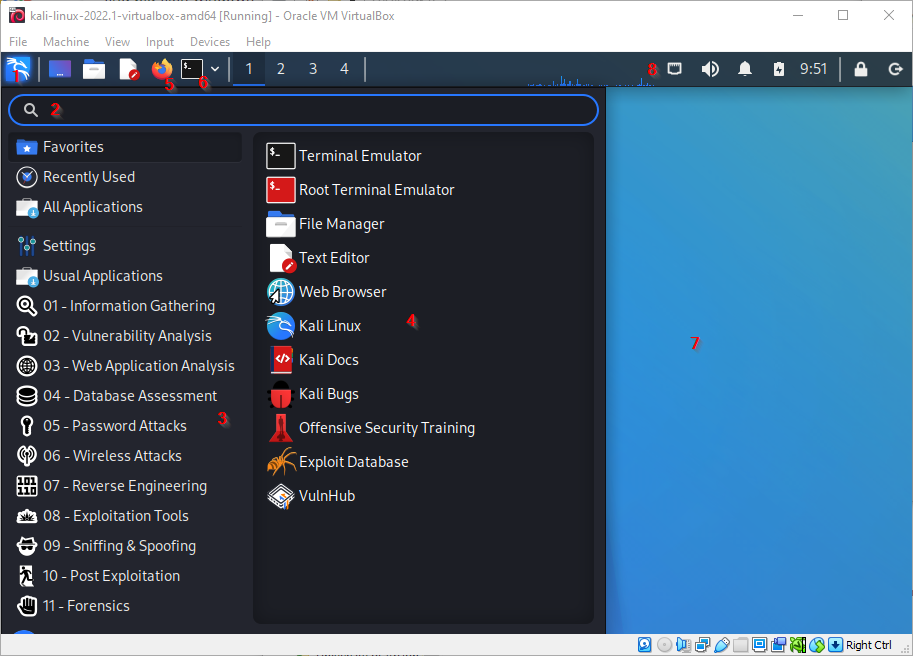
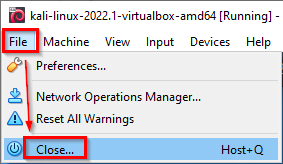
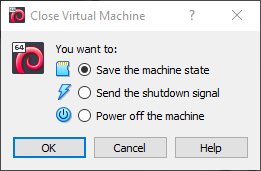
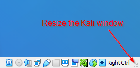
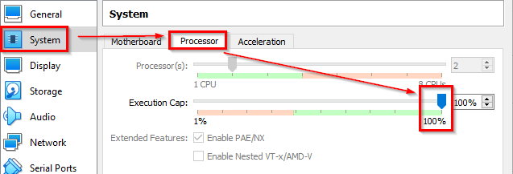

= Using Kali

Kali Linux is a Linux distribution that comes with many cybersecurity tools installed. Kali makes it easy to get started assessing security instead of installing and configuring tools.

== Learning Objectives

You should be able to:

* Log into Kali
* Launch a web browser
* Find the desktop
* View the Kali applications

== Explore Kali

The Kali virtual machine will be used in many labs. The following screenshot shows just a few of the features that can help you get started using Kali.

.Kali interface

. The Kali dragon is like the Start menu in Windows.
. The search bar can be used to find applications quickly.
. Applications are organized by category. Hovering your mouse over these categories will reveal different applications applicable to those categories.
. Applications that can be run.
. A regular web browser.
. A terminal is used for entering text commands.
. The desktop.
. Network settings, sound settings, and where you can shut down the virtual machine from within Kali.

Take a few minutes to explore Kali's interface and the types of tools that you could run.

== Saving a Virtual Machine

The Kali virtual machine consumes a lot of memory and CPU resources on your computer, so it's best to close it when you're not using it. The steps below document the process for VirtualBox, but there are equivalent options in VMWare Workstation Player.

. In the Kali window, choose `File > Close.`
+
.Close the virtual machine

. When prompted, choose to save the machine state. This is like putting the virtual machine to sleep. The virtual machine will be saved on your hard drive. It should only take a few seconds to save the machine state.
+
.Save the machine state

. You can now close the VirtualBox Manager.

== Troubleshooting

* After logging in, the Kali screen is just black.
** In the Kali window, drag the dots in the lower-right corner to resize the window. This basically forces Kali to redraw itself.
+
.Resize a virtual machine window

* I forgot my username and password.
** It's `kali` and `kali`, all lowercase.
* If Kali is not booting and you see a message about a "BUG" and "CPU" being stuck, open the virtual machine settings in the VirtualBox Manager. Open the `System` tab, then the `Processor` tab, then ensure that the `Execution Cap` is 100%.
+
.Check Execution Cap

* If Kali does not boot and you see a message about a PXE-E06 option and a message about the CD-ROM:
** Power off the virtual machine.
** In the VirtualBox manager, go to *Settings*, *System*, and uncheck the CD-ROM boot option.
** Click *OK* to save the settings.
** Boot the virtual machine.

== Challenge

* Find the Kali Linux official site. What documentation do they provide?

== Reflection

* Is blocking advertisements ethical?