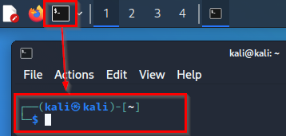
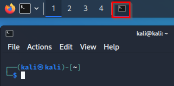
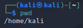
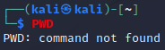
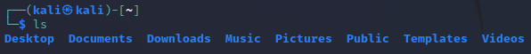
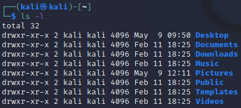

= Linux Command Line Interface

The Linux command-line interface (CLI) is one of the primary ways that Linux administrators and ethical hackers use Kali Linux. This chapter will walk you through a few commands that you can run in the command-line interface.

== Learning Objectives

You should be able to:

* Launch a terminal
* Use the `pwd`, `cd`, `whoami` and `ls` commands
* Run basic commands with options

== Basic Linux Commands

Most people learn best by doing. This section will walk you through the basic use of several commands. Pay attention to the commands that you type. It is more important to understand *why* the commands are important and *when* they would be useful. In a sense, different Linux commands are like different ingredients when cooking: the more commands you know, the more "recipes" you'll be able to create and the more problems you'll be able to solve.

=== Launch a Terminal

. Start the Kali virtual machine (using VirtualBox or VMWare).
. Log in with the username `kali` and the password `kali` if prompted.
. Click the icon on the toolbar to launch the terminal. The terminal is where you can enter commands with a command-line interface.
+
.Launch a terminal

. Notice that a terminal icon will appear to the right showing that a terminal application is running. This is similar to how running programs appear at the bottom of the screen in Windows and Mac OSX operating systems.
+
.Terminal running

. Close the terminal and start it again.
. Notice that the terminal prompt says `kali@kali`. This refers to your username and computer name. You will be running these commands with the user account `kali` on your virtual machine which was named `kali` when the operating system was first installed.
. There is a cursor that indicates where you can type commands.

=== Print Working Directory Command: pwd

One of the hardest things for new Linux terminal users to understand is where they are in the filesystem. Files are organized in directories. Often, we run commands to load or create files. We must know where the commands will look for files. The `pwd` command helps confirm we are in the right place to create to load or create a file. The `pwd` command prints the name of the working directory.

. Run `pwd` in a terminal by typing the command and pressing enter.
+
[source,shell]
----
pwd
----
. You should see output similar to the following.
+
.pwd output

. Note that your home folder is /home/kali. In Linux, users' files and folders are organized in the /home folder. Since kali is your username, your home folder is /home/kali. Every user on the computer would have a separate folder in the /home.
. Run `PWD` in the terminal.
+
.PWD output

. Notice the error message: command not found. In Linux, all commands and file names are *case sensitive*. This behavior is very different in Windows. In Windows, the case of commands and file names are ignored.

=== Change Directory Command: cd

The `cd` command is used to change your working directory. This command lets you move around the directories on your Linux computer.

. Run:
+
[source,shell]
----
pwd
----
+
This will just check your current working directory.
. Run:
+
[source,shell]
----
cd /etc
----
. Run:
+
[source,shell]
----
pwd
----
+
The location should be:
+
....
/etc
....
+
Using `cd` followed by a forward slash ('/') changes directory to directory relative to the *root*. The root of the file system is /.
. Run:
+
[source,shell]
----
cd /
----
. Run:
+
[source,shell]
----
pwd
----
+
You should see:
+
....
/
....
. To quickly return to your home folder, run:
+
[source,shell]
----
cd ~
----
+
The tilde is a special character that references the home folder.
. Print your working directory. It should be `/home/kali`.
. Run:
+
[source,shell]
----
cd ..
----
+
The two periods tell the `cd` command to change directories to the parent folder.
. Print your working directory again. It should be `/home`.
. Run:
+
[source,shell]
----
cd kali
----
+
Because the Kali directory exists in the /home directory, and your working directory is current in /home, you can just type the directory name `kali` after the `cd` command to change directories to /home/kali.
. Confirm that your working directory is now /home/kali.

=== Absolute and Relative Paths

Entering directory paths that start with `/` or `~` are `absolute` paths because they will take you to the same place no matter your present working directory.

. In the terminal, run:
+
[source,shell]
----
cd ~
----
+
Because `~` refers to the home directory, it will always take you to /home/kali (if logged in as the kali user).
. Change to another directory with an absolute path.
+
[source,shell]
----
cd /var/www/html
----
+
It would not matter if your previous working directory was `/`, `/home/kali`, `/etc`, or any other directory. Because the path started with `/`, you will be taken directory to `/var/www/html`.
. Relative paths include `.`, `..`, files in the current directory, and subdirectories of the current directory.
. The period (`.`) refers to the current directory. Run the following command to check your directory, change the current directory (`.`), and check your directory again.
+
[source,shell]
----
pwd
cd .
pwd
----
. Two periods in a row (`..`) refer to the `parent` directory. Run the following commands to observe what happens when changing directories using `cd ..`.
+
[source,shell]
----
pwd
cd ..
pwd
----
+
You should now be in the `/var/www` directory. 
. Run `ls` to see what directories exist in /var/www.
+
[source,shell]
----
ls
----
. Notice that the `html` directory is inside /var/www/html. (This should make sense since you were just there.) To navigate to the `html` folder, you can use a relative path with `cd`.
+
[source,shell]
----
cd html
----
+
This is a `relative reference` to the `html` folder because it can be found relative to your present working directory.
. Run `ls` to see the files inside of /var/www/html.
+
[source,shell]
----
ls
----
. Print the contents of `index.html` using `cat`.
+
[source,shell]
----
cat index.html
----
+
Again, the reference to index.html is relative because we did not give the `cat` command an absolute reference to the index.html file.
. Run the following `cd` command with an absolute reference.
+
[source,shell]
----
cd /var/www
----
+
Knowledge check: does the command use an absolute or relative reference?
. Run the following command to print the `index.html` file in the `html` subdirectory.
+
[source,shell]
----
cat html/index.html
----
+
This is a relative reference to `html/index/html`. This command would only succeed if my present working directory were /var/www.
. Run the following command to print `index.html` again.
+
[source,shell]
----
cat /var/www/html/index.html
----
+
This is an absolute reference. This command would work no matter the present working directory.
. Navigate home using the `~` absolute path. Then verify your location with `pwd`.
+
[source,shell]
----
cd ~
pwd
----
. Run the following two commands. One will work. One will not. Why?
+
[source,shell]
----
cat html/index.html
cat /var/www/html/index.html
----

The distinction between absolute and relative paths is important in many computing contexts, including Windows, website URLs, and importing modules when developing code, just to name a few.

=== User Command: whoami

The `whoami` command tells you the account that you are currently logged in as. It might seem obvious right now since you have only logged in with the `kali` user account, but there are times when you may need to log into systems with multiple accounts.

. Run:
+
[source,shell]
----
whoami
----
+
You should see:
+
....
kali
....

Along with `pwd`, the `whoami` command can help you make sense of who you are and what you are doing (at least as far as using Linux is concerned).

=== List Command: ls

The `ls` command is used to list files. This is such a common command that even a simple 4-letter word had to be abbreviated to save Linux admins from getting carpal tunnel syndrome, apparently.

. Run the following command to navigate to your home folder.
+
[source,shell]
----
cd ~
----
. Run:
+
[source,shell]
----
ls
----
+
You will see the list of files and directories in your home folder.
+
.ls output in the home directory

. Currently, there are just a bunch of folders--no files. Notice that they are laid out left to right. To view them in a list from top to bottom, run:
+
[source,shell]
----
ls -l
----
+
.ls -l output

. There is a lot more information about each directory. For now, you can ignore all of the extra data presented. It is important to recognize that the `ls` command has several options. The `-l` option is used to show the listing in "long" format. Going forward, you will use command-line options for many different kinds of commands.

== Challenge

Adapt the commands in the previous section to complete the following tasks.

. Navigate to `/var`.
. Print your working directory.
. List the files and directories in a wide format.
. Navigate to the `www` directory that exists in the /var directory.
. Print your working directory.
. Print the name of the currently logged-in user.
. List the files and directories in a wide format.
. Navigate up one directory.
. Print your working directory.
. Return to your home folder.
. Print your working directory.

== Reflection

* Have terminals gone the way of the dinosaur?
* What advantages does a terminal have over a graphical interface?

