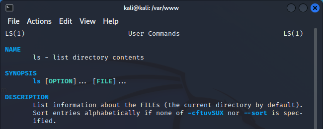
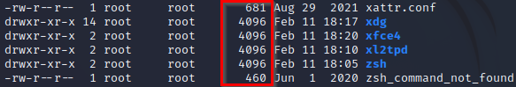
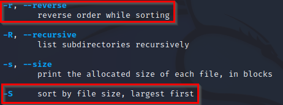

= The Linux Manual

Author: Dr. Jim Marquardson

Changelog

* 2022-08-15 Initial Version

The Linux command-line interface (CLI) has a steep learning curve. One of the most important skills with Linx (and life in general) is to learn how to learn. Linux comes with a built-in manual, but learning how to read the manual is key.

== Learning Objectives

You should be able to:

* Launch the Linux manual for specific commands
* Navigate the manual
* Exit the manual
* Use the manual to craft new commands

== The Manual

Linux comes with a manual. The `man` command launches the manual. The manual for a specific command can be launched directly from the terminal by entering the command after `man`, such as `man ls`. These manuals are often referred to as "man pages," having nothing to do with gender--"man" is just short for "manual."

In the Linux world, people are expected to read the documentation before asking questions. A simple question might be met with the response, "RTFM" which stands for "read the flipping manual" except the "f" doesn't stand for flipping. Manual first. Questions later.

This section will guide you through basic use of the manual.

. Run the following command to learn about the `ls` command.
+
----
$ man ls
----
. The manual application will launch, overtaking the terminal window.
+
.Linux manual entry for ls

. The command name, syntax, and description are at the top of the page.
. Scroll up and down with the arrow keys or the page up/down keys. You can also scroll with your mouse wheel (if available).
. When finished reading, press `q` to quit. Do not use the `File` menu to quit the manual application--that would close the whole terminal window. (Though if you did close the terminal window, you could simply open another one. No harm done.)

== Exercise: Learning to Sort

In this section, you will use the Linux manual to learn new ways to use the `ls` command.

. Run the following command to change directories to /etc.
+
----
$ cd /etc
----
. Run the following command to list the files and directories in long format.
+
----
$ ls -l
----
. File sizes are listed next to the date in the output. Notice that the file sizes are in no particular order (i.e., unsorted). It might be useful to sort the output to find the biggest or smallest files.
+
.Listing of ls -l

. Run the following to launch the manual for the `ls` command:
+
----
$ man ls
----
. There should be a few helpful entries that describe how to sort.
+
.Sort options for ls

. Notice that `-S` (capital `S`) can be used for sorting by file size, from largest to smallest.
. Notice that either `-r` or `--reverse` can be used to sort in reverse order.
. Putting these things together, a command to sort files from biggest to smallest or smallest to biggest can be created.
. Run the following command to list the files from largest to smallest in a long format:
+
----
$ ls -lS
----
+
You could also run the following:
+
----
$ ls -Sl
----
+
With the `ls` command (and most commands), the order of the options after the dash does not matter.
. Run the following command to list the riles from smallest to largest in a long format:
+
----
$ ls -lSr
----
+
This command basically says, "list the files in long format, sorted by size, in reverse."

It is very easy to forget the options for Linux commands. That is why being able to read the Linux manual is key.

== Change: Advanced ls

Use the Linux manual to come up with new ways to use the `ls` command.

. It can be hard to process file sizes by looking at total bytes. Instead of showing files as 4096 bytes, find a way to show the file sizes at 4.0K.
. By default, `ls` will hide files that start with a period, such as .htaccess. Find a way to show these files. What hidden files exist in your home directory?

== Reflection

* Imagine you are a new employee at a tech company. Why would your mentor expect you to check the Linux manual before asking how to do something?
* What do you find helpful or lacking in the Linux manual?
* Where else would you go for help besides the Linux manual?

