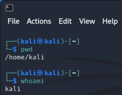
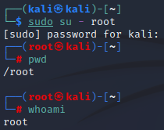
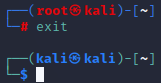

= Root

The Linux root account is the privileged administrator account. The root account has access to create, read, update, an delete anything on the Linux system. It is a powerful account and if used carelessly could result in crashing the system. So let's try it out!

== Learning Objectives

You should be able to:

* Run individual commands with elevated permissions using `sudo`.
* Switch to the root user using the `su` command.
* Switch back to a regular user account.

== sudo

The `sudo` command can be used to run a single command with elevated privileges.

. Open a new terminal.
. Double-check that you are logged in with the `kali` account and are in your home directory.
+
.Regular kali account in the home directory

. Run the following command to try to list the root user's home directory:
+
[source,shell]
----
ls -a /root
----
+
You should get a permission denied error. Note that all other user home directories will be in `/home`.
. Run the following command to run `ls` with elevated privileges:
+
[source,shell]
----
sudo ls -a /root
----
+
You will be prompted for the sudo password, which is `kali`.
. Run `whoami` to verify that your account is still kali.

The `sudo` command is often used when making changes to system files and settings.

== Switching to root

Generally, it is a good idea to switch to the root user only when needed. Regular system usage should be done with a non-privileged account (like the kali user account). But there are times when switching to the root account will be helpful.

. Run the following "substitute user" command to switch users to the root account.
+
[source,shell]
----
sudo su - root
----
+
If you just entered the sudo password, you will not be prompted to re-enter the `kali` password.
. Run `pwd` and `whoami` to check your current information.
+
.pwd and whoami after sudo su - root

+
Notice that the current user is now `root`, and the working directory is /root. You did not `cd` to change directories, but by switching users with `su -` you basically logged into the system with that user account. Notice that the prompt also changed to show `root@kali` instead of `kali@kali`.
. Run:
+
[source,shell]
----
ls -a
----
+
You should see a listing of the files (including hidden files starting with a period) in the root user's folder. You should not get a permission denied error.
. Run:
+
[source,shell]
----
exit
----
+
Notice that the terminal program did not exit. You only exited from the root user account.
+
.Exit from the root account

. Run:
+
[source,shell]
----
exit
----
+
Notice that this time, the terminal application exited.

== Reflection

* What is the benefit of computers making you elevate permissions to perform certain tasks?
* What would go wrong if all users were given root privileges?

== See Also

* https://i.redd.it/if5ikirzf0ua1.jpg
