= Create, Move And Delete Files and Directories

Author: Dr. Jim Marquardson

Changelog

* 2022-08-15 Initial Version

It is important to be able to work with files and directories on Linux. There are several ways to create files in Linux. This section will focus on using the `touch` command to create empty files. You will use the `mkdir` (make directory) command to create directories. Files will be renamed with the `mv` (move) command. You will then delete those files with `rm` (remove).

== Learning Objectives

You should be able to:

* Create files using the `touch` command
* Create folders using the `mkdir` command
* Rename files using the `mv` command
* Use the `*` wildcard character
* Remove files and folders using the `rm` command.

== Prerequisites

You should already:

* Have a Kali virtual machine running in VirtualBox
* Know how to use the `pwd`, `ls`, and `cd` commands.

== Exercise Touching Files

The `touch` command can do several things. First, it can be used to create new, empty files. The touch command can also be used to update the last modified dates and other date properties of files, but we won't get into that.

. Boot Kali Linux in VirtualBox if it is not already running. (Login with kali/kali if needed).
. Launch a new terminal.
.. Your new terminal will start in your home directory by default.
.. Run `pwd` to ensure that your working directory is /home/kali.
. Create a new file with the following command:
+
----
$ touch you.txt
----
. Notice that Linux does not give you any indication that the command succeeded. This is the Linux way. No news is (hopefully) good news.
+
.Touch command output: nothing
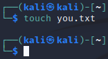
. Create a new file called me.txt with the touch command.
+
----
$ touch me.txt
----
. Verify that the files exist using the list command.
+
----
$ ls
----
+
.me.txt and you.txt are present
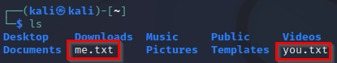

== Move files with mv

It is generally not a great idea to litter your home directory with random files. Looking at the contents of your home directory, notice that there is a `Documents` directory. Follow the steps below to move me.txt and you.txt into the Documents folder.

. Run the following `mv` (move) command to move me.txt to the Documents directory.
+
----
$ mv me.txt Documents
----
+
Again, new news is (hopefully) good news.
+
.me.txt moved
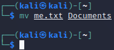
. Run the following list commands to check the contents of /home/kali and /home/kali/Documents. Remember that case matters.
+
----
$ ls
$ ls Documents
----
+
The `ls` command knows that "Documents" is a directory in the current working directory, so adding it to the `ls` command tells the `ls` command to list the files in that directory.
+
.List after moving me.txt
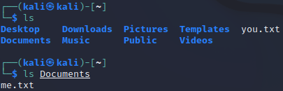
. Adapt the previous commands to move you.txt into the Documents folder.
. Change directories to your Documents folder.
. When finished, run the `ls` command to view the contents. You should see the following.
+
.me.txt and you.txt in Documents
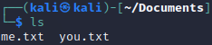

== Create Directories

The files are organized better already, but typically we want to organize files in multiple directories. You might have a different directory for each project you are working on, for example. Next, you will use `mkdir` to create a directory.

. Your working directory should be /home/kali/Documents. Use `pwd` to verify that this is your working directory.
. Run the following command to create the "sweetcaroline" directory.
+
----
$mkdir sweetcaroline
----
+
Again, no news is good news.
. List the files and folder in the Documents directory.
+
----
$ ls
----
+
.sweetcaroline created
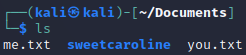
+
Notice that in the Kali terminal, files have a white font and directories are blue.
. That's about how complicated it is to create a directory using the command-line interface in Linux.
. Move both text files into sweetcaroline using the following command.
+
----
$ mv *.txt sweetcaroline
----
+
//Must escape the first instance of the asterisk so that the contents are not bolded.
Instead of moving files one by one, it is possible to move multiple files at once. Here, the `\*` character is used to match any file that has the .txt extension. The `*` character is a common wildcard character. Wildcard characters are used for pattern matching.
. Change directories to sweetcaroline and list the files.
+
.me.txt and you.txt in sweetcaroline
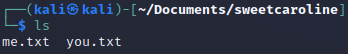

== Deleting Files

Files are deleted with the `rm` remove command. Pay attention when using the `rm` command. Linux will let you accidentally delete everything on your system.

. Use `pwd` to ensure that your working directory is `/home/kali/Documents/sweetcaroline`.
. Run the following command to delete me.txt.
+
----
$ rm me.txt
----
+
Notice that there is no prompt about making sure you really want to do it. The file just gets deleted.
. Verify that me.txt was deleted by listing the directory's contents.
+
----
$ ls
----
+
.sweetcaroline after a file deletion
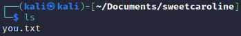

== Deleting Directories

Deleting directories with the `rm` command requires additional options.

. Use `pwd` to ensure that your working directory is `/home/kali/Documents/sweetcaroline`.
. Create a new folder called `imempty`. (Refer to the syntax) for creating folders if you need help with this command.
. List the contents of sweetcaroline.
+
----
$ ls sweetcaroline
----
+
.imempty directory created
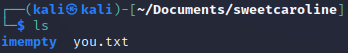
. Try to delete the imempty directory with the `rm` command. (The command below will fail.)
+
----
$ rm imempty
----
+
It won't work. By default, `rm` does not delete directories. This is a basic safeguard to make sure that you don't delete things accidentally.
. Use the following command to recursively delete imempty and any (nonexistant in this case) subdirectories.
+
----
$ rm -r imempty
----
+
.Recursively remove impempty
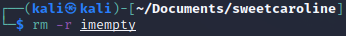
. Run `ls` to ensure that the imempty directory has been removed. Note that you.txt still exists in the sweetcaroline directory.
. Run the following command to change working directories to the Documents directory.
+
----
$ cd ..
----
. Delete the sweetcaroline directory.
+
----
$ rm -r sweetcaroline
----
. Verify that the Documents directory is empty using the `ls` command.

== Files and Directories with Spaces

In the Linux world, the use of spaces in files and directory names is discouraged. Spaces just complicate things from the command line. The solution for using spaces is to put quotes around file and directory names.

. Ensure that your working directory is /home/kali/Documents using the `pwd` command.
. Create a directory called `it works` with the following command.
+
----
$ mkdir "it works"
----
. List the files with `ls`.
+
.Directory with a space in the name
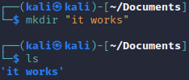
. The same thing can be done with files.
. Create a file named "imma file.txt" with the following command.
+
----
$ touch "imma file.txt"
----
. List the contents of Documents with `ls`.
. Delete the file and directory with the following commands.
+
----
$ rm "imma file.txt"
$ rm "it works" -r
----

== Practice with Files and Directories

. Create a new directory in Documents with the name of a fruit.
. Create three files in the new directory with the names of people you know (e.g., alice, bob).
. Rename the files to the names of different colors (e.g., red, blue, yellow).
. Delete the files one by one.
. Delete the directory you created with the fruit name.

Tips:

* Pay attention to your working directory using `pwd`.
* You may need to move around using `cd`.

== Reflection

* Why is organizing files in directories a best practice?
* How might the command line interface be more efficient than a graphical user interface for working with files and directories?

