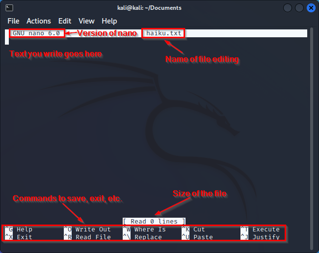
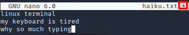
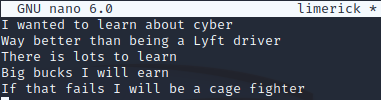
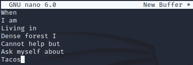
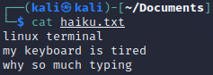

= Editing Files With Nano

Nano is a simple text editing application that runs in the terminal. It is commonly installed in most Linux distributions. Nano is one of the easiest ways to quickly make changes to text files.

== Learning Objectives

You should be able to:

* Launch nano
* Edit a new file with nano
* Edit an existing file with nano
* Save nano files
* Exit nano
* Use the cat command to print the contents of files

== Prerequisites

This lab requires a Kali Linux virtual machine. You should already know:

* How to navigate directories using `cd`
* How to check your current working directory with `pwd`
* How to create files with `touch`

== Editing Existing Files with Nano

. Open a terminal window. Navigate to your home directory's Documents folder with the following command.
+
[source,shell]
----
cd ~/Documents
----
+
No matter what your working directory was previously, you will now be in /home/kali/Documents. ~/Documents in an absolute path, not a relative path.
. Create a text file called haiku.txt with the touch command.
+
[source,shell]
----
touch haiku.txt
----
. Launch the `nano` editor with haiku.txt ready for editing using the following command.
+
[source,shell]
----
nano haiku.txt
----
. Nano will take over the entire terminal window until you exit.
. Note the various interface elements.
+
.nano interface

. Just start typing to add text. This might seem obvious, but other Linux text editors are less intuitive.
. Write a haiku. As a reminder, a haiku has 3 lines. The first line has 5 syllables, the second line has 7 syllables, and the last line has 5 syllables. Your worth as a human being depends heavily on the quality of the haiku that you write in this exercise. Below is a sample.
+
.Haiku that makes minstrels weep

+
Note that the asterisk next to haiku.txt now appears. The asterisk indicates that the file has unsaved changes.
. Having a "save" command option would be too obvious, so the makers of nano decided to call this feature "write out."
+
."Write out" to save

+
The *write out* command is used by pressing the control key and "o" at the same time.
. Nano will give you a chance to save the file as a new name. Here, simply press the enter key to accept the suggested name.
+
.File name to write

. Nano should indicate that the write was written (i.e., saved). The asterisk next to the file name will disappear indicating that there are no unsaved changes.
. Press control + "x" to exit nano. Nano will close and you will be back in the normal terminal interface.

== Editing New Named Files with Nano

Once you know how to edit existing files with `nano`, creating and editing new files is not rocket surgery. Next, you will create a file that has no file extension. In the Linux world, file extensions are not required. Many Linux system files have file names without extensions.

. Run the following command to start editing a new file called `limerick` (with no file extension).
+
[source,shell]
----
nano limerick
----
. Write a limerick. As a reminder, limericks have five lines. The first, second, and fifth lines must have seven to ten syllables and rhyme. The third and fourth lines should be shorter--5 to seven syllables--and rhyme with each other. Below is an example.
+
.Career in limerick form

. Note that the proposed file name is in the header. This file does not exist, yet. Again, the asterisk indicates unsaved changes.
. Use control+o to save the file.
. Accept the file name--it will be the same name you entered in the terminal after the nano command.
. Use contrl+x to exit.
. Run `ls` to show the files. The files "haiku.txt" and "limerick" should exist.

== Editing New Unnamed Files with Nano

You can launch nano and start editing files before you know the file name.

. Run the following command from the terminal.
+
[source,shell]
----
nano
----
+
Nano will launch and you can start typing text.
. Write an acrostic. In an acrostic, the first letter of each line forms a secret message. Below is an example.
+
.Acrostic

+
Notice that where the file name would be we see "New Buffer."
. Press control+o to save the file. Name the file acrostic.txt. Notice that once saved, "New Buffer" will be replaced with "acrostic.txt."
. Press control+x to exit.

== Use Cat to Print File Contents

The `cat` command can be used to display file contents in the terminal.

. Run the following commands to display the poems.
+
[source,shell]
----
cat haiku.txt
----
+
.Haiku printed with cat

. Run the following command to print the limerick.
+
[source,shell]
----
cat limerick
----
+
.Limerick printed with cat

Notice that `cat` does not care about the file extension.

== Practice

. Create a new file for a poem.
. Add text to the file with `nano`.
. Save the file and exit `nano`.
. Display the contents of the file with the `cat` command.
. Create a new directory called "poems."
. Move all of your poems into the poems directory.
. List the files in the poems directory.

== Reflection

* How does nano compare to other text editors you have used.
* In what ways are plain text files better or worse than Word documents?
* How much better would Bill Shakespeare's work have been if he had access to nano?
