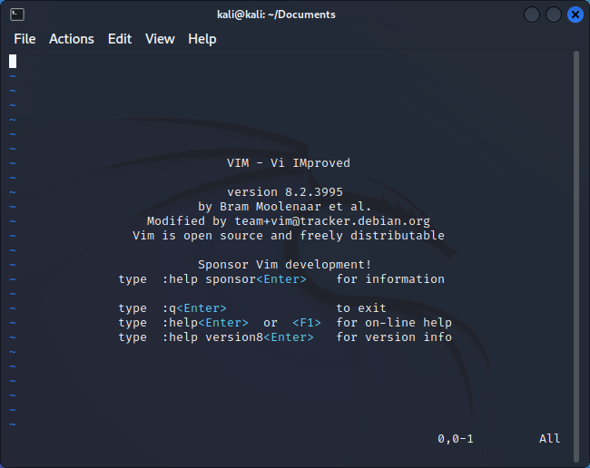
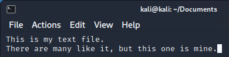
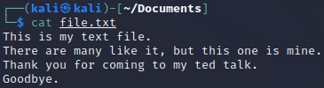

= Editing Files With Vim

Author: Dr. Jim Marquardson

Changelog

* 2022-08-15 Initial Version

Vim is a terminal text editor installed on every Linux system. It has existed for decades and will likely exist until the heat death of the universe. So, if you plan to use Linux at all in your life, it is worth getting to know vim. Becoming a vim ninja takes many, many hours of dedicated work. Here, you will learn the basics so that you can survive. Many Linux applications use the same keyboard shortcuts as vim, so learning a bit about vim can help you in other administrative tasks.

== Learning Objectives

You should be able to:

* Launch vim
* Change between command mode and insert mode
** escape for command mode
** i for insert mode
* Add text
* Save files
** :w
* Exit vim (very much not obvious)
** :q
** :wq
** :q!

== Vim Modes

Vim is different than many other text editors in that it has two distinct modes:

1. Command mode. In this mode, the keys you type on the keyboard run commands rather than adding text.
2. Insert mode. In this mode, the keys you type add text to the document.

If you are in the command mode when you want to write text, vim will look like it's going nuts.

== Create a File in vim

This will walk you through the absoulte basics of using vim.

. In Kali, navigate to your Documents folder in your home directory.
+
----
$ cd ~/Documents
----
. Launch vim just by running the `vim` command.
+
----
$ vim
----
. The vim editor will take over the terminal window.
+
.Vim interface

. Type the text `fleck`. Notice that no text appears in the window. This is because vim default to opening in *command* mode.
. Type `i` to enter *insert* mode. Note that the insert mode will be indicated in the bottom left.
+
.Insert mode entered
image::insert-mode-label.png[insert mode enabled]
. Type the text `fleck` again. This time, the text will actually appear.
. In insert mode, you can use the arrow keys, enter key, etc. to add text.
. Add some text. Below is an example.
+
.Sample text in vim

. To save files in vim, you have to change the mode to command mode.
. Press the scape key to exit insert mode and enter command mode.
. To save the file:
.. Press `shift+:` to enter the colon character.
.. Enter `w file.txt`. The `w` command tells vim to *write* the contents to a file.
.. Press enter. The file should now be saved.
. Press `i` to enter insert mode again.
. Add some more text.
. Press escape to leave insert mode and enter command mode.
. Enter `:w` and press enter. Because you already gave the file a name, you do not need to enter it again. All changes should be saved.
. While still in command mode, enter `:q` and press enter to quit vim.

== Edit a File in vim

You created `file.txt` in the last section. Here, you will edit this file.

. Run the following command to open file.txt in vim.
+
----
$ vim file.txt
----
+
You should see all of the file's content.
. Type `i` to enter insert mode.
. Add some text to the file.
. Press escape to enter command mode.
. Type `:wq` to save the changes and quit. The `w` and `q` commands can be run together or separately.
. Display the file contents with `cat`.
+
----
$ cat file.txt
----
+
.Contents of file.txt with cat

== Exit vim Without Saving

There are time when you make changes to a file, but do not want to save the changes.

. Edit file.txt with vim again.
+
----
$ vim file.txt
----
. Type `i` to enter insert mode.
. Change some text.
. Press escape to enter command mode.
. Type `:q!` to quit vim. Notice that the `w` command was omitted because we do not want to write the changes to disk. The `q` command quits vim. The exclamaion point (`!`) tells vim to ignore any unsaved changes.

== Power of vim

At this point, you might think that the people who made vim are either crazy or masochists. But these exercises only touch on the most basic vim funcionality. By separating command mode and insert mode, vim can do very powerful things to make editing text efficient.

There are many ways to learn more advanced vim features. One fun resource is https://vim-adventures.com/.

== Reflection

* What text editors do you prefer?
* Why would it be worth investing time in learning a text editor?
