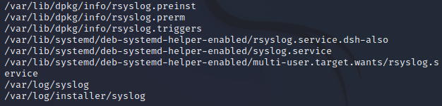

= Searching For Files

If you have ever forgotten where you saved a file, you know the value of search. Tools exist on Linux to search for files by file name, or you can search the contents of files.

== Learning Objectives

You should be able to:

* Search file name using `locate`
* Search file contents using `grep`

== Searching for File Names

The `locate` command can be used to find files by filename. The locate command searches all file names on the computer using an index that is rebuilt periodically (often daily). It is possible that very new files may not be in the index. A benefit of the locate command is that it runs extremely quickly--the database is typically searched in less than a second.

. Launch a Kali terminal.
. If your Kali virtual machine is new, the database of files might not be updated. Run the following command to update the database.
+
----
sudo updatedb
----
. Imagine that you have heard that Linux has a system log called "syslog." Run the following command to find files that have "syslog" in the file name.
+
----
locate syslog
----
+
You will see output similar to the following.
+
.'locate syslog' output

. There are a lot of results. It may take some time to look through the results to find the file you really want.
. By default, `locate` finds matches in the directory or file name. So a search for "bunny" would find /home/kali/bunny/easter.txt and /home/kali/bunny.txt.
. To search only for file names (not directories), use the `-b` option.
+
----
locate -b syslog
----

In this example, the file /var/log/syslog is the file you are looking for.

Remember that `locate` only looks at file names--it does not look at any of the file content.

== Load Files

. Run the following command in the Kali terminal to ensure you are in your home directory.
+
----
cd ~
----
. Run the following command to delete the cyfunfiles directory (if it exists).
+
----
rm -rf cyfunfiles
----
. Run the following command to download files from the internet. This will create a new folder called *cyfunfiles* in your home directory.
+
----
git clone https://github.com/jimmarq/cyfunfiles.git
----
. Change directories to the *cyfunfiles* directory.
+
----
cd cyfunfiles
----
. Change directories to the *linux_finding* subdirectory.
+
----
cd linux_finding
----
. Look at the files in the folder with `ls`.
+
----
ls
----
+
.Contents of the cyfunfiles directory

. Use the `locate` command to look for fruits.txt.
+
----
locate fruits.txt
----
+
If you just checked out the files from GitHub for the first time, the `locate` command could not find fruits.txt, even though you obviously see it.
. Run the following command to update the database of files on your system.
+
----
sudo updatedb
----
+
You may need to enter the password `kali` if prompted. This command will take about 15 seconds to run. It is indexing all of the file names on your system.
. Run the following command to look for fruits.txt again.
+
----
locate fruits.txt
----
+
You should see that fruits.txt can be found in /home/kali/cyfunfiles/linux_finding/.

== Searching for File Content

The `grep` command looks inside files for specific contents. The syntax is `grep [options] [search pattern] [file(s) to search]`

. Run the following command to look for the word *celery* in the file veggies.txt.
+
----
grep "celery" veggies.txt
----
+
If the output is not blank, it means the text was found.
. Search for the word "strawberry" in veggies.txt.
+
----
grep "strawberry" veggies.txt
----
+
In this case, there is no output, meaning that the search did not return any results.
+
.Search results for celery and strawberry

. Run the following command to look for the word *banana* in all files in the current folder.
+
----
grep "banana" ./*
----
+
The "./" tells Linux to look in the current folder, and the asterisk tells kali to match any file name. The grep command should find the word *banana* in fruits.txt.

== Challenge

. Find entries in the /var/log/auth.log file that have the words "user root."
. Find files with the name "firefox" in the file name only.
. Find files and directories with "apache" in the name.
. How many employees work for the company "Tavu?" The file customer_data.txt in the linux_finding directory contains customer information.

// Solutions:
// grep -a "user root" /var/log/auth.log
// locate firefox
// locate -b apache
// grep "Tavu" ./*

== Reflection

* When would it be most useful to search by file name?
* When would it be most useful to search for content within files?

