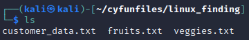
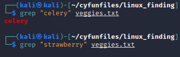

= Searching For Files

If you have ever forgotten where you saved a file, you know the value of search. Tools exist on Linux to search for files by file name, or you can search the contents of files.

== Learning Objectives

You should be able to:

* Search file contents using `grep`
* Look for content from command output using `grep`

== Load Files

. Run the following command in the Kali terminal to ensure you are in your home directory.
+
[source,shell]
----
cd ~
----
. Run the following command to delete the cyfunfiles directory (if it exists).
+
[source,shell]
----
rm -rf cyfunfiles
----
. Run the following command to download files from the internet. This will create a new folder called *cyfunfiles* in your home directory.
+
[source,shell]
----
git clone https://github.com/jimmarq/cyfunfiles.git
----
. Change directories to the *cyfunfiles* directory.
+
[source,shell]
----
cd cyfunfiles
----
. Change directories to the *linux_finding* subdirectory.
+
[source,shell]
----
cd linux_finding
----
. Look at the files in the folder with `ls`.
+
[source,shell]
----
ls
----
+
.Contents of the cyfunfiles directory

== Searching for File Content

The `grep` command looks inside files for specific contents. The syntax is `grep [options] [search pattern] [file(s) to search]`. This syntax says, "Look for this pattern in this place."

. Run the following command to look for the word *celery* in the file veggies.txt.
+
[source,shell]
----
grep "celery" veggies.txt
----
+
If the output is not blank, it means the text was found.
. Search for the word "strawberry" in veggies.txt.
+
[source,shell]
----
grep strawberry veggies.txt
----
+
In this case, there is no output, meaning that the search did not return any results.
+
Notice that no quotation marks were put around the word `strawberry`. This is because the word does not contain any spaces. If the word had spaces, the quotation marks would be required.
+
.Search results for celery and strawberry

. Run the following command to look for the word *banana* in all files in the current folder.
+
[source,shell]
----
grep banana ./*
----
+
The "./" tells Linux to look in the current folder, and the asterisk tells Kali to match any file name. The grep command should find the word *banana* in fruits.txt.
. The following command searches for content with a space.
+
[source,shell]
----
grep "they are" fruits.txt
----
+
Without the quotation marks, the `grep` command would get confused. It would think that the word *they* was the search term, and that *are* was the file name.

== Useful Options

The following are useful grep options.

. `-i` - ignore case. By default, Linux is case-sensitive. This option tells Linux to ignore the case. Example: 
+
[source,shell]
----
grep -i please /var/www/html/index.html
----
+
This would match both "Please" and "please."
+
Without the `-i` option, the search would only match "please."
+
[source,shell]
----
grep please /var/www/html/index.html
----
. `-r` - recursive. This option tells Linux to search all subdirectories. Example:
+
[source,shell]
----
grep -r please /var/www/html/
----
+
Note that this search is case-sensitive. To make it case-insensitive, add the `-i` option.
+
[source,shell]
----
grep -ri please /var/www/html/
----
. `-n` - show line numbers. This option tells Linux to show the line number where the search term was found. Example:
+
[source,shell]
----
grep -ni please /var/www/html/index.html
----
+
Line numbers are helpful if you want to edit the file and need to know where to make the change.

== Searching in Command Output

Some Linux commands produce a lot of output, and it can be time-consuming to scroll through the output to find what you are looking for. The `grep` command can be used to search the output of other commands.

. Run the following command to list the contents of the `/etc/passwd` file.
+
[source,shell]
----
cat /etc/passwd
----
. There is a lot of content. But perhaps you only want to look at the line for the `kali` user. Run the following command to search for the word *kali* in the output of the `cat` command.
+
[source,shell]
----
cat /etc/passwd | grep kali
----
+
In this case, the `grep` command is missing the file name. This is because the `grep` command is getting its input from the `cat` command. The `|` symbol is called a pipe. It tells Linux to take the output of the command on the left and use it as input for the command on the right.
. List the files in the `/dev/` directory. The `/dev/` directory contains files that represent hardware devices.
+
[source,shell]
----
ls /dev/
----
+
There are a lot of files in this directory. Perhaps you only want to see the files that represent hard drives. Run the following command to search for the word *sd* in the output of the `ls` command.
+
[source,shell]
----
ls /dev/ | grep sd
----
. In modern versions of Kali (and many other modern Linux distributions), the tool `journalctl` can be used to list logs. But logs can be enormous. Run the following command to list the logs for the current boot.
+
[source,shell]
----
journalctl -b
----
+
Press the space bar to page through the results. When you are sick of looking at logs, press `q` to quit.
. Perhaps you want to look for a specific log entry. Run the following command to search for the word *error* in the output of the `journalctl` command.
+
[source,shell]
----
journalctl -b | grep -i failure
----
+
If you do not get any results, try replacing "failure" with "error" or "warning."

Many Linux commands produce text output. Grep searches text. Therefore, grep can be paired with many Linux commands.

== Regular Expressions

Regular expressions are search patterns. There is nothing "regular" about them. The name is basically a historical artifact. Regular expressions are used in many programming languages and tools, including Linux.

Here are some common elements of regular expressions:

. `.` - match any character
. `*` - match zero or more of the previous character
. `+` - match one or more of the previous character
. `?` - match zero or one of the previous character
. `^` - match the beginning of a line
. `$` - match the end of a line
. `[]` - match any character in the brackets
. `\` - escape character. This is used to escape special characters. For example, `\.` would match a literal period.

There are more regular expression elements, but these are common,

. This regular expression searches for email addresses in the file that start with the letter `s`.
[source,shell]
----
grep -E ,s[a-z]*@ customer_data.txt
----
+
The email address is always preceded by a comma in this particular file, so the search starts with a comma. Then, the letter `s` is used to indicate that an `s` should immediately follow. Brackets are used to define character sets. In this case, `[a-z]` says to match any character from `a` to `z`. The `*` means "zero or more of the previous character." The `@` is a literal `@` symbol. So in plain English, look for a comma followed by an s, followed by zero or more letters from a to z, followed by an `@` symbol.
. The following grep command looks for a single digit at the start of a line, followed by a comma.
+
[source,shell]
----
grep ^[0-9], customer_data.txt
----
. The following grep command looks for any ID that ends with the number 5.
[source,shell]
----
grep ^[0-9]*5, customer_data.txt
----
. The following grep command looks for any line that ends with the letter "x."
+
[source,shell]
----
grep x$ customer_data.txt
----
+
Here, the dollar sign means "end of line."
. The following grep command looks for all email addresses ending with ".gov".
+
[source,shell]
----
grep \.gov customer_data.txt
----
+
Here, the slash ('\') is used to escape the period. Otherwise, the period could mean "any character."

== Challenge

. Find entries in the /var/www/html/index.html for lines that contain the word "please."
.. Find words that contain "Please" with a capital **P** in the same file.
.. Look at the **grep** manual to find a way to perform a case-insensitive search.
. How many employees work for the company "Tavu?" The file customer_data.txt in the linux_finding directory contains customer information.
. Use grep to look for hardware devices that have "cd" in the name. (The /dev/ directory contains files that represent hardware devices.)
. The following regular expression to look for a social security number is flawed. How can you fix it?
+
[source,shell]
----
echo "123-45-3820" | grep [0-9]?-[0-9]?-[0-9]?
----

== Reflection

* When would it be most useful to search by file name?
* When would it be most useful to search for content within files?

