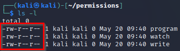
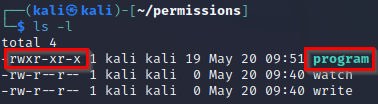
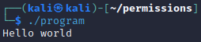
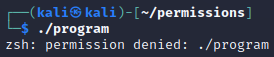

= Permissions

Restricting access to files and folders is important for maintaining confidentiality. Linux has features that allow different users or groups to read files, write to files, or execute programs.

== Learning Objectives

You should be able to:

* Describe read, write, and execute permissions
* Interpret the *user*, *group*, and *other* permissions
* Use the `chmod` command to change permissions
* Execute a program after granting execute permissions

== Read, Write, and Execute

Limiting access to resources is key to maintaining confidentiality. In Linux, file permissions can be modified to grant read, write, and execute permissions. These permissions will show up in the terminal as `r`, `w`, and `x`.

* Read permissions. This allows users to display the contents of the file, or open the file in a program. Just because somebody can read a file does not mean that they can make changes.
* Write permissions. People can update or delete files. Technically, it is possible to grant somebody write permissions without read permissions, but that is often reserved for special systems processes. In most cases, if you grant write permissions, you likely want to grant read permissions as well.
* Execute permissions. The Linux execute permission is very different from permissions on Windows. In Linux, just because a program exists on a computer does not necessarily mean that you can run it. Execute permissions have to be granted in some cases.

The `chmod` command can use numbers that represent the permissions.

|========
| Read    | 4
| Write   | 2
| Execute | 1
|========

You can compute permissions by adding the numbers for the desired permissions. For example, if a user needs `read` and `execute` permissions, you would add 4 + 1 to get 5. Every combination of permissions can be represented uniquely with the numbers 1-7.

|========
| Read (4) | Write (2) | Execute (1) | Sum
| No       | No        | No          | 0
| No       | No        | Yes         | 1
| No       | Yes       | No          | 2
| No       | Yes       | Yes         | 3
| Yes      | No        | No          | 4
| Yes      | No        | Yes         | 5
| Yes      | Yes       | No          | 6
| Yes      | Yes       | Yes         | 7
|========

== Create Files

This section will have you create several files. Later, you will set the permissions on the files.

. Start your Kali virtual machine in VirtualBox.
. Open a new terminal window.
. Run the following command to ensure that you are in your home directory.
+
[source,sh]
----
cd ~
----
. Run the following command to create a new folder called `permissions`.
+
[source,sh]
----
mkdir permissions
----
. Change directories to the new *permissions* folder.
+
[source,sh]
----
cd permissions
----
. Use the `touch` command to create files called *program*, *watch*, and *write*.
+
[source,sh]
----
touch program
touch watch
touch write
----

At this point, there are now three files in the *permissions* folder.

== Listing File Permissions

. Run `ls -l` to list the files in the long format which shows the permissions.
+
[source,sh]
----
ls -l
----
+
.ls -l output

Notice the dashes and letters. The first column's dash indicates that *program*, *watch*, and *write* are files. The *r* indicates read access. The *w* indicates write access. 

There are 3 sets of permissions (that correspond to the 3 read permissions):

. Owner - The user who "owns" the file. Often, this is the creator of the file, but ownership can be transferred. In the current case, the *kali* user is the owner.
. Group - Groups of users that can be granted permissions. In the current case, the *kali* group has access to the file.
. Other - People who are not owners or given access via a group are "other."

Looking at the permissions, you can read and write all three files, but not execute them.

== Executing Files

There are times when you need to download a file from the internet and execute it (i.e., run it). In this section, you will write a very small program, add the execute permissions, and then run the program.

. Open the *program* file in `nano`.
+
[source,sh]
----
nano program
----
. Add the following text
+
----
echo "Hello world"
----
. Run the following command to add the execute permission.
+
[source,sh]
----
chmod +x program
----
. List the folder contents with the permissions.
+
[source,sh]
----
ls -l
----
+
.ls -l output after adding execute permissions

+
Note that the "x" permission now exists. Also, the word *program* is now in a different font to show that is can be executed.
. Run the program with a period, forward slash, and the name of the program.
+
[source,sh]
----
./program
----
+
.Running "program"

. Remove the execute permission.
+
[source,sh]
----
chmod -x program
----
. Try running the program again.
+
[source,sh]
----
./program
----
+
.Execution fails

+
Note that the program will not run.

Unlike Windows, programs in Linux can have any file name. They do not always have extensions. In Windows, you often tell a program by its *.exe* file extension.

== Group Permissions

In the previous section, the `chmod` command was used to grant execute permissions to user, group, and other. It is possible to grant permissions granularly. In this section you will modify the group permissions.

. Verify the permissions using `ls -l`.
+
[source,sh]
----
ls -l
----
. Note that the *kali* group does not have write access to any of the files.
. Run the following command to grant the *kali* group access to the *write* file.
+
[source,sh]
----
chmod g+w write
----
. Check the permissions. Note that the group now has write access.
+
[source,sh]
----
ls -l
----
+
.Write permissions granted

== User Permissions

Perhaps we want to protect a file so that changes are not made to it. Write access can be revoked.

. Verify the permissions using `ls -l`.
+
[source,sh]
----
ls -l
----
. Note that the *kali* user has write access to the *watch* file.
. Run the following command to revoke write access.
+
[source,sh]
----
chmod u-w watch
----
. Try to edit the file in `nano`.
+
[source,sh]
----
nano watch
----
. Notice that `nano` says that the file cannot be changed.
+
.Nano warning

. Quit nano.

== Using chmod with Numbers

. Create a new file called `permtest.txt`.
+
[source,sh]
----
touch permtest.txt
----
. Change its permissions to that the owner, groups, and others get full read, write and execute access (7, 7, and 7).
+
[source,sh]
----
chmod 777 permtest.txt
----
. Verify the permissions with `ls -l`
+
[source,sh]
----
ls -l
----
. Change the permissions so that the owner have read and execute permissions, the group have read and write permissions, and others do not have any permissions.
+
[source,sh]
----
chmod 560 permtest.txt
----
. Verify the permissions using the `ls`.
+
[source,sh]
----
ls -l
----

Because full owner, group, and other permissions can be set with a single command using numbers, installation instructions will often include instructions that set the permissions via numbers. Using numbers is a little less intuitive than manually setting individual permissions, such as `u+x`, but it is much more compact.

== Challenge

. Create a file called `me`.
. In the program, echo your name.
. Grant the execute permissions on `me`.
. Run the program.

== Cleanup

When finished, the permissions folder can be deleted with the following commands.

[source,sh]
----
cd ~
rm -rf permissions
----

== Reflection

* At a hospital, who should have access to read patient data, update patient data, and execute applications?
* At a hospital, what groups would you create to help manage access?
* Linux requires that the execute permission be added to programs. Why might this default help prevent people from malware infections?

