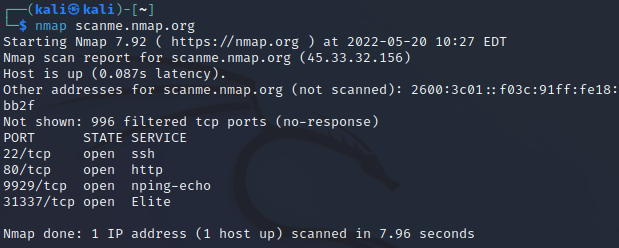
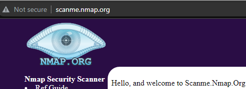
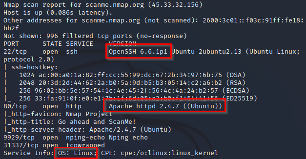

= Network Mapping

Author: Dr. Jim Marquardson

Changelog

* 2022-08-15 Initial Version

Network administrators, ethical hackers, malicious hackers, security auditors and others may need to run network scans to produce network maps. `Nmap` is a popular network mapping tool. Every day, millions of network scans are run on the internet, but that does not always mean that they are legal. Generally speaking, you should have permission before scanning somebody's network. In this chapter, you will scan a site that explicitly grants permission to scan--scanme.nmap.org.

== Learning Objectives

You should be able to:

* Describe the purpose of network scanning
* Run nmap from the command line
* Change scanning options

== Network Mapping

Network mapping is used to help us understand networks. Network mapping can be used to tell us what computers exist on a network, their IP addresses, and the services that they are running. For example, a server might host websites at the IP address 192.168.10.5. A different server might host email at 192.168.10.25. `Nmap` is the most popular network scanning software.

Network scanning is kind of like walking around a neighborhood and seeing what houses exist. Each house has a unique address. But you're not sure what is inside each house. So you walk up to each house and check to see if the doors are locked, the windows are shut, and if the hose is turned on. Even if you do not plan to break into the house, the occupents might be concerned about stranger checking everything out and call the police. Network scannins is a bit like this. With network scanning, you do a little bit of poking around to see what exists on a remote server, but you are not trying to break in.

So is network scanning legal? There is some gray area. It is very rare for somebody to be prosecuted simply for network scanning, but it happens. Generally, networking professionals do not freak out about their networks being scanned--it happens thousands of times per hour. But network professionals do not create the laws, and some prosecutors have applied hacking laws to people who perform network scans. The following is not legal advice, but likely sound advice. Do not do intrusive scans on government sites, especially the CIA, FBI, or Department of Defense. Stay away from banks. Generally, public tech companies like Microsoft, Google, and Amazon will not give you a headache if you scan their publicly accessible networks. The site scanme.nmap.org gives explicit permission to perform periodic scans.

== Basic nmap scan

. Launch the Kali virtual machine from VirtualBox.
. Open a terminal.
. Run the following command to do a basic network scan with namp. The scan should take less than 30 seconds to complete.
+
[source,sh]
----
$ nmap scanme.nmap.org
----
. The output should look similar to the following.
+
.nmap output

. Running a basic scan is easy. Interpreting the results takes more effort. Your scan results may differ from the scan when the screenshot above was taken. But below is an analysis of what the scan results in the screenshot say.
** The IPv4 address for scanme.nmap.org is 45.33.32.156
** The IPv6 address for scanme.nmap.org is 2600:3c01::f03c:91ff:fe18:bb2f
** The server is running the secure shell (SSH) service, which means that somebody with the right credentials can log on remotely.
** The server is listening on port 80, so it is likely that a website can be reached. Below is a screenshot of the website.
+
.scanme.nmap.org website

** The server is running nping, a tool used for network testing. We could test this in Kali.
+
----
$ nping scanme.nmap.org -p 9929
----
+
(Press control+c to stop the ping.)
** It is strange for a server to be listening on a very high port--31337. That is the hacker spelling of "elite." The server administrator is probably just having fun with us.

== Custom nmap scans

Nmap is powerful. Options can be configured to do things like operating system detection and service version detection.

. In the Kali terminal, run:
+
----
$ nmap -A scanme.nmap.org
----
+
The `-A` parameter tells nmap to try to figure out the name and version of everything it finds on the server.
. Review the output. It should be similar to the following.
+
.nmap output with version information

. Note the following.
.. For SSH, the server is running OpenSSH 6.6.1p1.
.. For the website, the server is running Apache 2.4.7.
.. The server's operating system is Linux.
. Run `man nmap` in the terminal to see what other options are available.
.. Find an additional options that could be helpful. For example, you might simply try operating system detection with `-O`.
+
----
$ nmap -O scanme.nmap.org
----
+
But running this command requires administrative privileges. Run it again with `sudo`.
+
----
$ sudo nmap -O scanme.nmap.org
----
+
Enter the password `kali` if needed. The the scan fails, press control+c to cancel the scan.
.. Press `q` to quite the manual.

== Challenge

* What operating system is your school's website running?
* What would the following scan options do? Use the manual or a search engine as needed.
** -A
** -O
** -sS
** -sU
** -sn

== Reflection

* How would you use network scanning responsibly?
* Imagine you are an network administrator for a company. How would you feel if somebody scanned your network one time? How would you feel if somebody scanned your network 1,000 times?
* How would malicious hackers use nmap?
* How would system auditors use nmap?

