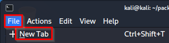
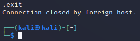
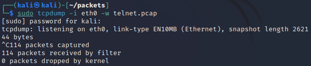
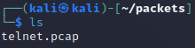
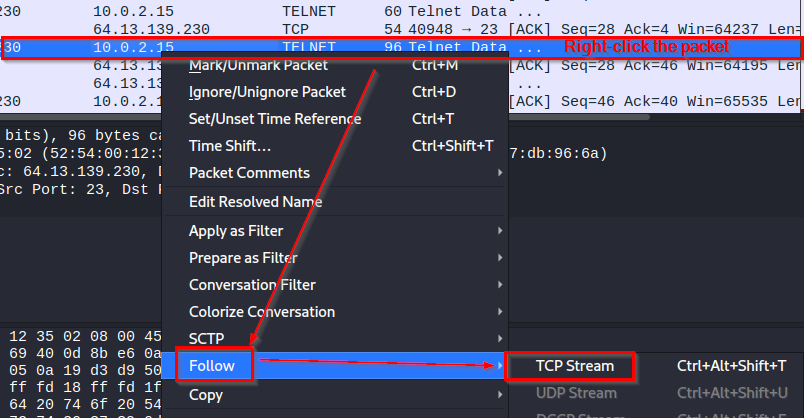
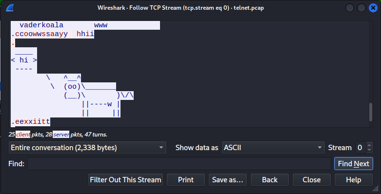

= Packet Inspection

From a user's perspective, computer networks just work. We don't usually have to care about the individual packets that get sent on the wire. Occasionally, we do care about the individual packets. A cybersecurity professional may want to make sure that data is being sent securely. A network administrator may need to look at network packets to troubleshoot problems. In this chapter, you will peel back the covers and take a look at individual network packets.

== Learning Objectives

You should be able to:

* Capture packets using tcpdump
* Analyze packet captures with WireShark

== Packets

A packet is a single chunk of data sent over the network. Your computer may need to receive hundreds of packets to load a high-resolution photo. Your computer assembles those packets to reconstruct the data. Sometimes those packets are sent across the network in cleartext--unencrypted. Sometimes the packets are encrypted.

Generally speaking, the software on our computers takes care of all of the network packets and we never have to investigate what is happening. But imagine that a company was planning to adopt network software to transmit data from its headquarters building to an off-site backup. That company might want to inspect the network packets to ensure that the data was transmitted in an encrypted format. Also, network administrators might need to troubleshoot problems. For example, a user might not be able to obtain an IP address automatically, and the network administrator could look at the network packets to determine what is going wrong.

Intrusion detection systems (IDS) automatically scan packets coming into a network to look for malicious traffic patterns. These systems work much like antivirus. But where antivirus programs typically look for malware signatures in files, IDSs look for malicious signatures in network traffic. An IDS might be installed in a large network where it can inspect all incoming and outgoing internet traffic. In some ways, an IDS acts like `tcpdump` in that it captures network packets, but an ID runs continuously and has sophisticated analytics and reporting on top of it.

== Use tcpdump to Capture Traffic

Tcpdump is a command-line tool that can be used to capture network traffic. Later, you will use a graphical program to inspect the packets.

. Launch a Kali terminal.
. Run the following command to ensure you are in your home directory.
+
[source,shell]
----
cd ~
----
. Make a new directory called *packets*.
+
[source,shell]
----
mkdir packets
----
. Change directories to the new *packets* directory.
+
[source,shell]
----
cd packets
----
. Verify that you are in the correct directory using `pwd`.
+
[source,shell]
----
pwd
----
+
You should be in /home/kali/packets.
. Run the following command to start capturing packets with `tcpdump`.
+
[source,shell]
----
sudo tcpdump -i eth0 -w telnet.pcap
----
+
The `tcpdump` will capture packets on the eth0 interface and write the file to telnet.pcap.
. Tcpdump will run until canceled.
. Open a new terminal tab by clicking File > New Tab (or open a new terminal window by pressing control+alt+t).
+
.Open a new terminal tab

. Run the following command to connect to a service called Telehack.
+
[source,shell]
----
telnet telehack.com
----
. You will be connected to a remote computer through your terminal.
. Run `cowsay hi` to run the `cowsay` program.
+
.Result of cowsay program

. Run `exit` to close the remote connection. You will not be back to running commands on your personal computer.
+
.Connection closed

. Close the current terminal tab by clicking the `X` or running the `exit` command.
. Press control+c to stop `tcpdump` in the original terminal tab. You should see the number of packets received. The number you capture will likely differ from the number in the following screenshot.
+
.Packets captured by tcpdump

. Confirm that the file exists by running `ls`.
+
.telnet.pcap now exists

== Analyze Capture in Wireshark

Wireshark is a graphical program that can be used to capture and analyze `pcap` files. You already made the capture file, so we will only use Wireshark to analyze the file.

. In the terminal, run the following command to open the capture file in Wireshark.
+
[source,shell]
----
wireshark telnet.pcap
----
. Wireshark displays a ton of information. It might be helpful to make your Kali virtual machine window larger to display more data.
. Each row of data in Wireshark represents a different network packet. Your connection to Telehack spanned many packets.
. Find a row where the protocol is *TELNET*.
. Right-click on the row, then select Follow > TCP Stream.
+
.Follow TCP Stream

. Browse the content. Notice that the cleartext communication has been reconstituted.
+
.Telnet stream

+
Note that there are blue and red letters. The blue letters are what was sent to you from the server. The red letters are what you sent to the server.

From this analysis, it is clear that telnet is not encrypting any data. This communication was not secure. If you had sent important information like your bank account password, a hacker might have been able to intercept that communication and read it.

== Challenge

* Explore the Wireshark interface.
* Evaluate the source and destination addresses. Note when you are the source and when you are the destination.
* Look at ports.

== Cleanup

. Close Wireshark.
. Run the following command to delete the files.
+
[source,shell]
----
cd ~
rm -rf packets
----

== Reflection

* How would analyzing packets help you troubleshoot network problems?
* How would analyzing packets help you determine if a data breach occurred?
* How would you learn about network protocols you have never discovered?
