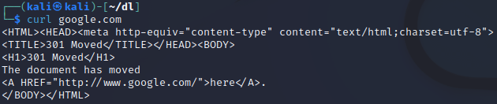
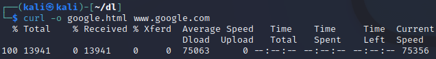
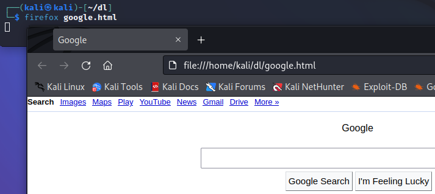
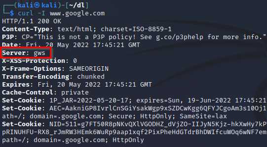

= Curl

Author: Dr. Jim Marquardson

Changelog

* 2022-08-15 Initial Version

Curl is a tool for downloading files off of the internet. Sometimes it is used as parts of software installation instructions. Curl can also be used to done some basic reconnaissance such as banner grabbing.

== Learning Objectives

You should be able to:

* Use curl to download files off of the internet
* Use curl for banner grabbing

== Curl for Downloading

. Open a new terminal in Kali.
. Run the following command to ensure that you are in your home directory.
+
[source,sh]
----
$ cd ~
----
. Run the following command to make a new temporary directory called *dl* (download).
+
[source,sh]
----
$ mkdir dl
----
. Run the following command to change directories to the new *dl* directory.
+
[source,sh]
----
$ cd dl
----
. Run the following `curl` command to download google.com's web page.
+
[source,sh]
----
$ curl google.com
----
+
Note the contents. Some of the text is human readable. You will see the hypertext markup language (HTML) that describes how the page should be displayed.
+
.Curl download of google.com

+
Notice that the web page says "The document has moved." Google wants to send us to www.google.com instead of letting us access google.com (without the www at the beginning).
. Run the following command to download www.google.com.
+
[source,sh]
----
$ curl www.google.com
----
+
Notice that the web page is much more complete.
. Run `ls` to show that no files were created. Curl just displayed the web page in the browser.
. Run the following command to download google.com to a file.
+
[source,sh]
----
$ curl -o google.html www.google.com
----
+
The `-o` option tells curl to output the download to the file google.html.
+
.Curl downloading to a file

. Run the following command to open the google.html file in Firefox.
+
[source,sh]

+
Notice that images and styling look different than visiting http://www.google.com. This is because curl did not download any images or styling information. Also note that the address bar shows file:// instead of http://. The address bar uses file:// to show that you are browsing a file on your local computer.
. Close Firefox (otherwise the terminal will be locked).

== Curl for Banner Grabbing

*Banner grabbing* is the act of requesting information from a server to discover information about the server's configuration. Ethical hackers (and malicious hackers) use banner grabbing in the reconnaissance phase of an attack. `Curl` can be used to gather some basic information about the server.

. In the Kali terminal, run the following command. The `-I` switch loads the HTTP headers (the stuff that your web browser hides from you because it is not necessary for rendering a web page.j)
+
[source,sh]
----
$ curl –I google.com
----
+
.Curl banner grabbing

One of the most useful pieces of information is that google.com is running the "gws" web server. This is a custom web server built by Google and run in-house.

== Challenge

* Determine what web servers the following website use:
** microsoft.com
** apple.com
** cnn.com
** foxnews.com
* Download your school's web page to a local file on your computer. Open the file in a web browser.

== Reflection

* Why would it be useful to download files from a command-line interface?
* Should companies try to hide the technologies they use? I.e., should they try to block banner grabbing?

