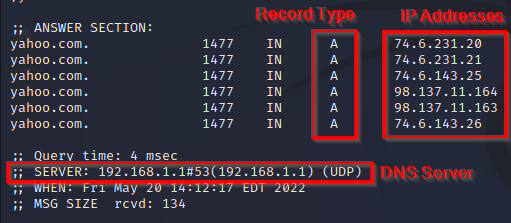
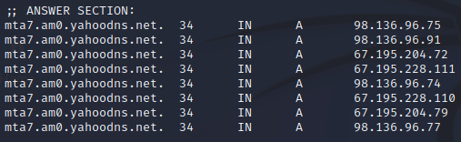
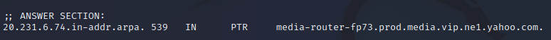

= Dig

Author: Dr. Jim Marquardson

Changelog

* 2022-08-15 Initial Version

Commputers like numbers, but people like words. The domain name system (DNS) makes the internet easier for people to use because it lets people remember the names of sites, and the computers will remember the IP addresses associated with those sites. `Dig` is a tool in Linux that lets us investigate DNS settings.

== Learning Objectives

You should be able to:

* Differentiate forward lookups and reverse lookups
* Use `dig` to perform DNS forward lookups
* Use `dig` to query different DNS record types
* Use `dig` to perform DNS reverse lookups

== DNS Forward Lookups

Suppose you want to visit yahoo.com. You want to be able to type yahoo.com in your web browser and load the site. But your web browser needs to know the IP address of yahoo.com's web server. Fortunately, your browser takes care of looking up the IP address for yahoo.com for you and it connects to the web server using its IP address. `Dig` is a tool that lets you manually query DNS to determine IP address information.

. Open a terminal in Kali.
. Run the following command to query DNS information for yahoo.com
+
[source,sh]
----
$ dig yahoo.com
----
+
.Dig output

+
Dig tells us that to access yahoo.com, we should go to the IP addresses listed in the response. The record type is "A" for IPv4 addresses. There are multiple IP addresses because yahoo.com is a popular site, and yahoo.com wants to distribute the load to different web servers. The response came from my DNS server, which in this case, was my home router.
. Push the up arrow key to find the most recent command and run it again. Run it a few times. (If you want to make life hard on yourself, type it out again.)
+
[source,sh]
----
$ dig yahoo.com
$ dig yahoo.com
$ dig yahoo.com
----
+
Notice that the order of IP addresses changes. Yahoo wants this to happen to help spread out the load.
. You can query different types of records using `dig`. If you wanted to send somebody who worked at Yahoo an email, your email provider needs to look up where to send @yahoo.com email addresses to. Query email information using the `MX` record type.
+
[source,sh]
----
$ dig yahoo.com MX
----
+
.Yahoo's MX Records

+
Notice that instead of an IP address, we have several domains. Yahoo uses this strategy to help distribute the load between its email servers.
. You can pick one of the email servers and look up its IP address. (You may have to modify the command based on the output of the previous `dig` command. Use one of the server names listed.)
+
[source,sh]
----
$ dig mta7.am0.yahoodns.net
----
+
.IP address of yahoo email server

== Reverse DNS

With a reverse DNS lookup, you know the IP and want the name associated with it. This can be useful if you see an IP address in a log file, or see that a program on your computer is connected to an IP address and you want to know if that IP address is associated with a domain name.

. In the Kali terminal, run the following command to do a rever DNS lookup.
+
[source,sh]
----
$ dig -x 74.6.231.20
----
+
The instructions here use that specific IP address because it was one of the IP addresses output in the previous command. But, IP addresses that company's use change all the time. If this command does not give you any results, try an IP address that you recently saw in the forward lookups.
. Analyze the output.
+
.Dig reverse lookup output

+
The IP address is associated with "media-router-fp73.prod.media.cip.ne1.yahoo.com." That's a big, long name to try to parse. We can at least tell that something at Yahoo is associated with that IP address. Routers move packets between networks. Based on the name, this could be a device with some kind of routing capability.

If I saw the 74.6.231.20 IP address in my logs, and I did a reverse lookup and found that it was associated with yahoo.com, I wouldn't worry.

== Challenge

* Use `dig` to query different record type for your school's domain. Use the following record types.
** A: IPv4
** AAAA: IPv6
** MX: Email
** NS: Nameserver
** TXT: Text data
* What does the output of those `dig` commands tell you about your school's infrastructure?
* Ping google.com and see what IP address returned. (Press control+c to stop the ping.) Do a reverse DNS lookup for that IP address. To what domain name does the IP address point? The IP address that you will get when you ping google.com will very likely be different than the IP address in the screenshot below.
+
[source,sh]
----
$ ping google.com
----
+
.Example ping of google.com

== Reflection

* Why might IP addresses change?
* How would a malicious hacker use `dig` to query a company's DNS records?
* If the `ping` command can find an IP address, why would we use `dig`?
