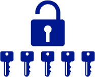
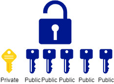

= Symmetric Encryption

Symmetric encryption is used to protect information on our hard drives and sent over networks. Symmetric algorithms encrypt data with a key, and decrypt data with the same key.

== Learning Objectives

* Describe symmetric algorithms
* List common symmetric algorithms

== Symmetric Encryption Algorithms

Data can be encrypted with symmetric or asymmetric algorithms. With symmetric algorithms, data is encrypted with a key, and that data can be decrypted with the same key. Using the same key to encrypt and decrypt data is fairly intuitive. An example is a physical lock that accepts a physical key. Anybody with a copy of the key can unlock the lock.

.Symmetric Encryption: Anybody with the Key Can Unlock the Lock

This differs from asymmetric encryption in which data is encrypted with one key in a public key/private key pair, and the lock can only be unlocked with the corresponding key.

.Asymmetric Encryption: Encrypt with One Key, Decrypt with the Other

Symmetric encryption is faster and more efficient than asymmetric encryption. On the internet, asymmetric encryption is often used to transmit a shared symmetric key, then the bulk of data transmitted uses symmetric encryption.

There are several common symmetric encryption algorithms.

* One-time Pads: One-time pads were used by spies to send secret messages. Encryption and decryption could be done with pencil and paper. One-time pads are unbreakable, but distributing and protecting keys is hard.
* Caesar Cipher: This is probably the encryption scheme you learned in 2nd grade. You shift your message a certain number of characters in the alphabet to encrypt, and you shift back to decrypt.
* Advanced Encryption Standard (AES): This is one of the most common symmetric encryption algorithms used on modern computer systems. It is fast and efficient. When used appropriately, data encrypted with AES cannot be broken.

New encryption algorithms are being created all of the time. But, it takes a tremendous amount of time and effort to properly scrutinize algorithms for weakness.

== Reflection

* What techniques have you used to encrypt data?
* What are the pros and cons of letting people encrypt data in a way that the government cannot decrypt?

