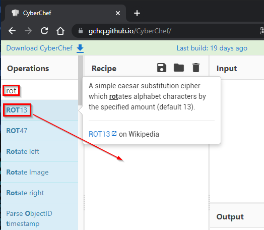

= Symmetric Encryption: Caesar Cipher

Author: Dr. Jim Marquardson

Changelog

* 2022-08-15 First version

One of the simplest methods of encryption is the Caesar Cipher. It is also known as a rotation cipher. The Caesar Cipher demonstrates the principles of symmetric encryption, but should not be used for serious cryptography.

== Learning Objectives

You should be able to:

* Describe the algorithm and key in the Caesar Cipher
* Describe a rotation in the Caesar Cipher
* Brute force decrypt a message encrypted with the Caesar Cipher

== The Caesar Ciphers

Julius Caesar used this particular cipher for military communications. This was not the first attempt at encrypting data, but Julius Caesar made this particular cipher popular. As far as encryption goes, it is not strong. At all. Fortunately for Julius Caesar, many of his enemies could not read, so a basic encryption scheme worked well enough for his purposes.

The Caesar Cipher is also called a rotation cipher because the alphabet is "rotated" a certain number of characters. The number of rotations is the key. The following table shows an alphabet with zero rotations:

.Alphabet with Zero Rotation
|=====
| Cleartext  | A | B | C | D | E | F | ...
| Ciphertext | A | B | C | D | E | F | ...
|=====

.Alphabet with One Rotation
|=====
| Cleartext  | A | B | C | D | E | F | ...
| Ciphertext | Z | A | B | C | D | E | ...
|=====

.Alphabet with Two Rotations
|=====
| Cleartext  | A | B | C | D | E | F | ...
| Ciphertext | Y | Z | A | B | C | D | ...
|=====

Caesar himself used an alphabet with 3 rotations.

.Alphabet with Three Rotations
|=====
| Cleartext  | A | B | C | D | E | F | ...
| Ciphertext | X | Y | Z | A | B | C |  ...
|=====

Using the table above, the word *FACE* would be encrypted as *CXZB*. 

Challenge: Encrypt the word *CAFE* using a rotation of 3.

== Cyber Chef

The CyberChef is an open-source application that lets you build "recipes" of many cybersecurity algorithms. The ROT-13 algorithm implements the Caesar Cipher. The default rotation is 13.

. Go to https://gchq.github.io/CyberChef/.
. In the *Operations* filter, type *rot*.
. Click and drag the *ROT13* operation into the recipe area.
+
.Add the ROT13 Operation to the Recipe

. Type the word *CAFE* in the *Input*. The encrypted text will appear in the *Output* area.
+
.ROT13 Encryption of the Word "CAFE"

. Every time you change the input or the operation, CyberChef will "re-bake" the recipe to produce new output.
. Change the *Amount* in the ROT13 algorithm. Change it to -3. Does that match what you had encrypted earlier?

== Brute Force Decrypting the Caesar Cipher

. There are 26 letters in the English alphabet, so there are only 26 possible unique rotations. (A rotation of 27 is the same thing as a rotation of 1.) In a brute force attack, every possible key is tried. 
. Imagine that you find the following encrypted text.
+
----
Nby Wuymul Wcjbyl cm lyuffs hin mywoly. Sio mbiofx hin omy cn ni jlinywn xunu.
----
. Paste that text into the *Input* in the CyberChef.
. Increase or decrease the *Amount* of the ROT13 rotation until you find something that reads like English.
. How hard was it to decrypt the message?

== Caesar Cipher Summary

The Caesar Cipher is not strong. But, it demonstrates how symmetric algorithms work. Symmetric algorithms have algorithms (e.g., shifting letters of the alphabet) and keys (the number of letters to shift). The Caesar Cipher's algorithm is not complex, and the key is easy to brute force. Modern encryption algorithms have very sophisticated algorithms and require much better keys.

== Reflection

* Was Julius Caesar wrong to use such a simple encryption algorithm?
* Will people in two thousand years laugh at our current computer systems?

