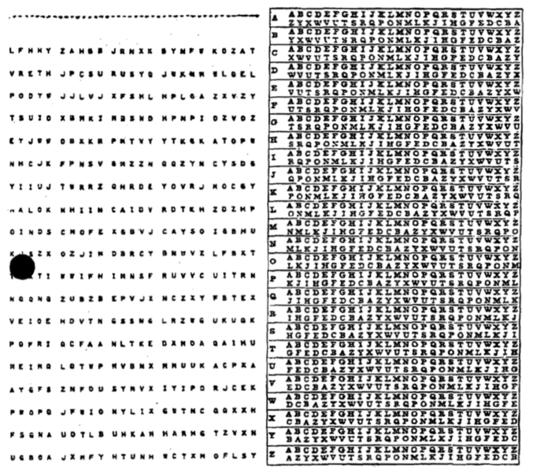
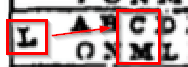
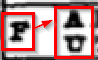
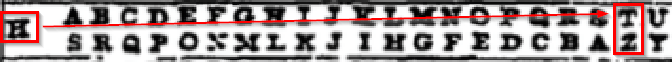
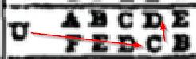
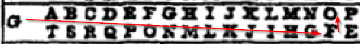
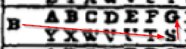

= Symmetric Encryption: One-Time Pad

One-time Pads are the strongest way to encrypt data. But their strength comes with several limitations. Encryption and decryption with one-time pads can be done by hand, which made it useful for spies.

== Learning Objectives

You should be able to:

* Use a one-time pad to encrypt and decrypt data
* Describe some of the limitations of one-time pads

== Encrypting with One-time Pads

A pad refers to a book of codes. A book might have hundreds of pages, each with a unique key. The following is a page from a book of codes from the National Security Agency.

.US National Security Agency, Public domain, via Wikimedia Commons

The left portion of the page has groups of randomly generated characters. The key to the right gives lookup values. The right half of the page is static--it can be repeated and distributed publicly. The left-hand side has the keys that are randomly generated. These keys should never be disclosed.

. Suppose you wanted to use this one-time pad to encrypt the word "CAT."
. Using some agreed-upon method, you and the recipient of your message will use the first line of the one-time pad.
+
....
LFHHY ZAHBB ...
....
+
Because the message "CAT" is only three characters long, only three characters of the key are needed. (If you needed to send a message a thousand characters long, the key would also need to be a thousand characters).
. The first character of the key is *L*, so we look in the lookup table in section *L*. The character *C* corresponds to the encrypted character *M*. So *M* is the first character of the encrypted output.
+
.Encrypt "C" Using the Key "L"

. The second character of the key is *F*, so we look in the lookup table in section *F*. The character *A* corresponds to the encrypted character *U*. So *U* is the second character of the encrypted output.
+
.Encrypt "A" Using the Key "F"

. The third character of the key is *H*. In the lookup table for *H*, the character *T* corresponds to the encrypted character *Z*.
+
.Encrypt "T" Using the Key "H"

. And so, encrypting *CAT* with the one-time pad key *LFH* gives the encrypted text *MUZ*.

== Decrypting with One-time Pads

Suppose you know you must use the last line of keys in the one-time pad--*UGBOA*--to decrypt data. You are sent the encrypted text: CFS.

. The first key is *U*. We find the encrypted character *C*, and it corresponds to the cleartext *D*.
+
.Decrypt "C" Using the Key "U"

. The second character of the key is *G*. In row *G*, find the encrypted character *F*. This corresponds to the letter *O*.
+
.Decrypt "F" using the Key "G"

. The third character of the key is *B*. In row *B*, find the encrypted character *S*. This corresponds to the letter *G*.
+
.Decrypt "S" Using the Key "G"

== Impossible Challenge

Consider the ciphertext **RBBTLFDWVKDDIL** (14 characters). The source cleartext was encrypted using the NSA's lookup table, but you do not know the key. What is the cleartext?

The table below shows how different keys can extract different candidate cleartext messages. The table shows 3 example keys among the 629,983,141,281,877,223,603,213,172,736 (14^26) possible keys along with the cleartext produced if decrypting the ciphertext with that key. How would somebody know when they got the correct key?

|=====
| Key            | Cleartext
| ULUBGCPKIBROZH | ONEFISHTWOFISH
| GYNVCQOLXDWSGW | CALLMEISHMAELS
| AFCGWUHSAPECAK | ITWASAPLEASURE
|=====

If all possible keys were used to decrypt the ciphertext, the introduction to every book written in English would be found. The cryptographers would have no way of knowing which of the valid combinations of letters and words is correct.

== Thought Experiment

Imagine that you operate a starport in the Andromeda galaxy. There are 17,576 (26*26*26) ports where spaceships can dock. All port identifiers are 3 letters, such as AXY, VLN, and ERQ. Each port identifier is unique.

Your security team intercepts an encrypted message. Your intelligence source says that this message contains the port where a bomb has been and is set to explode in one hour. You can dispatch your security team to check 50 different ports in an hour, so you do not have enough time to check every port. Assume that the encrypted message contains the correct port.

=== Scenario 1: Caesar Cipher 

The encrypted message you receive is **HGX**. The message was encrypted using the **Caesar cipher**. You do not have the key.

* How would you determine which ports must be checked?
* How many ports must be checked to guarantee that you find the bomb?
* Will you find the bomb in time?

=== Scenario 2: One-time Pad

The encrypted message you receive is **HGX**. The message was encrypted using a **one-time pad**. You do not have the key.

* How would you determine which ports must be checked?
* How many ports must be checked to guarantee that you find the bomb?
* Will you find the bomb in time?

== Challenge

Use the key and the NSA codebook to encrypt and decrypt the missing data below.

|=======
| Key   | Cleartext | Ciphertext
| LFHHY | APPLE     | ?????
| VRETH | FISH      | ????
| NHCJK | ?????     | XHXOL
| POFRI | ????      | JDRE
|=======

== Limitations

As the name suggests, keys in one-time pads can be used once. If keys in the pad are used more than once, code breakers could find patterns in the encrypted data and reverse engineer the encryption keys.

== Reflection

* How would you securely transmit codebooks?
* What could an attacker do if they intercepted a codebook?
* Would one-time pads work on the modern internet?

