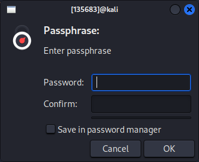

= Symmetric Encryption: AES

The Advanced Encryption Standard (AES) is one of the most widely used symmetric encryption algorithms. Like all symmetric encryption algorithms, it uses the same key to encrypt and decrypt data.

== Learning Objectives

You should be able to:

* Describe how the AES symmetric encryption algorithm was adopted
* Use AES to encrypt and decrypt files using the Gnu Privacy Guard (GPG)

== AES

The Data Encryption Standard (DES) was a symmetric encryption algorithm published in 1977. DES was endorsed by the United States government and widely used. Weaknesses in DES were discovered in the 1990s, and proof-of-concept attacks breaking DES encryption were demonstrated in the late 1990s. Clearly, there was a need for a better algorithm for encrypting data.

In 1997, The National Institute of Standards and Technology (NIST) issued an open call for cryptographers to create a successor to DES. Submissions were evaluated over the next several years. During that time, mathematicians, computer scientists, and cryptographers probed the algorithms for weaknesses. In 2001, NIST announced that the Advanced Encryption Standard (AES) would be the replacement for DES. Decades later, no significant weaknesses have been found in AES and it continues to be widely deployed. It is very likely that the websites you browsed today were encrypted and decrypted using AES.

NIST officially endorsed AES in the Federal Information Processing Standards 140 series (FIPS 140). These standards evolve as new algorithms are adopted and weaker algorithms are found unfit for use.

== Use AES

Your computer uses AES frequently. In this exercise, you will use the Gnu Privacy Guard (GPG) to encrypt and decrypt individual files.

. Start your Kali virtual machine. (Log in with kali/kali if needed.)
. Open a new terminal.
. Run the following command to ensure that you are in your *Documents* directory.
+
[source,sh]
----
$ cd ~/Documents
----
. Make a new folder called *crypto*.
+
[source,sh]
----
$ mkdir crypto
----
. Change directories to the new *crypto* directory.
+
[source,sh]
----
$ cd crypto
----
. Create a file called secrets.txt.
+
[source,sh]
----
$ touch secrets.txt
----
. Edit the secrets.txt file with nano.
+
[source,sh]
----
$ nano secrets.txt
----
. Type a secret message in the text file.
. Save the file with *control+o*, then exit using *control+x*.
. Run `ls -al` to view the file details.
+
[source,sh]
----
$ ls -al
----
+
----
-rw-r--r-- 1 kali kali   33 Jun 28 13:45 secrets.txt
----
+
My file is 33 bytes.
. Encrypt the file using AES. By default, if you symmetrically encrypt data with the Gnu Privacy Guard, it will use AES for the encryption algorithm. 
+
[source,sh]
----
$ gpg --output encrypted-secret.gpg --symmetric secrets.txt
----
+
If you get an error that says, "No such file or directory," then double-check that you 1) did not make a typo when creating *secrets.txt*, and 2) did not make a typo when typing *secrets.txt* into the `gpg` command.
. You will be prompted for a passphrase. This will become the key used to encrypt and decrypt the data.
+
.Passphrase Prompt

+
You do not need to save the password.
+
The file should be encrypted quickly.
. List the files with `ls -al`
+
[source,sh]
----
$ ls -al
----
+
Some overhead was added to the plaintext file.
+
----
-rw-r--r-- 1 kali kali  114 Jun 28 13:48 encrypted-secret.gpg
-rw-r--r-- 1 kali kali   33 Jun 28 13:45 secrets.txt
----
. Display the contents of both files using `cat`.
+
[source,sh]
----
$ cat secrets.txt
----
+
----
Pineapple on pizza is excellent.
----
+
[source,sh]
----
$ cat encrypted-secret.gpg
----
+
----
�  ��)�W�3���au�ft��8�St-}��U]˽a�i����r`�J��O
 �r�D��U��Tc`s���z%�T�:�o4�W
----
+
The output will not be human-readable. The terminal did its best to try to write out text, but the content is really just a mess of binary zeros and ones.
. Delete your cleartext file with the `rm` command.
+
[source,sh]
----
$ rm secrets.txt
----
. Now, you are left with the encrypted file.
. This next step would typically only be done for testing. The Gnu Privacy Guard remembers that you just entered the passphrase, so it will not prompt you for it again when trying to decrypt. You can clear out this cache to simulate having just downloaded the file from the internet.
+
[source,sh]
----
$ gpg-connect-agent reloadagent /bye
----
. Decrypt the file with the `gpg` program. If you sent this file to a friend, your friend could use the same process for decrypting the file.
+
[source,sh]
----
$ gpg --decrypt encrypted-secret.gpg
----
+
You will be prompted for the passphrase. After confirming the passphrase, you should see the output in cleartext. But, the cleartext content will not be written to a file.
. To decyrpt the file contents to a file use the `--output` option.
+
[source,sh]
----
$ gpg --output clear.txt --decrypt encrypted-secret.gpg
----
. Run `cat` to view the contents of clear.txt.
+
[source,sh]
----
$ cat clear.txt
----
+
The original file will be restored.
+
----
-rw-r--r-- 1 kali kali   33 Jun 28 13:58 clear.txt
-rw-r--r-- 1 kali kali  114 Jun 28 13:48 encrypted-secret.gpg
----

== Reflection

* Should the government be given a copy of all AES keys for safekeeping?
* Should encrypted communication be the default?

