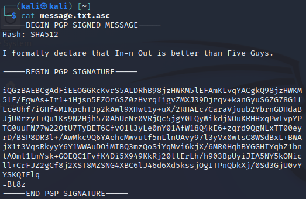

= Asymmetric Encryption: RSA

Author: Dr. Jim Marquardson

Changelog

* 2022-08-15 Initial Version

The Rivest-Shamir-Adlemen (RSA) algorithm has been used for decades. It is commonly used to sign files and to exchange temporary symmetric keys.

== Learning Objectives

You should be able to:

* Create a public key/private key pair with GnuPG
* Export public and private keys
* Sign a file with a private key
* Encrypt a file with a private key

== About RSA

The Rivest-Shamir-Adlemen (RSA) cryptosystem is widely used. Everybody simply refers to it as RSA. It is a cryptosystem in that is more than just one algorithm. The RSA algorithm's security comes from the difficulty of factoring extremely large numbers. Below is a sample number that represents a public key:

----
888543399485851280665871513485854174533437878627129683313818488950313296153906113636770382369898726207590351381649865201542888928197263259697442353212658748205044155921924820618558204850367013022783410286695730869371767527703466091414046042351258484081749958759328089377609803747581648962695820583750804884262873147710412854250330874844945900191690185580939077629536872438400197919570789639137711209705478706065025451012043381766201060123580338086141255891594901508048294709809971972555602353452149603408707791663213183685129822881687626063859407642992756090551248261843554783232903036734612066227567443149785711799
----

A private key could look like the following:

----
21086672194055230843612669443904574149811002047199307203395284381153222757946337921885021264571719641013039076957836127385367613397254088944127537594742835698599342510485047377962431798843899579770319434276737961042366904179340813692562855003898865028195278616282018741182344735960747779342416070036207295835459331516253126867178440116447801834476800207659890363928165409520291568362358485983049331749816176659779777775050704230265170530312109028338452264162399421025001847654072603050778790932784226771957796904573649393088878115602311774948562636636391090805302582907612057686556952164829704687199975950062033355959
----

(There are some other numbers that make up the public and private keys, but those are not important for now.)

Those numbers are big. Really big. It is not currently computationally feasible to "crack" a private key if you have the public key and some sample data. Because those numbers are so big, they are typically represented in a much more compact format. However, most people never even have to look at the keys. The keys just live on computers and applications use them when needed.

== Downside of RSA

RSA keys are computationally expensive to create. Instead of creating a new private key/public key pair every time somebody wants to exchange a secret, the same private/key public key pair are reused. The fact that the key is reused means that RSA key exchange does not provide *perfect forward secrecy (PFS)*. Imagine that somebody captured all of your encrypted network traffic for a year. In that year, the attacker could not read any of the data. But, at the end of that year, the private key became compromised and the attacker got a hold of it. The attacker could go back and decrypt all of your data. Not great.

RSA is still very popular for encrypting emails and signing files, but it is no longer the preferred solution for key exchange. For modern key exchange, Elliptic Curve (EC) cryptography is preferred. With EC cryptography, a new public key/private key pair is created each time a temporary symmetric key needs to be exchanged which dramatically reduces the effects of a compromised private key.

== Create a Key Pair with GnuPG

The GnuPG application can be used to create RSA key pairs. 

. Launch your Kali virtual machine.
. Open a terminal and run the following command to ensure that you are in your home directory.
+
[source,sh]
----
$ cd ~
----
. Run the following command to start the key creation wizard.
+
[source,sh]
----
$ gpg --full-generate-key
----
. Choose RSA and RSA (the default.)
+
.Select the RSA key type

. Enter *3072* for the key size.
. Enter *0* for the key expiration. This key will not expire.
. Confirm that the key will not expire.
. Enter a name. Use your real name if you want, or enter a fake one. Gpg does not actually know who you are.
. Enter an email address (real or fake).
. Enter a comment or leave it blank. A comment could be a note about how the key is intended to be used.
. Enter *o* to confirm that the key settings are correct.
+
.Confirm key options

. You will need to enter a passphrase. Enter something simple (and remember it).
. Notice the messages that appear during and after entering the passphrase.
+
.Key creation messages

. The RSA private key is very large and requires a lot of randomness for the key to be secure. This process is computationally expensive.
. Once the key has been made, some key details are displayed.

== Export RSA Keys with Gpg

Right now, the private key/public key pair only lives on your computer. But you might want to copy your private key to another computer you own. And you might want to email your public key to colleagues so that you can send them digitally signed messages.

. Export your public key with the following command. (Replace the email address with the email that you used when creating your key.)
+
[source,sh]
----
$ gpg --output public.key --armor --export bugs@bunny.com
----
. Run `ls` and verify that the file public.key exists in the directory.
. View the contents of the key file with the `cat` command.
+
[source,sh]
----
$ cat public.key
----
+
You should see something similar to the following.
+
.Public key contents

. Notice that the text says "PGP" public key block. Think of PGP as a wrapper for RSA.
. Export your private key with the following command.
+
[source,sh]
----
$
----
. Run the following command to display the contents of the key file.
+
[source,sh]
----
$ cat private.key
----
+
You should see output similar to the following.
+
.Private key contents

== Sign a File

Signing a file verifies that you are the person who had control of the file when it was signed. It basically confirms authorship.

. Run the following commands to create a text file and edit it in `nano`.
+
[source,sh]
----
$ touch message.txt
$ nano message.txt
----
. Add a controversial opinion to the text file.
+
.It's true, don't deny it

. Save the file with control+o. Exit with control+x.
. Now you will clear-sign the file. Clear signing leaves the file in a readable format.
+
[source,sh]
----
$ gpg --clearsign message.txt
----
. Confirm your passphrase.
+
.Confirm passphrase

. There will not be a file called message.txt.asc in the directory. View it with the `cat` command.
+
[source,sh]
----
$ cat message.txt.asc
----
+
You should see output similar to the following.
+
.Clearsigned file

. Notice that your message is intact. The PGP signature can be verified with your public key.

At this point, you could send your public key and this signed file to anybody in the world and they could verify that it was your private key that was used to sign it.

== Encrypt Files with a Public Key

Clearsigning the file left it in a human-readable format. But what if you were concerned about spies? If you have somebody's public key, you can encrypt data using they public key, and then only they can decrypt it.

. Run the following command to encrypt data *for* yourself. (Replace the email address with the one you used previously.)
+
[source,sh]
----
$ gpg --encrypt -r bugs@bunny.com message.txt 
----
+
The above command encrypts the file for the recipient bugs@bunny.com using Bugs' public key.
. If the command works, a file message.txt.gpg will now exist in the directory.
. Use `cat` to view its content.
+
[source,sh]
----
$ cat message.txt.gpg
----
+
You will see output similar to the following.
+
.Encrypted contents of message.txt.gpg

Now, the only person in the world who can decrypt this is the person with the private key associated with the public key.

== Clean up

When you are finished with the exercise, you can delete the 5 files created in your home directory.

[source,sh]
----
$ rm message.*
$ rm *.key
----

The "*" character is the wildcard character that matches any character. The above commands delete all files that start with "message." or end with ".key."

The keys you created still exist on your computer, but it is fine to leave them there. If you really want to delete the keys from your system, run these commands (replacing the email as needed). The first command deletes the private key, and the second command deletes the public key.

[source,sh]
----
$ gpg --delete-secret-keys bugs@bunny.com
$ gpg --delete-keys bugs@bunny.com
----

== Reflection

* What techniques could be used to protect private keys?
* If you wanted to encrypt your email with your private key, where would that private key need to live? On your computer? On a remote email server? What would be the dangers of keeping the key in either place?
* In this exercise, Bugs Bunny was used for the name. If anybody can pick a name, how can we know the true identity of the person who created the key pair? (Hint: search the internet for "web of trust" for some possible answers.)
