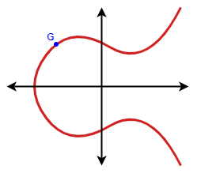
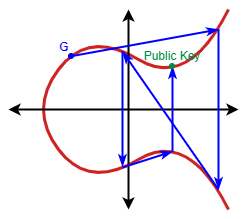
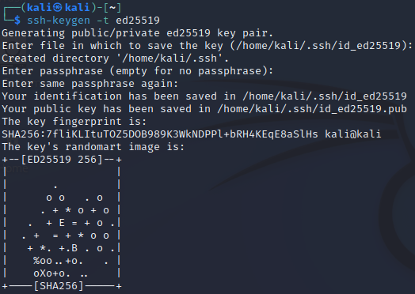
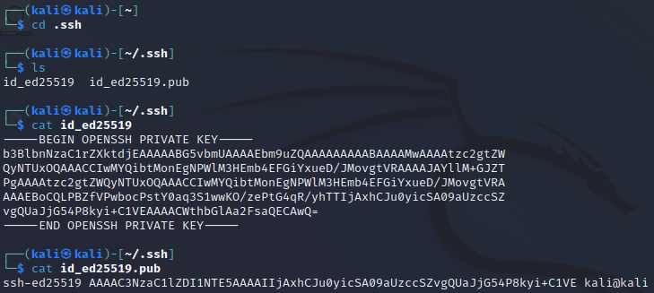

= Asymmetric Encryption: Elliptic Curve Cryptography

Author: Dr. Jim Marquardson

Changelog

* 2022-08-15 Initial Version

Elliptic Curve (EC) cryptography has become increasing popular. RSA was invented first and was easier to vet mathematically, but EC cryptography has survived decades of inspection and it is increasingly being used. One benefit of EC is that it provides better security with smaller key sizes.

== Learning Objectives

You should be able to:

* Explain the basic concepts of EC security
* Use OpenSSH to create an EC key pair

== Elliptic Curve Cryptography Principles

The following is a simplified explanation for how keys are generated in elliptic curve cryptography. EC cryptography's security comes from the challenge of determining how lines traverse special curves.

Consider the following curve on a graph.

.Sample elliptic curve graph

The curve is defined by a formula (something like y^2 = x^3 + 7). There is a generator point G, which can be considered a starting point, which is part of a curve's parameters. The private key is a random number in a range defined in the curves parameters. For example, a curve might tell people to pick a number between 17 and 2^255. For simplicity sake, imagine that we randomly came up with the number *6* as our random number. We would start at point G and follow specifical rules for hopping around the curve. The image below shows what 6 "hops" would look like.

.Public key on a curvey where the private key is 6

So, given a curve with the starting point G, we pick a random number, and that random number will correspond to a public key point on the curve. A key concept in EC cryptography is that if we are given a random point on the curvey, it is tremendeously difficult to determine how many hops it took to get there. There is no easy way to find the private key when given the public key.

In reality, your computer does not "hop" trillions of times to determine the public key. EC cryptography is computationally efficient. Essentially, a single multiplication operation can be done to compute the public key.

== Exercise

In this section you will create an EC key pair using OpenSSH. OpenSSH is commonly used on the internet for secure communications.

. Launch your Kali linux terminal.
. Open a terminal.
. Navigate to your home directory with the following command:
+
[source,sh]
----
$ cd ~
----
. Run the following command to launc the key creation process with OpenSSH.
+
[source,sh]
----
$ ssh-keygen -t ed25519
----
+
The *ed25519* refers to a specific curve specification.
. You will be prompted to enter optional information. Simply press *control+j* to accept the defaults. Pressing the enter key will just enter ^M instead of doing what you might reasonably expect. Just press *control+j* until it finished.
. You should see output similar to the following.
+
.Elliptic curve key pair created with OpenSSH

. Note that they key pair was created very quickly. Though benchmarks for creating keys is tricky, a ballpark number is that it's about 1,000 times faster to create an EC key than an RSA key for equivalent security.
. Navigate to the hidden .ssh directory and use `cat` to display the contents of the private key and the public key. The public key has a .pub extension. The private key has no extension.
+
[source,sh]
----
$ cd .ssh
$ cat id_ed25519
$ cat id_ed25519.pub
----
+
You should see something similar to the following.
+
.Elliptic curve key contents

It is important to note that the public key really just represents a point on the curve. The private key is just a large number. 

== Reflection

* How can we be sure that the math behind elliptic curve cryptography is sound?
* Will quantum computers just break all of your current cryptography algorithms?

