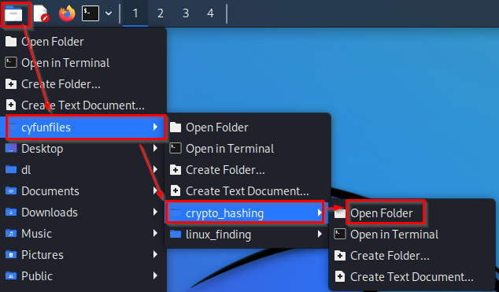
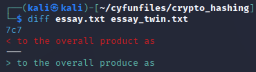

= Hashing Files

Author: Dr. Jim Marquardson

Changelog

* 2022-08-15 Initial Version

File hashes are like digital fingerprints. If two file hashes match, it means the contents of the file are the same. Hashing is used to verify the integrity of data.

== Learning Objectives

You should be able to:

* Describe the purpose of hashing files
* List popular file hashing algorithms: MD5, SHA2
* Compute the hash of files using Linux

== About Hashing

Hashing falls under the cryptography umbrella, but it's not encryption. But, it shares some of the same mathematical concepts as encryption. Hashes are one-way functions. Data is sent to the hash function, and a hash digest is output. It is impossible to reverse the process. You cannot take the hash digest and reconstruct the input.

A good hashing algorithm should have output that is impossible to predict. Changing a single bit in the file should result in a completely different hash digest. MD5 (message digest version 5) was a popular hashing algorithm, but it was mathematically flawed. Researchers discovered patterns between the input and output and were able to "break" the algorithm. MD5 is considered broken and should not be used.

Today, SHA2 is a popular hashing algorithm that is still considered strong. It is widely adopted. SHA2 has longer hash digests than MD5, but SHA2's strength is in the mathematical improvements that make it more resistant to attack. SHA3 is a newer version that is considered strong, but is less widely used.

== Hash Files in Linux

Next, you will hash several files in Linux and analyze the output.

. Launch the Kali virtual machine.
. Open a terminal.
. Run the following command. Note that it will delete any files you added or changed in the cyfunfiles folder.
+
[source,sh]
----
$ rm -rf cyfunfiles
----
. Run the following command to download files from the internet. This will create a new folder called *cyfunfiles* in your home directory.
+
[source,sh]
----
$ git clone https://github.com/jimmarq/cyfunfiles.git
----
. Change directories to the *cyfunfiles* directory.
+
[source,sh]
----
$ cd cyfunfiles
----
. Change directories to the *crypto_hashing* subdirectory.
+
[source,sh]
----
$ cd crypto_hashing
----
. Look at the files in the folder with `ls`.
+
[source,sh]
----
$ ls
----
. Inspect each of the text files with `cat`.
+
[source,sh]
----
$ cat a.txt
$ cat b.txt
$ cat long.txt
$ cat essay.txt
$ cat essay_twin.txt
----
+
Note that the contents of essay.txt and essay_twin.txt look very similar--but are they exactly the same? You'll use hashing to find out.
. The terminal is not great for looking at the two images in the cyfunfiles directory. In the Kali tool bar, click on the folder icon and choose cyfunfiles > crypto_hashing.
+
.Open the crypto_hashing folder in the graphical interface

. Look at smile.png and smile_twin.png. They look the same. But are the files exactly the same? You'll use hashing to find out.
. Back in the terminal, run the following command to compute the SHA2 hash of a.txt.
+
[source,sh]
----
$ sha256sum a.txt
----
+
You should see the following result.
+
----
ca978112ca1bbdcafac231b39a23dc4da786eff8147c4e72b9807785afee48bb  a.txt
----
+
The SHA2 hash will compute the same output every time it receives the same input.
. Notice that the program is sha256sum. SHA2 has several output lengths. 256 bits is very common, so really, you are using SHA2-256 when you run sha256sum.
. Calculate the SHA2 hash of b.txt.
+
[sourch,sh]
----
$ sha256sum b.txt
----
+
The result should be:
+
----
3e23e8160039594a33894f6564e1b1348bbd7a0088d42c4acb73eeaed59c009d  b.txt
----
. Notice that the input for both a.txt and b.txt was a single character, but the hash is 64 hexadecimal characters long (64*4 bits per character=256 bits).
. Compute the hash for long.txt.
+
[source,sh]
----
$ sha256sum long.txt
----
+
The result should be:
+
----
7a086ed41eddf5329b9434f877d9ab3654358c32f6b5340c921e2a729ee1cbda  long.txt
----
+
Even though long.txt has a lot more content than a.txt and b.txt, the hash digest is still 256 bits long. You could hash a 1 gigabyte movie and the sha256sum output would still just be 256 bits long. This should give you some evidence that if given a hash digest, you could not tell if the input was small or large, much less the content of the original hash.
. Check the hashes of essay.txt and essay_twin.txt.
+
[source,sh]
----
$ sha256sum essay.txt
$ sha256sum essay_twin.txt
----
+
Are the file contents the same? The hashes should look very different which indicates that the file contents are not the same.
. You can try to find the difference manually by carefully reading each file to look for changes. But for text files, Linux has a built-in comparison tool. Run the following command to check for differences in text files line by line.
+
[source,sh]
----
$ diff essay.txt essay_twin.txt
----
+
The output should look similar to the following screenshot.
+
.Diff of essay.txt and essay_twin.txt

+
The diff result shows that a change occured on line 7, and the resulting change is contained on line 7. So in this case, hashing told us that the file contents were not the same. But file hashing cannot tell us *what* has changed. For text files, the `diff` tool can be helpful.
. The two smiley faces look the same, but unless we hash the files we cannot know for sure. Calculate the SHA2-256 hashes.
+
[source,sh]
----
$ sha256sum smile.png
$ sha256sum smile_twin.png
----
+
The hashes should match, indicating that every single bit in each of the files matches.

== File Hashing Use Cases

File hashing is used in the following cases:

* When syncing files between computers, programs can check hashes to see if files have been modified since the last time files were synced.
* When law enforcement seizes phones and computer equipment, hashes of all files will be taken before forensic analysis begins. This ensures that law enforcement can determine if any files were modified by investigators. Without hashes and the proper chain of custody, digital evidence would not be admissible in court.
* When uploading files to cloud computing services, you sometimes have to send a hash of the file to ensure that the cloud provider got the file intact.
* Some websites publish the hash of files that you download. You can verify the hash to make sure that nobody inserted malware into the file you downloaded.

== Reflection

* How might a website like Pinterest use file hashing to detect duplicate images?
* How might a website like Facebook use hashing to determine if content violates its guidelines or the law?

