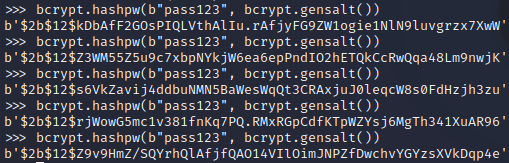

= Hashing Passwords

Websites and other systems should never store passwords in cleartext. Instead, password hashes should be stored. Password salting and algorithm choice are important.

== Learning Objectives

You should be able to:

* Describe password salting
* Select a good algorithm for password storage

== Hashing Passwords

Like files, passwords can be hashed. When you submit your password on a website, the website should compare the hash of the submitted password to the hash of your password that the website stored when you created your account. Websites should never store passwords in cleartext.

There are 2 main considerations that are different for hashing passwords than there are for hashing files:

1) Using salt, and 
2) Selecting slower algorithms.

=== Salting Passwords

In the context of password hashing, salt is random data added before the password. The salt will be stored in the database with your username and password hash.

. Launch your Kali VM
. Open a new terminal
. Run the following command to compute the SHA2-256 hash of the password "pass123."
+
[source,shell]
----
printf "pass123" | sha256sum
----
+
(The `printf` function is used here to send the quoted text directly to the `sha256sum` program without any carriage returns or line breaks.) The result should be:
+
....
9b8769a4a742959a2d0298c36fb70623f2dfacda8436237df08d8dfd5b37374c
....
. There is a problem, though. If two people in the database use the same password, the same password hash will show up several times. In fact, if that password has ever been used in another system and somebody has cracked it, everybody knows that somebody in the database with the password hash *9b8769a4a742959a2d0298c36fb70623f2dfacda8436237df08d8dfd5b37374c* has the password *pass123*.
. Mentally roll some dice and come up with 6 random digits. Add them to the beginning of the previous password to salt it. Compute the hash.
+
[source,shell]
----
printf "829974pass123" | sha256sum
----
+
The resulting hash of the above is:
+
....
ffc90137b42e823fc2aa04adcdfcdf19bd6d8747dac9e4d4dfd52bef24423177
....
. The user does not need to see the random salt. The salt could be stored in a database like so:
+
|========
|Username | Salt   | Hash
| joe123  | 829974 | ffc90137b42e823fc2aa04adcdfcdf19bd6d8747dac9e4d4dfd52bef24423177
| sue789  | 266714 | f04af89361e83062d6dad7c812f65dc42f560dc091d704f385beb7dc6878e1a5
| eve765  | 109872 | 893447cf95bd33a89834643c0265da12030daef39729d4143c83791c09168529
|========
+
Each of the 3 users in the table above has the password "pass123," but because they have random salt, the password hashes are completely different. Password salting makes cracking passwords much more difficult.

=== Slower Algorithms

File hashing algorithms are optimized for speed. But when it comes to hashing passwords, slower can actually be better. If an attacker is trying to crack passwords, the faster the algorithm runs, the faster the passwords are cracked. Certain algorithms intentionally slow down the password hashing so that it makes it difficult for passwords to be cracked. Some of these algorithms also salt passwords by default.

. In the Kali terminal, launch python.
+
[source,shell]
----
python
----
+
Python version 3 should be the default. The bcrypt library should be present.
. Run the following code to create a bcrypt hash of the password "pass123."
+
[source,python]
----
import bcrypt
bcrypt.hashpw(b"pass123", bcrypt.gensalt())
----
+
Python will calculate the hash. Your results will look similar to the following, but because of the random salt, your value will be different.
+
[source,python]
----
b'$2b$12$SDo.HaGB8HTqhD0WnjL/KuToKXHDL/RKBZ9bd0ikGGiX9wZwkNDF6'
----
. Press the up arrow key and enter to run the previous line of python code again. And do that again. And again. See how long it takes to run.
+
.Multiple hash creations with bcrypt

. In python, run `exit()` to quit the python interactive interpreter.
+
[source,python]
----
exit()
----

Notice that the bcrypt hashes were not generated instantly. It takes a fraction of a second, but a long time in computer time. Bcrypt intentionally wastes some of your computing power so that it goes slower. Depending on computer hardware, bcrypt can make about 30 hashes per second. That same hardware can do thousands of SHA2-256 hashes. Scrypt and PBKDF2 (password-based key derivation function version 2) work similarly to bcrypt.

== Reflection

* How do websites store passwords?
** Search for details on data breaches by looking for MD5, SHA1, SHA256, bcrypt, salting etc.
* Does choosing good passwords still matter if you do not know how websites are storing passwords?
* Why is password reuse a problem?
