= Password Managers

Passwords are the most common way to authenticate yourself. Biometrics, smart cards, USB devices, and other authentication techniques can augment password authentication, but it is unlikely that passwords will go away any time soon. It is nearly impossible for a human being to remember many strong passwords. Password managers relieve the burden of remembering strong passwords.

== Learning Objectives

You should be able to:

* Describe why password managers are useful
* Set up a password manager
* Generate passwords

== Password Strength

Good passwords are:

* Long - at least 12 characters, ideally 20 or more characters
* Complex - they have multiple character sets, such as lower case, upper case, numbers and symbols
* Random - passwords should be unique across all passwords ever generated in the world

People often choose passwords that are similar in form to the following *bad* passwords:

* "password" - One of the most common passwords. Every hacker will try this password.
* "samantha1" - The "significant other" + 1 is extremely common.
* "wildc@t" - Hackers know to replace an "a" with a "@" sign.
* "pearljam" - According to https://haveibeenpwned.com/Passwords, this has been used tens of thousands of times despite not being in an English dictionary.

The following are better passwords because they are long and have several character sets:

* "the*book%is(out)#of!Jelly"
* "I_have_155_!#%_magic_beans"
* "000ps_eye_d^d_THAT_thing_again"

The problem with the above "better" passwords is that they are difficult to remember and to some extent follow patterns that somebody who knows you well might be able to figure out. If you have 100 accounts, you would have to remember all of the odd quirks in each password.

The following are the best kinds of passwords because they are completely random:

* XRKFg&WepSZ$uvEer6u2
* oPxVcCMn9%94mhV$fzrK
* eQ$NrF7RkzmnGAdE$*@2

The above passwords were generated by Bitwarden--a password manager. Humans cannot remember many of those passwords. But, the passwords are virtually invulnerable to cracking techniques that hackers use. A unique password like these examples should be made for *every* account that requires a password. Passwords should never be reused, even if the passwords are very strong.

== Set Up Bitwarden

There are several password managers. 1Password, LastPass, and BitWarden are popular. In this section, you will set up the Bitwarden password manager. Bitwarden is popular and free for personal use.

. Go to https://bitwarden.com/download/.
. If you do not have an account, you will need to create a free account. If you already have an account, skip to the next step.
.. You will need a valid email address.
.. Choose one good password for your *Master Password*. This one secret protects *all* of your passwords.
. On https://bitwarden.com/download/, scroll down to the browser extensions.
. Click on the browser that you're using to be taken to the correct extension installation page for your web browser. For example, the following screenshot shows a snapshot of the Bitwarden installation page for Chrome.
+
.Bitwarden in the Chrome Web Store
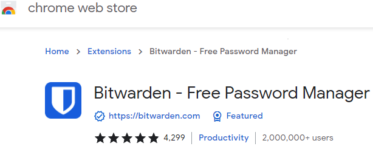
+
Notice that this extension has more than 2 million users. The large number of users is a good (but not perfect) indication that the plugin is legitimate.
. Install the browser extension for your web browser.
. When the extension is installed, click on the shield link and log in with your Bitwarden account.
+
.Bitwarden Log In
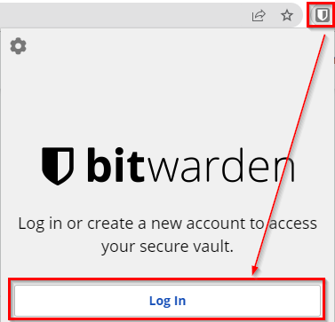
. You will be prompted for your email address and master password.
+
.Email and Master Password
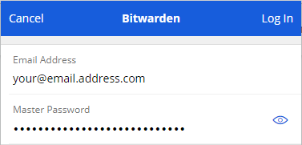
+
When you log in, Bitwarden downloads your encrypted credentials from the Bitwarden server, decrypts them, and shows you all of your accounts.
+
(I have over 400 different accounts registered in Bitwarden. Accounts accumulate over time.)
+
.Lots of accounts
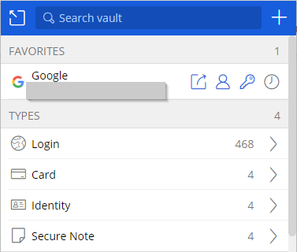

If you have just created a Bitwarden account and installed the extension, you will not have any passwords saved in the password vault, yet. The next sections will walk you through using your password manager.

== Log In to a Website to Save Credentials

Bitwarden tries to detect when you log in to websites. If Bitwarden detects a new login for a website, it will automatically prompt you to save the password in your password manager. Registering new logins and existing logins is one of the first steps you should take with your password manager.

. Visit any site where you have an account.
. Login with your existing username and password.
. At this point, one of two things will happen.
.. Bitwarden may prompt you to save the password for you.
+
.Bitwarden prompt to save password

... Click "Save" to save the login.
.. Bitwarden may not have captured the login information. It happens. In this case, you have to add the login information manually.
... Click the Bitwarden shield icon in your list of extensions, and click the "+" icon.
+
.Add login information manually
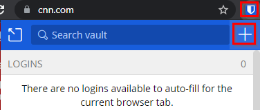
... Bitwarden will add a name and URL automatically.
... The name is for you to keep your vault organized.
... The URL is used for pattern matching so that Bitwarden recognizes when it has a password in the vault for the sites you visit.
... Add your username.
... Add your password. To make sure you typed it correctly, it might be helpful to toggle the password visibility by clicking on the eye icon. Only do this if nobody is looking over your shoulder, otherwise they could steal your password.
... Click save.
+
.Manually added information
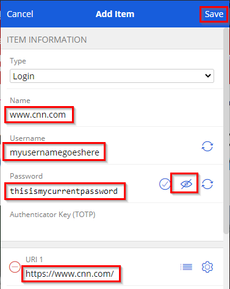
. When you return to a site where you had previously saved a password, Bitwarden will try to find all logins associated with the site. In the screenshot below, Bitwarden had previously saved login information for yahoo.com.
+
.Yahoo login information saved
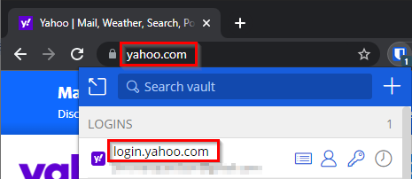

== Creating New Passwords

Saving credentials in a password manager is a good first step for security. But ideally, you will replace weak passwords with strong passwords over time.

. Log in to a website where you have a bad password. Maybe the password is short, or you have used it on more than one website.
. Start the password reset process. (This exact process will be slightly different on every website, but look at your site profile, account, and/or site security settings).
. You will likely have to enter your existing password.
. For the new password, click the Bitwarden extension icon and select the *Generator* link.
+
.Bitwarden generator icon
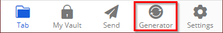
. Choose the password characteristics you want to set. For example, you might want a longer or shorter password. Some sites do not let you use special characters in passwords, so you have to uncheck that box. When you are satisfied with your password, click the copy icon.
+
.Password Generation options
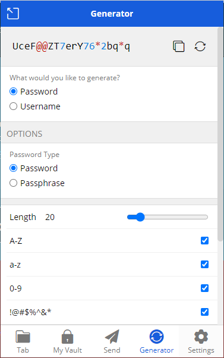
. Paste the password into the new password fields.
. Save your account.
. Bitwarden *should* recognize the password update and prompt you to update the password in the vault. But sometimes this does not happen automatically.
. If you were not prompted to save the new password in the vault, click the Bitwarden icon, and view the account information.
+
.View a save credential
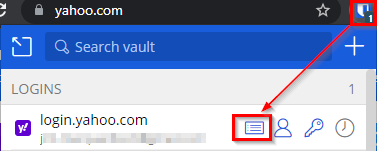
. Click the visibility icon and confirm the password. If the password is out of date, click the *Edit* button.
+
.Confirm the password and edit if needed
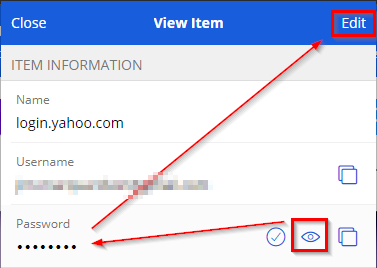
. Paste the new password into the password field, then click *Save.*
. At this point, your new, secure password will be saved in Bitwarden.

== Day-to-Day Use

You should be using your password manager all the time. When you first launch your browser, your vault may be locked. You can unlock the vault with your master password.

.Unlock your password vault with your master password
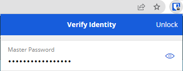

At this point, Bitwarden should be installed and helping keep your accounts more secure. Bit warden can only really help if you integrate it in the login and password reset processes. Give it a try for a couple of weeks to see if it adds value. At first, it may feel more cumbersome than just trying to remember passwords, but as muscle memory improves, you will likely find that you save time when using a password manager.

== Challenge

. Start registering your existing accounts in Bitwarden.
. Reset your bad passwords. Use the Bitwarden password generator to create new passwords.
. Install Bitwarden on your smartphone.

== Reflection

* What happens if you forget your master password?
* How should you protect your master password?
* If somebody gets access to your master password, they would have access to all of your fantastic passwords. Is the tradeoff worth it?

