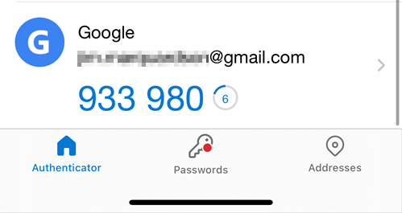

= Multifactor Authentication

Strong passwords help secure accounts, but passwords can be lost, guessed, or stolen. Many modern systems let you log in with alternatives to passwords, such as SMS text messages, email verification, or biometrics. Using multiple factors to authenticate can improve your account security.

== Learning Objectives

You should be able to:

* Describe multifactor authentication
* Install an authenticator app on a smartphone
* Register an account with multifactor authentication

== Authentication Factors

Authentication is the process of verifying that you are who you say you are. You should be the only person who knows your password, for example, so if you can provide the correct password, you verify that you are the account owner. Passwords are "something you know," but there are other types of authentication. Below are different authentication factors:

* Something you *know* (like passwords, answers to secret questions)
* Something you *are* (biometrics like a fingerprint, face scan, palm scan, retina scan)
* Something you *have* (such as a smartphone)

An attacker might be able to steal one of these things, but it is much harder to compromise more than one. For example, a hacker might steal your phone, but not know your password. A password might become disclosed in a data breach, but that would have nothing to do with your physical smartphone. Requiring multiple authentication factors can dramatically improve your account security.

Many of our accounts are low-risk and do not necessarily need multifactor authentication. Maybe you signed up for a small message board, and nothing terrible would happen if that account were compromised. But many accounts, such as email, are very important to secure. If your email account is compromised, attackers can reset accounts, cause embarrassment, and more. At a minimum, multifactor authentication should be turned on for email.

Multifactor authentication occurs when more than one type of authentication is used. Usernames, passwords, and personal identification numbers (PINs) are all something you know, so if you are asked to provide all 3 at login, that is still only single-factor authentication.

== Practical Advice for Multifactor Authentication

For websites (the majority of peoples' accounts), passwords are the common denominator. The choice for a second authentication factor usually is one of the following:

. SMS text message authentication
. Using an authenticator app

SMS authentication *basically* is a "something you have" factor of authentication. Ideally, only your phone is linked to your phone number. Seems reasonable enough. But some people hack phone number portability (the feature that lets you keep your phone number when you switch carriers) to steal your phone number. Typically, only high-value targets need to worry about their phone number being stolen. But it does happen.

Authenticator apps are more secure than SMS authentication. These should be preferred when they are an option. These apps are linked to your phone's hardware, not your phone number. So even if an attacker was able to steal your phone number, they would not have access to the authenticator apps on your smartphone.

== Download an Authenticator App

There are several authenticator apps available. Google makes one. Microsoft makes one. Other companies make them. Choose one that you think is secure. I was uncomfortable with how much I rely on Google, so I decided to install Microsoft's Authenticator app.

If you already have an authenticator app installed on your phone, you do not need to install another one (unless you just want to test another one out).

. Go to the app store for your smartphone.
. Search for "authenticator app."
. Below are the top results in the Apple Store. The Microsoft Authenticator and Google Authenticator apps have similar (high) numbers of installs. Either app is a good choice. Avoid authenticator apps from companies that you do not recognize.
+
.Apple Store Results
image::app_store_apps.png[Apple Store Results]
. Install an authenticator app.
. Launch the authenticator app.
. Finish the authenticator app setup as prompted in the app.

== Enable Multifactor Authentication on Gmail

This activity assumes that you have a Gmail account. Multifactor authentication setup should be similar for most email providers. Email is used here because it is likely the most critical account that you manage. 

. Go to https://myaccount.google.com/.
. Click on the *Security* link, and click *2-Step Verification*.
+
.2-Step Verification Link

. You may be prompted to authenticate. This protects you in case you left your web browser open and somebody wanted to change your authentication options.
. You can set up SMS verification if desired. The remainder of this section will address authenticator apps.
. Click the *Authenticator app* link.
+
.Authenticator app link

. Click the button to set up an authenticator.
+
.Set up authenticator

. Launch the authenticator app on your phone and scan the QR code on your screen.
+
.QR Code

. In your smartphone's authenticator app, grab the code and enter it on the website.
+
.QR Code Confirmation.

. Test the 2-factor authentication.
.. Open an incognito/private web browser window.
.. Login to your Gmail.
.. After entering your password, you will be prompted for the code in your app.
+
.2nd Verification Prompt

.. Find the code on your smartphone.
+
.Authenticator smartphone app screenshot

.. You can optionally choose to remember this device (i.e., the web browser).

If you remember your devices, you will not be prompted for the second factor every time you log in.

== Challenge

. Think about other critical accounts you manage. Set up 2-factor authentication with your authenticator app if possible.

== Reflection

* Why are authentication apps better than SMS verification?
* How comfortable are you registering your biometric data with companies for authentication purposes?
* How might attackers be able to hack the 2-factor authentication process? (Hint: it might take some social engineering.)

