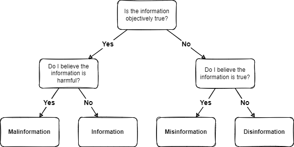
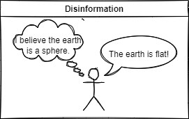
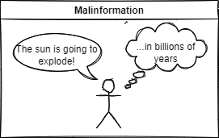

= Information: Dis, Mis, and Mal

As long as language has existed, people have used it to persuade others. Some argue that lying evolved to give people a natural advantage over others. If you can successfully make people believe untruths, you could be at an advantage to gain resources and pass your genes to the next generation.

In modern society, we are bombarded with information. We struggle to discern truth from fiction. Individuals, governments, businesses, and other groups have a vested interest in establishing narratives in their favor. We must be on guard. Cybersecurity literature refers to malicious attempts to control the narratives as influence campaigns. No political party holds a monopoly on influence campaigns.

== Learning Objectives

You should be able to describe and give examples of:

* Disinformation
* Misinformation
* Malinformation

== Quick Definitions

* *Disinformation* is false information claimed as truth, and the person promoting it as truth knows that it is untrue.
* *Misinformation* is false information claimed as truth, but the person promoting it as truth genuinely thinks it is true. Misinformation does not qualify as deception because the person promoting it has no intention to create false beliefs. However, misinformation can be damaging because may believe the information.
* *Malinformation* is true information that could lead to a negative outcome. It is "malicious" information. 

The following diagram shows how a statement could be classified. Classification requires that the objective truth be known and the subjective analysis of whether true information could cause harm is also known.

.Flowchart for Classifying Information

== Disinformation

Spreading disinformation is deception. Disinformation propagators know that the information they share is untrue, but they intentionally choose to share it anyway. The hardest part of classifying a message as disinformation is knowing the beliefs and intentions of the sender.

.Disinformation

== Misinformation

When you are misinformed, you think you know that something is true but you're wrong. The hardest part of determining if something is misinformation is agreement on truth. Somebody might spread misinformation by stating that Greenland is a territory of the United States because they heard that from a friend. (Objectively, Greenland is not a territory of the United States.) We have all probably unintentionally spread misinformation at some point in time just out of ignorance, not malice.

.Misinformation
image::misinformation_drawio.png[]

In some cases, identifying misinformation is easy. The earth is a sphere. It is not flat. But some people genuinely believe that the earth is flat. If somebody believes that the world is flat goes on Twitter and tweets that the world is flat, most of us will agree that this is misinformation. In this example, the person tweeting is merely misinformed. The vast majority of people on earth would agree that the flat earth tweet is misinformation, but a vocal minority who agree with the flat earth

Misinformation can be harmful. A journalist could quote an unnamed source that says 5G cell towers caused COVID-19. This misinformation might result in public policy that delays the rollout of broadband internet to underserved communities.

== Malinformation

Malinformation is "malicious" information. It is true information that could lead to negative outcomes. Some people argue that malinformation does not exist--it is simply the truth and the truth can never be malicious. Some argue that society should regulate malinformation when censoring true information is in the best interest of the greater good.

.Malinformation

Theoretically, you could try to make people panic by telling them that the sun will explode. Indeed, in billions of years, the sun will explode. Warning people about the sun's impending explosion is fully accurate. But this information could be shared in a way to influence people to spend their life savings building bomb shelters or to join strange cults. Intention *could* matter when classifying something as malinformation.

Conceptually, labeling truth as malicious could have negative consequences. One political party might want to squash truths that weaken allegiance to it. That party might request that social media platforms stop truthful information from going viral because their righteous cause would be harmed in the long run.

In 2023, the report Matt Taibbi documented efforts to suppress truthful information about vaccine side effects because they could lead to vaccine hesitancy (https://twitter.com/mtaibbi/status/1633830002742657027). Proponents of suppressing truthful information could argue that vaccines, despite their side effects, provide much more benefits than harms, and therefore any information that leads people away from vaccination should be suppressed. Opponents of suppressing true information could argue that people should be able to weigh all of the evidence and make informed decisions. The same information could be classified as malinformation or simply truth depending on the person making the judgment.

== Judgment

George Orwell's dystopian novel "1984" describes the fictional government of Oceania. In the novel, Orwell describes the "Ministry of Truth." The Ministry of Truth has exclusive authority for determining truth from fiction. If the Ministry says that 2+2=5, then it is so. The novel warns about what happens when the determination of truth resides in the hands of a single group, unaccountable for its decisions.

In 2022, the United States Department of Homeland Security tried to establish a "Disinformation Governance Board." The Disinformation Governance Board was charged to combat dis-, mis-, and malinformation. Quickly, politicians and the media compared its mission with 1984's Ministry of Truth. Opposition from many groups was swift. After just a few weeks, the Board was shut down pending further review. It is not clear if the United States government shuttered its attempts to influence the way information is published, or if the government simply decided to move its discussions behind closed doors.

== Reflection

* In what circumstances might it be prudent for a government to officially classify information as true, disinformation, misinformation, or malinformation?
* Does malinformation exist? Why do you think so?
* Who will watch the watchers?

