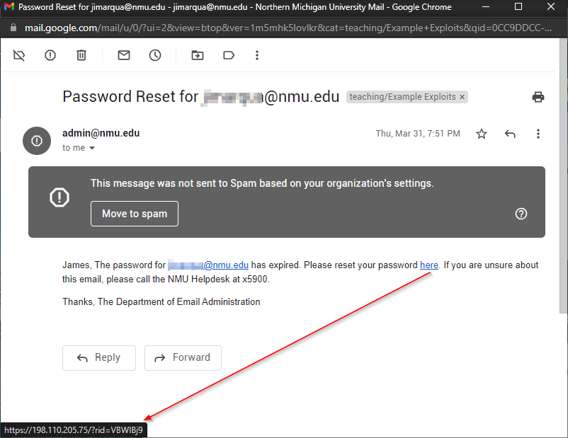
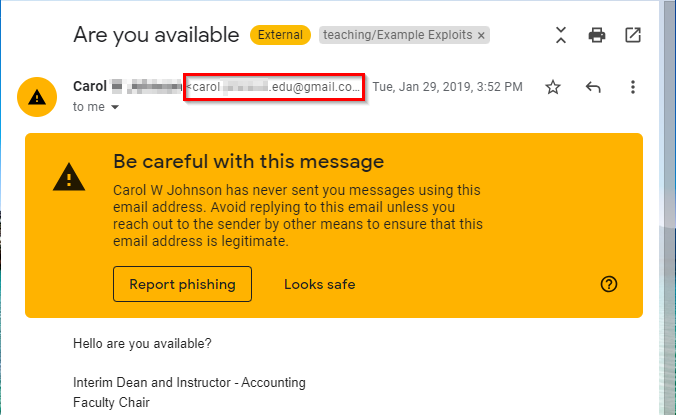
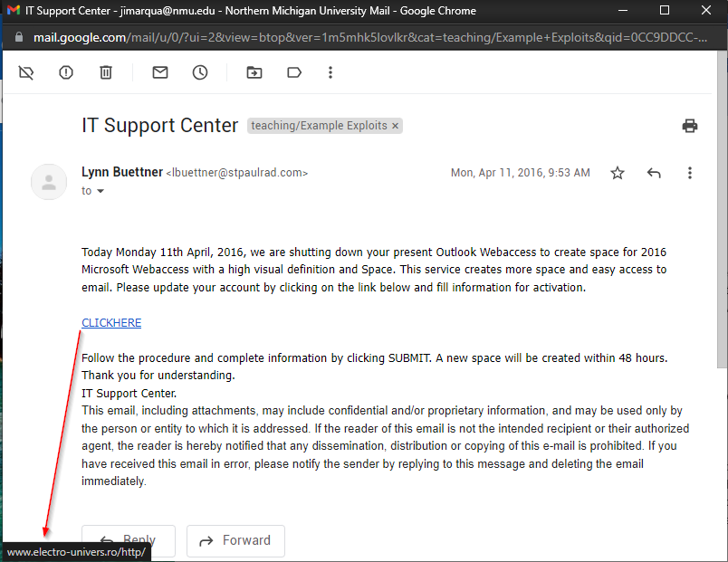

= Phishing

Phishing attacks are one of the most common ways that organizations are breached. Many phishing emails are caught by spam filters, but a well-crafted phishing attack can bypass filters and cause a lot of damage.

== Learning Objectives

You should be able to:

* Recognize phishing email indicators
* Describe phishing protection

== Phishing Email Indicators

Some phishing emails are easy to spot. Others take some work. Below is a real phishing email.

.1st Sample Phishing email

Several features indicate this could be a phishing email:

* The *here* link does not point to a nmu.edu domain. Instead, it points to an IP address, and it's not clear who manages that server.
* The people in charge of email do not reset passwords
* There is no Department of Email Administration at NMU.
* Other features in the email header may have triggered the spam warning.

The following is the actual text of another phishing email I received.

----
Dear Sir/Madam  
My name is Andrea Polvic. I'm a private solicitor to Mr. Dmitry Zakharchenko, who was the head of the Anti-Corruption Board
in Russia.You can read the link below to have fullknowledge of the man.
 
https://www.rt.com/news/359330-russia-corruption-bank-switzerland/
 
I'm secretly working on getting his wife an asylum in the United Kingdom, she informed me of some private Deposit with Private Vaults and financial institution which she wants me to get someone reliable to secure and invest the funds for the
family. These Deposit were made before the episode express in the link. His wife has given us instructions to look
for an investor that could handle any ofthe funds on behalf of the family. I will reveal details of this testament as soon as we agreed to deal on this transaction.
 
If you agree to this request and you have the capacity to handle this funds, you will be charge with the responsibility of receiving the funds through legal means with the deposit document which I will present to you.You are free to negotiate a reasonable % for your involvement with his wife.But be rest assured that there is no risk in all of this as the Vault management holding the funds has assured us of safety and confidentiality.
 
The total amount deposited is much and I will give you details as soon as you indicate interest to work with us. 
 
Please keep confidential.
 
Sincerely,
 
Andrea Polvic
----

Several features of the email should raise some alarms:

* Spelling mistakes and punctuation errors. One might think that for such an important effort (i.e., granting somebody asylum), spell check would be used.
* I have no connections with Russia or anything to do with political asylum.
* It's just weird.

Below is a screenshot of a third phishing email I received.

.3rd Phishing Email Example

Somebody did a little research to make this phishing email more convincing.

* The email purported to come from my actual boss, but the email address was odd. The email address was not from my organization but was crafted to look like it came from my organization.

I thought it was a phishing email immediately. To verify, I walked 20 steps to my boss' office and asked her if she'd sent the email. It turns out that no, somebody was attempting a more targeted phishing attack.

In general phishing emails can be indicated by:

* Spelling errors
* Grammatical errors
* Odd requests
* Email from unexpected domains
* Broken links
* Broken images

When in doubt, do not click on links or download files from emails that could be phishing emails.

== Protecting Against Phishing

Technical and non-technical approaches should be taken to address problems with phishing emails.

Technical controls

* Use good spam filters
* Have all employees run antivirus software
* Employ data loss prevention (DPL) systems that prevent employees from accidentally emailing sensitive information

Non-technical controls

* Train people periodically about phishing emails
* Do regular tests to see if people will fall victim to phishing attacks
* Publish guidelines for the expected behavior when people receive phishing emails

== Seek and Find

Look at the following screenshot of an email. Decide whether the email is a phishing email and describe why. The URL of the link is indicated by the red arrow. For context, I was working for Northern Michigan University when I received this email.

.Is it a phishing email?

== Reflection

* Why do people fall victim to phishing attacks?
* What kinds of phishing emails do you receive?

