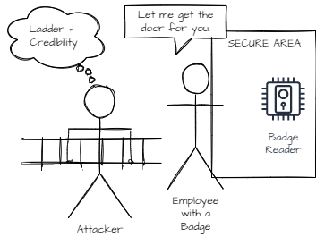

= Tailgating

Tailgating is a simple social engineering attack that gives the attacker access to a physical space.

== Learning Objectives

You should be able to:

* Describe the tailgating attack
* Provide recommendations for thwarting tailgating attacks

== Tailgating

At its core, tailgating is a simple attack. The attacker wants access to a restricted area, so the attacker follows an authorized individual into the restricted area. The key is getting an authorized person to ignore or help the attacker get access.

The following diagram shows a tailgating attack in its most basic form.

.Basic tailgating attack

People will often let you do something you are not supposed to if you just ask. But sometimes people need a little nudge. When you see somebody holding a heavy box, the "must help" part of the brain is triggered.

.People help you when you're holding heavy stuff
image::tailgate-box.drawio.png[People help you when you're holding heavy stuff]

But sometimes that is not enough. Nobody would try to go somewhere with a ladder without a good reason, right? People have snuck into the Superbowl just by bringing a latter. The people checking tickets have let people just walk on by if they are carrying ladders.

.Ladders add credibility

A fancy badge and clipboard is a foolproof recipe for looking like you know what you are doing. In some industries, anything related to *safety* is sacred because nobody wants to be accused of causing unsafe working conditions.

.Clipboards and badges look official

Attackers can do a lot of damage with physical access to restricted areas. This includes:

* Stealing printed documents
* Planting malware on computers
* Causing physical destruction
* Stealing computer equipment
* Failing to put the toilet seat down
* Putting devices to sniff network traffic in network ports

So, tailgating should be stopped.

== Preventing Tailgating

There are several ways to prevent tailgating.

. Tailgating alarms. Some systems can detect if one badge was swiped and yet two people tried to pass through a door.
. Access control vestibules (also known as mantraps). People pass one at a time through a narrow passage. You walk in and doors close on both sides. If your badge scans successfully, the door opens and you continue to your destination. If your badge does work, you wait until a security guard escorts you off campus.
. Employee training. Employees should challenge visitors who are in restricted areas. At a minimum, employees should contact security.

== Exercise

. Determine a place where you would like to gain access. How would you do it?
.. What would you wear?
.. What would you bring with you?
.. What would your pretext (i.e., cover story) be?
.. What would you do if challenged?

== Reflection

* What malicious things could an attacker do if they had access to your bedroom?
* How might culture change how comfortable people are at challenging whether somebody has the right to be in a restricted area?

