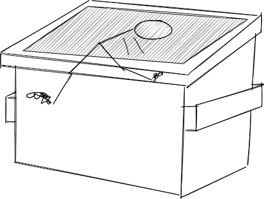

= Dumpster Diving

Author: Dr. Jim Marquardson

Changelog

* 2022-08-15 Initial Version

Dumpster diving is exactly what it sounds like. Look in the trash for treasure.

== Learning Objectives

You should be able to:

* Describe the goals of dumpster diving
* Describe how people can defend against dumpster diving

== Dumpster Diving

Even in today's largely digital world, we print a massive amount of documents every year. Paper forms may contain health information, financial information, pay stubs, tax forms, and much more. Among the documentation could be descriptions of information technology security, projects, networks, usernames, and system passwords (unfortunately).

.Dumpster diving

Attackers looking for information might time dumpster diving activities with busy times of the year. If taxes are filed on April 15, accountants might dispose of working documents shortly after that date.

Computer systems might be thrown out with data still on the hard drives. Most people do not know how to securely retire systems. Even when people think they have erased the hard drives, experts can recover much of the data.

== Dumpster Diving Prevention

Dumpster diving is a problem that can be solved by properly disposing of sensitive information.

. Shred sensitive documents.
. Securely wipe the drives of all computer equipment before disposal or donation.
. Physically destroy hard drives.
. Train employees on the proper disposal of information.

== Personal Dumpster Dive

. Look in your backpack, briefcase, purse, pockets, etc. for things that you probably should have destroyed or thrown away.
.. If somebody had been able to look through those items, could they have done anything malicious with them?

== Reflection

* What kinds of personal documents do you throw away that should probably be shredded?
* Do you have digital documents that you've hoarded for a long time that should be securely deleted?

