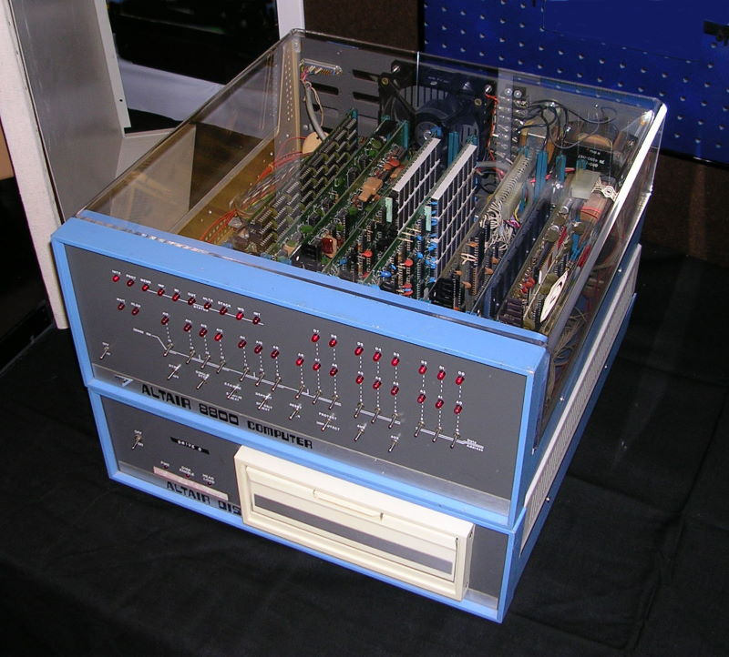

= The Rise Of Windows

Author: Dr. Jim Marquardson

Changelog

* 2022-08-15 Initial Version

Microsoft Windows dominates the enterprise desktop operating system market. This chapter provides a little history about Microsoft and its famed Windows operating system.

== Learning Objectives

You should be able to:

* Describe some of the highlights (and lowlights) of Windows
* Contrast Windows and Linux from a development perspective

== Early Days of Microsoft

In the 1970s, computer hardware dropped in price such that a hobbyist could buy a computer-like device for a few thousand dollars. The hardware was difficult to work with. Released in 1975, the Altair 8800 was perhaps the first computer that hobbyists could afford. You had to manually toggle switches to provide input instead of using a keyboard. Programming the device was tedious. Many hobbyist meetings were spent trying to figure out how to do something useful with the device. Hobbyists had a great time doing so.

.Altair 8800

Before computers could take off, somebody had to find a way to make it easier for software to interact with the computer hardware. The computer operating system is the software layer that lets programs access the computer hardware, such as the CPU, memory, keyboard, monitor, network cards, etc.

Five years after the Altair 8080 was released, the Seattle Computer Products company released an operating system internally branded QDOS--for Quick and Dirty Operating System. This operating system competed with an operating system developed by IBM--CP/M.

IBM was reluctant to license CP/M to hardware manufacturers. An enterprising young man named Bill Gates had no such reservations. Bill gates licensed and later purchased QDOS so that it could turn around and license it to hardware companies. Microsoft's initial success in licensing its software lead to further development of software that it could license. Microsoft eventually created its own operating system--MS-DOS (Microsoft Disk Operating System). The operating system was largely command-line driven and not terribly easy to use.

== Birth of Windows

Microsoft toyed with graphical user interfaces in the early 1980s, but it wasn't until 1985 that Microsoft released Windows 1.0. Though a minor success, Windows really took off in the home and business market with Windows 3.0 release in 1990.

Windows 95 likely had the largest marketing push in the history of computer operating systems. Windows 95 introduced the "Start" menu. Microsoft spent millions licensing the song "Start Me Up" by the Rolling Stones. People lined up around the block to buy a CD with the Windows 95 operating system. Some people even returned Windows 95 to the store because they did not realize that you needed a computer to run it. Windows 95 was released just as the internet and the world wide web were becoming mainstream. Broadband internet was being deployed across the United States and across the world. Windows 95 was the first operating system to expect internet access.

Windows 98 was a minor upgrade to Windows 95. Windows ME (Millenium Edition) was horrible and will not be spoken of again.

Windows XP was released in 2001. This was barely after the dotcom boom and bust. Though information technology professionals who have used Windows for decades still praise Windows XP, it had a rocky start. Microsoft had tons of bugs in Windows XP and many of those bugs were exploited by viruses that spread across the internet. Microsoft got serious with security when they released Windows XP Service Pack 2 (SP2). Many companies hung onto Windows XP as long as possible until Microsoft forced them to upgrade.

Windows Vista was a garbage operating system that everybody with any kind of taste hated. Hardware drivers were buggy, it was dog slow. Microsoft bragged how Visa would play music without skipping. The stupid trick they included to pull this off was to slow down your network connection every time you played music. If this paragraph sounds bitter, it's because writing it has brought back painful memories of using that terrible operating system.

Windows 7 was good again. It seemed as simple as Windows XP but with up-to-date features. People started to notice that every release of Windows alternated between good and garbage. 95--good. ME--garbage. XP--good. Vista--garbage. 7--good. 8--yep, garbage.

In Windows 8, Microsoft seemed to have dueling development teams make Windows. You had the "Start Menu" folks on one side, and the "Tile Menu" folks on the other side. Microsoft could not agree on which side was better, so they shipped a (insert expletive here) operating system that had two ways to do everything. It was stupid and dumb. Microsoft was trying to create one operating system that worked well on tablets, smartphones, desktops, and laptops, but they succeeded only in making people angry by creating an operating system that worked well nowhere.

Windows 10 followed the bad/good pattern by being a good operating system. Microsoft removed its stupidness from Windows 8 and basically made a better version of Windows 7. Balance in the universe was restored.

Microsoft released Windows 11 in October 2021, but honestly it seems like nobody gets excited about operating systems anymore. Windows is still very popular on computer desktops. One reason why businesses still embrace Windows is that desktops can be centrally managed using Active Directory (where user accounts are stored) and Group Policy (turns features on or off according to company policy).

== Development of Windows

Microsoft Windows is a proprietary operating system. You cannot use it unless you have a license purchased from Microsoft. Generally, all of Microsoft's code is closed source, meaning that Microsoft does not let you read the source code, and Microsoft does not accept contributions from the community. Microsoft tightly manages the Windows roadmap. All developers who write code for Windows are hired and paid by Microsoft.

(In recent years, Microsoft has open-sourced some parts of the operating system. The calculator that ships with Windows is now open source and community contributions are welcome. Perhaps this is a signal of a culture change in Microsoft.)

In contrast to Windows, most Linux distributions are open source and can be licensed for use for free. Development is done in the open and all changes to Linux are published online. Many developers who contribute to Linux are paid, but many are not financially compensated for their contributions. A programmer might work a regular job during the day and do some work on Linux at night or on the weekend. Some Linux developers might work for companies like Intel and work on Linux to ensure that their hardware runs well in Linux.

== Peek Into the Past

. Screenshots of early versions of Microsoft's operating systems are copyright protected and cannot be included in this chapter. Check out Wikipedia for some screenshots of early versions of Windows.
.. Windows 1.0: https://en.wikipedia.org/wiki/Windows_1.0x
.. Windows 2.0: https://en.wikipedia.org/wiki/Windows_2.0x
.. Windows 3.0: https://en.wikipedia.org/wiki/Windows_3.0
.. Windows 95: https://en.wikipedia.org/wiki/Windows_95
.. Windows 98: https://en.wikipedia.org/wiki/Windows_98
.. Windows ME: https://en.wikipedia.org/wiki/Windows_Me
.. Windows XP: https://en.wikipedia.org/wiki/Windows_XP
.. Windows Vista: https://en.wikipedia.org/wiki/Windows_Vista
.. Windows 7: https://en.wikipedia.org/wiki/Windows_7
.. Windows 8: https://en.wikipedia.org/wiki/Windows_8
.. Windows 10: https://en.wikipedia.org/wiki/Windows_10
.. Windows 11: https://en.wikipedia.org/wiki/Windows_11

== Home Versus Pro

For each major version of Windows, Microsoft typically offers two different kinds of licensing options: home and pro. Microsoft often offers slightly different versions (e.g., for education, or "ultimate"), but they are largely just a different mix of home and pro versions.

Businesses should use the pro versions because they have several benefits that help organizations secure data. Benefits of going pro:

* BitLocker - BitLocker is a feature used to encrypt entire hard drives. You will be safe if an employee loses a hard drive if the hard drive was encrypted with BitLocker.
* Group Policy - Windows computers connected to a network can have individual features enabled or disabled via Group Policy. A Windows administrator can make a policy, store it centrally in *Active Directory*, and deploy it to thousands of computers relatively easily. For example, Group Policy may forbid employees from installing software from unapproved sources.
* Active Directory Support - Active Directory stores user account information in a central location. Group Policy is applied to different organizational groups in Active Directory.

There are other pro features, but the three above are some of the most critical for cybersecurity.

== Reflection

* Do people care about operating system releases today?
* What operating system is your favorite? Why?
* Is a web browser becoming more important than the operating system?
* How should volunteer coders be compensated?
* What are the pros and cons of the development approaches used to create Windows and Linux?

== Bonus

If you need help planning a party with your friends to celebrate the release of a new Windows operating system, check out this video: https://www.youtube.com/watch?v=1cX4t5-YpHQ.
