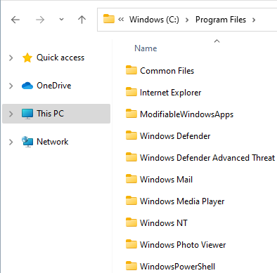

= Windows Folders

Author: Dr. Jim Marquardson

Changelog

* 2022-08-15 Initial Version

Recent versions of Windows have converged on a consistent set of folders. The organization is especially important to study if switching from tablets or Chromebooks that have very different folder structures. This chapter will use Windows 11. The principles apply to other versions of Windows, but some of the shortcuts, menus, and other graphical user elements might differ.

== Learning Objectives

You should be able to:

* Identify the location of important folders
* Be able to navigate using Windows Explorer

== Launch Explorer

*Explorer* is the official name of the application that lets you browse files and folders on your computer. You can launch *Explorer* several ways:

. Use the Windows key+e shortcut. This is my preferred way.
. Find the *File Explorer* app in the start menu.
+
.File Explorer Menu Icon

. Right-click on the start menu to open the super-secret options and choose *File Explorer*.
.Super-Secret Right-click Start Menu Options

== Explorer Organization

The Explorer windows contain several default categories: The *Quick access*, *OneDrive*, *This PC*, and *Network*.

The *Quick access* category contains recently used folders and folders that a user pins.

.Quick Access

Microsoft *OneDrive* is a service that synchronizes data between the local computer and the cloud. Files can be synchronized across devices, including multiple computers, smartphones, and other Microsoft devices.

.Microsoft OneDrive

Perhaps the most important category for learning what is on your computer is *This PC.* The *This PC* view shows the devices and drives connected to the computer. If you had a USB drive attached to the computer, a smartphone connected to the computer, or added a new hard drive, they would show up here. While Microsoft often tries to hide the complexity of the file system from the casual user, the *This PC* gives you a detailed view of the organization of hard drives. The next section will have you investigate the *This PC* category more.

.This PC Category

Large organizations tend to keep at least some files stored centrally on networked servers. These networked servers can be accessed from client devices. In the screenshot below, there are no network connections available.

.Network Category

== C-Drive

. Click on the *This PC* category. Notice that there is a *Windows (C:)* drive. But why is it labeled *C*? Historically, computers came with floppy disks. It was common to have two floppy disk drives. Those drives would be given the letters *A* and *B*. Fixed hard drives were given the label *C*. For historical purposes (and perhaps some backward compatibility), the first hard drive on your computer is typically given the letter *C*.
. Double-click on the C: drive to list its folders.
.Windows C: Drive

+
Depending on what software you have installed, the list of folders could be slightly different.
.. Take a few sends to read the names of the folders.
. Double-click on the *Users* folder to display its contents.
+
.Contents of the *Users* Folder

+
In this case, there are two folders: *jim* and *Public*. The *jim* folder corresponds to a specific user's account. The *Public* folder is used for sharing files between accounts. Imagine if a family had separate accounts for each person. If they stored photos in their individual user folders, members of the family could not access each others' content. But if they stored the photos in the *Public* folder, all members of the family could access the photos.
. Open your user account folder.
+
.Contents of a User's Home Folder

+
Each user has a separate *Documents* folder, *Desktop* folder, *Downloads* folder, etc.
. Navigate back to "This PC".
.. Go to C:\Windows\System32\Drivers\etc. This folder contains the *hosts* file. The *hosts* file is the first place your computer will look when trying to find the IP address associated with a domain name.
+
.Windows *etc* folder

. Programs are typically stored in two locations--C:\Program Files and C:\Program Files (x86).
. Take a look at the programs in C:\Program Files. This folder contains 64-bit applications.
+
.C:\Program Files

. Open C:\Program Files (x86). This folder contains 32-bit applications.
+
.C:\Program Files (x86)

+
Having two places where Windows stores programs is somewhat annoying. It basically means that you have to check two different places to see where a program was installed.
. Navigate to c:\users\youraccount\AppData by typing it directly in the address bar. AppData is hidden by default. Check out the Local and Roaming subfolders.
+
.Hidden AppData Folder

== Challenge

. What applications are storing data in your AppData folder?
. Which applications are 64-bit?
. Which applications are 32-bit?

== Reflection

* What aspects of the Windows folder organization is most confusing?
* How would you make it easier for people to organize files on their computers?

