= Windows Accounts

User account information can be stored centrally (such as in Microsoft Active Directory) or locally on individual computers. Unless your computer is connected to a corporate network, your user and group information is probably stored locally. This chapter will help you explore local account information.

== Learning Objectives

You should be able to:

* Describe how local users and groups work on Windows computers
* List local users
* Evaluate user properties
* List local group members

== Users and Groups: Windows Home

User accounts can be managed in Windows Home and Windows Pro, but the Home version has more limited abilities.

. In the start menu, search for *Users* and launch the *Add, edit, or remove other users.*
+
.Start Menu Item: Add, edit or remove other users
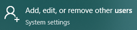
. You can add a family member or an "Other user." Click the button to add an "Other user."
+
.Add Other User
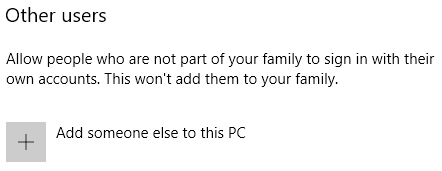
. Microsoft really wants people to sign in with an online account so that information can be synchronized. Click the link to indicate that we do not have this person's information.
+
.Skip the Online Sign-in
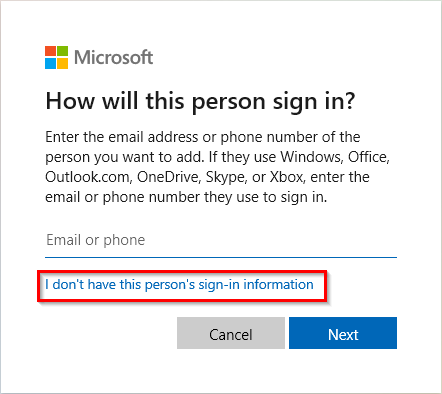
. Microsoft is being stubborn. Click the link to add a user without a Microsoft Account.
+
.No Microsoft Account
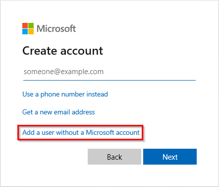
. Fill out the name, password, and other required information, then click *Next*.
+
.User Details
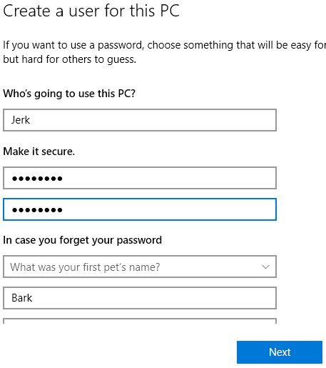
. At this point, the new user has been added. The account can now be used to log in.
+
.User Account Added
image::home-jerk-added.png[User Account Added]
. To remove the account, select the account, then click *Remove*.
+
.Remove Account
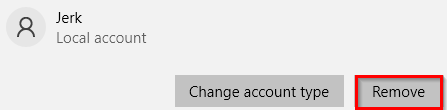
. Removing an account is kind of a big deal, so Windows will confirm that you really want to do this.
+
.Confirm Account Removal
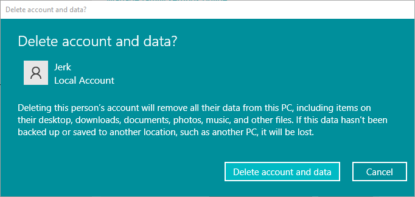
.. Go ahead and confirm if you'd like to delete this account. If you want to test it out, keep it. It's your computer.

== Users and Groups: Windows Pro

Microsoft includes different management tools in Windows Pro versions.

. Search for "lusrmgr.msc" in the start menu. This will link directly to a tool for managing local users and groups. In this case, "local" refers to this particular computer. These accounts are not centrally managed by an organization.
+
.Start Menu Search for lusrmgr.msc
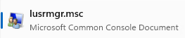
. Select the *Users* category.
+
.List of Local Users
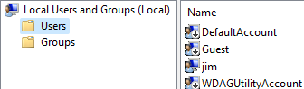
. Double-click on the *Guest* account. Notice that the account is disabled.
+
.Guest Account Properties
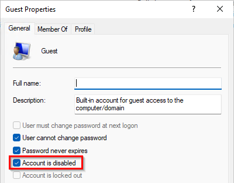
. Analyze the properties of your account.
. Open the *Groups*.
+
.List of Local Groups
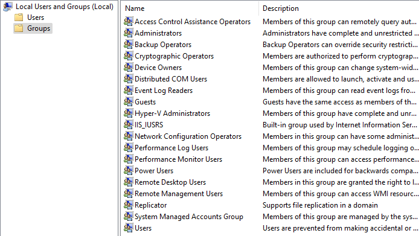
. Double-click the *Administrators* group. Your account is likely a member of the group.
+
.Administrator Group Properties
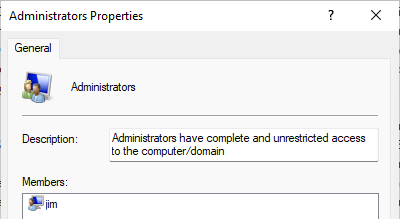
. Check several groups. Many groups will have no members. Some groups will have system account members only instead of named users. These are typically for services that run in the background.
+
.Internet Information Services (IIS) Group Members
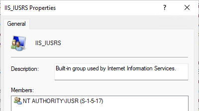

== Reflection

* Why would it be a poor practice to add everybody to the *Administrators* group?
* What would be the benefits of having all members of a family use separate local accounts when using a shared computer?

