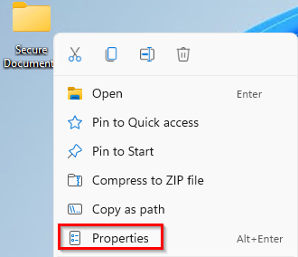
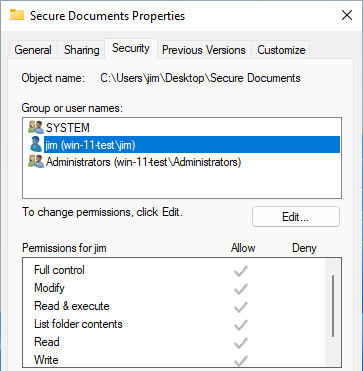
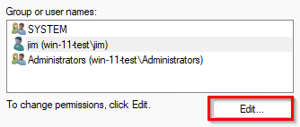
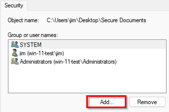
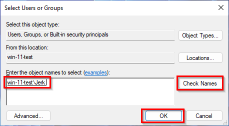
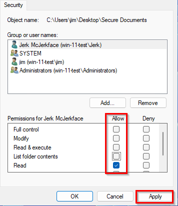

= Windows Permissions

Author: Dr. Jim Marquardson

Changelog

* 2022-08-15 Initial Version

Permissions can be set on files and folders to control access. Windows lets you change read, write, execute, and other permissions.

== Learning Objectives

You should be able to:

* Describe the permissions that Windows lets you set on files and folders
* Modify file and folder permissions

== Viewing and Modifying Permissions

. Create a new folder called *Secure Documents*.
. Right-click on the folder and choose *Properties*.
+
.Folder Menu Options

. Look at your account's permissions.
+
.Account Permissions

.. Full control: Read, edit, delete, and *change permissions*
.. Modify: Read, edit, and delete files
.. Read & Execute: Read files and run executables
.. List folder contents: View file and folder names only
.. Read: View the file and folder content
.. Write: Add and edit files and folders

== Challenge

. Create a new user account on your system.
.. Run *lusrmgr.msc* from the start menu.
.. Select the *Users* category.
.. Right-click in an empty space and click *New...*.
.. Give the new user information and click *Create* when done.
. Give the user read access to the *Secure Documents* folder.
.. Edit the permissions.
+
.Edit Folder Permissions

. Click *Add...*.
+
.Add User

. Type the name of the user, then *Check Names*, then *OK*.
+
.Find and Add User

. With the new user selected, uncheck all permissions except *Read*, then click *Apply*.
+
.Select Permissions

At this point, the new user has limited access to the folder in question.

== Cleanup

When finished:

. You can delete the *Secure Documents* folder.
. You can delete the new user account you created.

== Reflection

* Which elements of the security triad does changing permissions help with?
* When should permissions be granted to users? When should permissions be granted to groups?

