= Windows Task Manager

Author: Dr. Jim Marquardson

Changelog

* 2022-08-15 Initial Version

The Windows Task Manager is critical software for understanding what is running on your computer.

== Learning Objectives

You should be able to:

* Describe the Task Manager's use cases
* Launch the task manager
* Select Task Manager columns
* Sort processes

== Task Manager

The Task Manager has existed in Windows since its earliest days and will exist in some form forever. The Task Manager is often used to stop stuck applications. Applications might have bugs that occasionally make them eat up all of your CPU, memory, or disk processing capability, and your system will be unresponsive until those applications are forcefully stopped. The Task Manager can be used to hunt down those applications and kill them.

The Task Manager can also be used to look for *malware* or *potentially unwanted programs (PUPs)*. You might see a program named *Steal_My_Info_and_Show_Me_Ads.exe* in the list of running applications, and that could be a sign that some software needs to be uninstalled.

== Using Task Manager

. There are several ways to launch the *Task Manager*.
.. Right-click on the start menu and select *Task Manager*.
+
.Right-click Start Menu
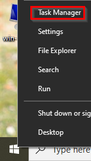
.. Find the *Task Manager* by searching the start menu.
+
.Search for *Task Manager*
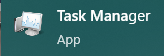
.. If your system is stuck, you can press control+alt+del. The Task Manager will be one of the options presented.
. Launch the *Task Manager* using one of the methods described previously.
. By default, *Task Manager* shows very little information. Your running applications will be displayed. I call this the *useless* mode because it hides virtually all important information.
+
.Task Manager with Hardly Any Information (Useless Mode)
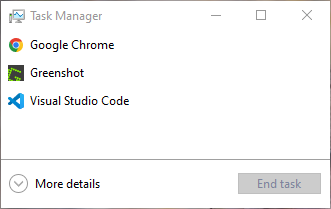
. Click the *More Details* link. A whole new world of information will now be available.
+
.Task Manager with Tons of Information (Useful Mode)
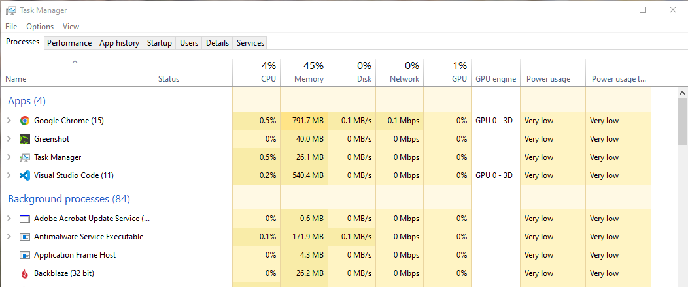
+
Note several changes:
+
In addition to the running applications, background processes are listed. These background processes can cause lots of problems and should occasionally be monitored.
+
There are several tabs--processes, performance, app history, startup, users, details, and services.

== Processes Tab

The *Processes* tab displays the current CPU, Memory, Disk, Network, and GPU utilization overall and for each process. For example, you might be using 50% of your computer's total memory. Google Chrome might be using a significant portion of that. Task Manager itself likely uses only a very small portion of your memory.

. Right-click on the header to see the columns that can be shown or hidden.
+
.Show or Hide Columns
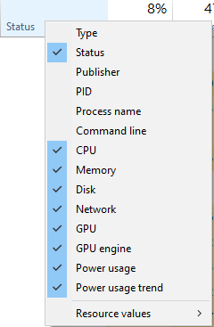
. Show the *PID* (Process Identifier) column. The *PID* column is sometimes useful for linking information with other tools.
. Hide the *Status* column.
. Click on the *Memory* column to sort the values.
+
.Processes Sorted by Memory
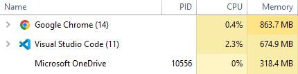
+
On my computer, Chrome, Visual Studio Code, and OneDrive were using the most memory. Sometimes, a program will have a *memory leak* and continue to use more and more memory until the computer runs out of memory. Sorting Task Manager by memory can identify when a program may have a memory leak.
. Sort by disk. Your computer might run slowly because a program is dominating the hard drive. Anti-virus programs are notorious for slowing down systems, often because they cause so much disk activity. Software updates also cause a lot of disk activity. Those processes should probably not be stopped.
. Sort by CPU. The sorting will likely jump around a lot. Many programs sit idle, then periodically need to process data causing the CPU to temporarily spike.
. Review the names. Is there anything suspicious?

== Performance

The *Performance* tab tracks hardware performance over time. This tab can help you know if your CPU, memory, disk, or network is being used heavily. The following screenshot shows a system that is not under very much stress. CPU and disk utilization are low. Nearly half of the memory is used, but there are still 8 gigabytes of memory free.

.Performance Tab
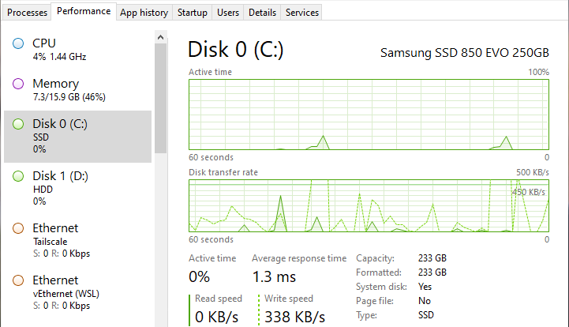

The screenshot also shows that the system has two disks. If one disk is heavily utilized and the other disk has little activity, it could indicate the need for spreading the load over the two disks.

== App History

The *App History* tab records application metrics for a month. By default, the *App History* only shows applications installed through the Microsoft Store (or applications that could be installed through the Microsoft Store that come pre-installed with Windows). I call this "Stupid Mode" because, despite Microsoft's best efforts, a lot of software is not installed through the Microsoft Store.

.App History Data: Stupid Mode that Displays Microsoft Store Apps Only
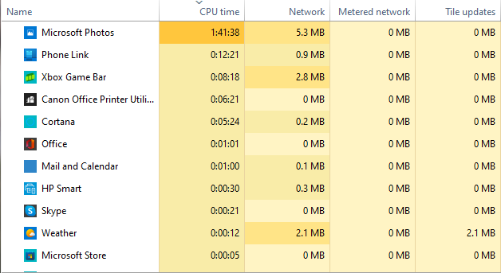

To show all applications, go to the *Options* menu and select *Show history for all processes*.

.History for All Processes (Smart Mode)
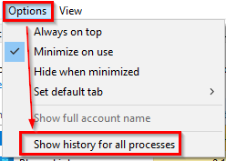

Now, the history will be more accurate.

.Full App History
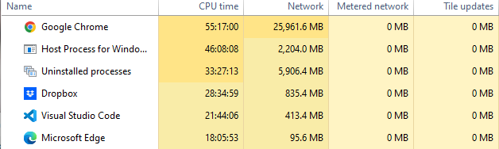

== Startup Tab

The *Startup* tab shows the application that can launch automatically every time you reboot your computer. It is possible to disable applications you do not want. This screenshot shows that the Amazon Music Helper is disabled. That's because I disabled it. I rarely used it, so I did not want it running every time my computer started.

.List of Applications that Can Start Automatically
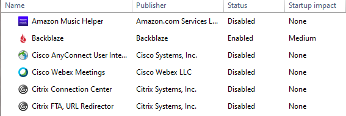

It is important to be careful when deciding which applications to disable. You probably want services that synchronize and backup files to run automatically, even though they impose a fairly large performance hit when they start.

== Users Tab

The *Users* tab likely won't have interesting information on your desktop. There is probably only one user. On a server, you might have several administrators logged into the same computer, in which case it could be important to distinguish what resources each user is using.

.Users Tab
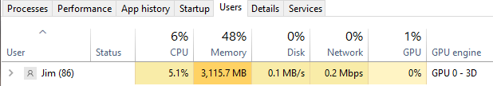

== Details Tab

The *Details* tab is similar to the *Processes* tab. But the *Details* tab will not try to group related processes, and more columns are available to show.

.Details Tab
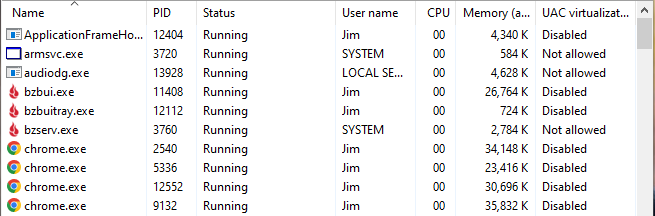

== Services Tab

The *Services* tab displays background services. Think of services as applications that have no graphical user interface. If you are not sure what a service does, it's best not to turn it off. Sometimes the *Services* tab is useful to investigate because a service might be running that you did not expect to be running. Services can be sorted by column, such as Status (stopped and running).

.Services Tab
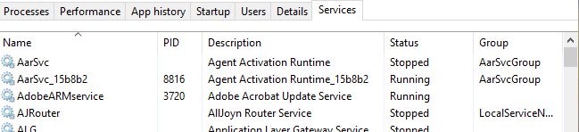

== Challenge

. Which application is using the most memory right now? (Process tab)
. What is your disk's current read and write speed? (Performance tab)
. How much data has your web browser used over the past month? (App History tab) 
. Look at the list of programs that start automatically. Disable applications you know you do not want to start. (Startup tab)
. How many users are logged into your computer? (Users tab)
. How many browser processes are running? (Details tab)
. How many services are running? (Services tab)

== Reflection

* How well do you know the applications and services that are running on your computer?
* How would you identify malware using the Task Manager?
* Does Windows give you sufficient control to manage the software that runs on your computer?

