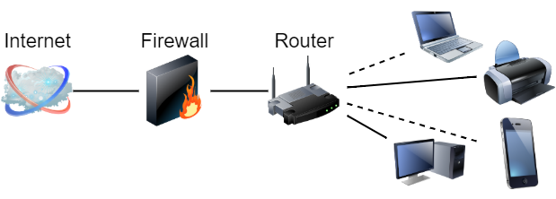
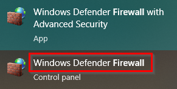
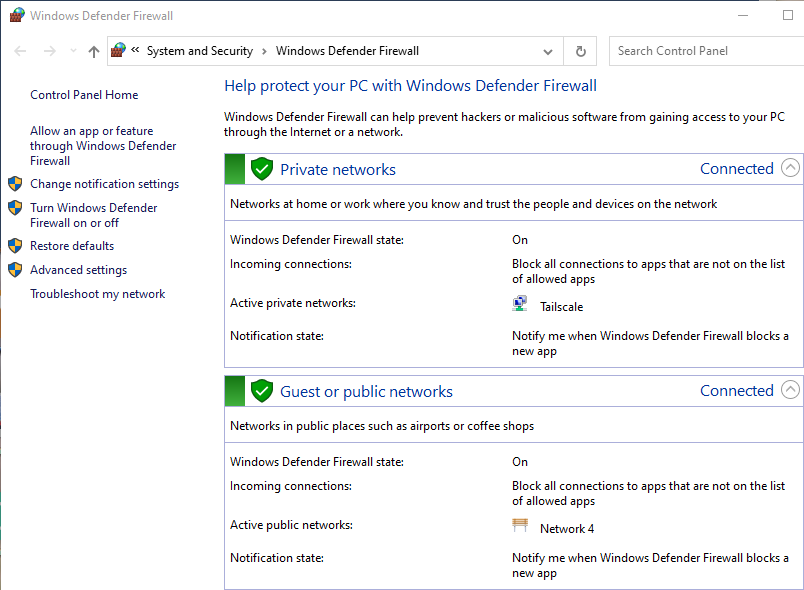
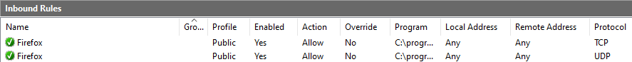

= Windows Firewall

Firewalls block packets based on rules. Firewalls can protect networks or single devices. The Windows Defender Firewall protects the computer on which it runs.

== Learning Objectives

You should be able to:

* Describe the purpose of firewalls
* Differentiate between host-based and network-based firewalls
* Explore firewall rules in the Windows Defender Firewall

== Firewalls

Firewalls filter network packets based on rules. The rules can apply to network protocols and/or specific applications. Some sample rules could be:

* Block ports used for email
* Allow all HTTP and HTTPS requests
* Allow all outgoing requests
* Block ICMP requests
* Allow League of Legends traffic

Firewalls can be broken down into two types: network-based and host-based. The following diagram shows a standalone firewall that filters all packets going into or out of the network. The diagram shows the router and firewall as separate devices, though virtually all home Wi-Fi routers have built-in firewalls.

.Network Firewall Filtering Packets Coming In and Out of an Entire Network

Modern devices have firewalls that provide basic protections. For example, a host-based firewall might reject packets that purport to be responses if the device never asked for a packet in the first place. *Stateful firewalls* make sure that your computer established a connection before it allows incoming replies. The following diagram shows that firewall software can run on a single device. The firewall only protects that device (though it can prevent that device from spreading malicious traffic to nearby devices).

.Host Firewall Filtering Packets Coming In and Out of a Single Computer

== Explore Windows Firewall

Before Windows XP SP2 (Service Pack 2), Windows did not come with a firewall by default. Microsoft was taking tons of heat for poor security in Windows, so Microsoft invested heavily in security with Windows XP SP2. Every version of Windows from Windows XP SP2 and on has come with a firewall. The firewall has improved over time. Microsoft's first firewall for Windows XP SP2 only filtered incoming packets. Future versions allowed incoming and outgoing packets to be filtered. Experts rarely complain about the Windows Defender Firewall anymore which is a fairly strong endorsement because experts like to complain.

. Search for *firewall* in the Windows Start Menu.
. There will likely be two good search results: *Windows Defender Firewall* and *Windows Defender Firewall with Advanced Security*. This makes it seems like there are two different firewalls. It's the same firewall, the links just take you to different parts of the firewall configuration. I wish Microsoft wouldn't do this.
. Click the *Windows Defender Firewall* link. You might think that you are giving up on "Advanced Security" features, but you're not.
+
.Launch Windows Defender Firewall

. Read the text. The firewall will tell you its purpose and what it is doing.
+
.Windows Defender Firewall Home Screen

When you establish a network connection for the first time, Windows asks if the network is *public* or *private*. By default, *private* networks make your computer discoverable by other devices on the network. You should only use a *private* network for your home or business. You would use *public* networks when connecting to Wi-Fi in a coffee shop, library, or other location where you may not trust other devices.

Host-based firewalls typically focus more on restricting access to applications. Network-based firewalls typically focus more on allowing specific network protocols into the network.

== Explore Windows Defender Firewall

. Click the *Advanced Settings* link. This will take you to the same place as if you'd clicked the *Windows Defender Firewall with Advanced Security* from the start menu.
. Highlight *Inbound Rules.*
. Investigate the list of applications.
. Because Firefox is on my computer, I have rules for Firefox.
+
.Firefox Firewall Rules

+
Clearly, I want Firefox to have access to the internet. TCP and UDP packets are allowed. (TCP is used for transmitting and receiving web pages, UDP is used for things like DNS requests.)
. Explore the other firewall rules. Unless you have a good reason, do not modify, add, or delete any rules.

== Limitations of Firewalls

Firewalls block packets, but they do not block all malicious traffic. Email is one of the most common ways for malware to successfully make it through a firewall. People need to read and answer their emails. Therefore, network and host-based firewalls are likely configured to allow email. So suppose that a hacker wants to get malware installed on an organization's network. That hacker might craft some custom malware (that avoids signature detection by anti-virus) and send it as an attachment in an email. The firewall inspects the packets and determines that because email is allowed, the email (with its accompanying attachment) should be allowed onto the network. The employee in question sends a request to check his or her email, and the host-based firewall acknowledges that a connection was established by the user, so the response containing the new emails will be allowed by the host-based firewall. Now, the employee has an email in his or her inbox with malware. The employee opens the email, runs the attachment, and the network is infected.

Firewalls are one critical piece of security in a *defense-in-depth* strategy. In a *defense-in-depth* approach to security, multiple layers of controls are used to protect networks. Firewalls, employee training, anti-virus, blocking unapproved applications, and other techniques reduce the likelihood of a successful network attack.

== Reflection

* Do firewalls provide all of the protection a computer needs?
* How can malware make it through a firewall?

