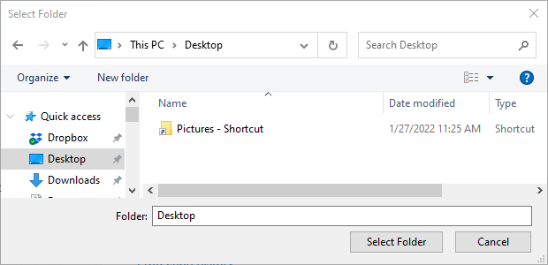
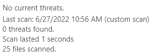

= Windows Virus & Threat Protection

Microsoft Windows offers built-in Virus & Threat Protection to discover and remove malware. This chapter will explore these protections.

== Learning Objectives

You should be able to:

* Describe why virus and threat protection is important
* View your current virus and threat protection settings
* Update virus definitions
* Run a custom scan

== Virus and Threat Protection

Computer viruses have been around for decades, and new viruses are created daily. Many viruses have *signatures*--patterns of code that anti-virus applications can detect. Other viruses modify their code so that each time the virus replicates it has a new signature. Anti-virus can try to detect these viruses through other means, such as finding patterns in the way that these viruses access data on the hard drive. Older generations of anti-virus software were sometimes as bad for computers as viruses themselves because they used so much of the computer's resources. Computers were sometimes slow and unusable because the anti-virus spent so much time scanning for viruses. In a sense, the anti-viruses worked just like a virus. Microsoft eventually built anti-virus into Windows so that consumers did not need to install third-party anti-virus (from companies like McAfee or Kaspersky). And Microsoft's anti-virus was good. It worked well without bringing your computer to a crawl. Still, some organizations choose to install third-party anti-virus because the third-party products provide features like centralized monitoring and reporting that they prefer over Microsoft's products.

Some people run computers without anti-virus intentionally. Every anti-virus application will impose some performance penalty on your computer. If you browse safe websites and are judicious in what applications you install, you *might* be okay running a computer without anti-virus. But sometimes malware can make it onto your machine without you doing anything wrong. A type of malware called *worms* can propagate over networks without the user doing anything. Because of the large number of known and unknown threats, it is better to run anti-virus. Occasionally, cybersecurity professionals have to test viruses, so in those cases, anti-virus can be disabled temporarily. If you are designing a network for a client, you must make anti-virus part of the design.

== Explore Windows Virus & Threat Protection

. In the start menu, search for *virus* and launch the *Virus & threat protection*.
+
.Start Menu: Virus & Thread Protection

. A summary of current threats and the latest scan will be shown.
+
.No Current Threats /humblebrag

+
The image shows that a quick scan was done overnight. Only 66,900 files were scanned. There are hundreds of thousands of files on my computer. A quick scan does not scan all files, but it does scan programs (which are most likely to contain viruses).
. All anti-virus software needs to be updated so that it can protect against the latest threats.
. Click the *Check for updates* link.
+
.Update Anti-virus Definitions

. Anti-virus typically checks for updates automatically. Checking for updates manually is helpful when a computer has been offline for a long time and has not been receiving updates automatically.
. Click the button to check for updates. It should take less than a minute.
+
.Check for Updates

. Click the *Virus & threat protection* link to return to the main screen.
. Click the *Scan options* link.
+
.Scan Options Link

. Take a moment to read the different scan options available.
+
.Scan Options List

. Select the *Custom scan* option, then click the *Scan now* button.
. A window will pop up asking you to select a folder.
. Click your *Desktop* folder, then click *Select Folder*.
+
.Select the Desktop Folder

. The scan should run quickly. If it does not run quickly, it means you have a lot of files stored on your desktop and you should rethink the way you organize files on your computer.
+
.Custom Scan Results

In general, anti-virus works well. Home users should always run anti-virus. Network administrators should ensure that all devices are running anti-virus, and that centralized reporting is available to determine when threats are detected.

== Reflection

* Do you know somebody who has had a device infected with a virus? What happened?
* How would you recover your system if you were infected with a virus?

