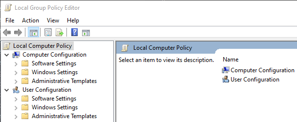
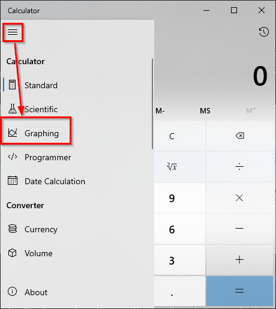
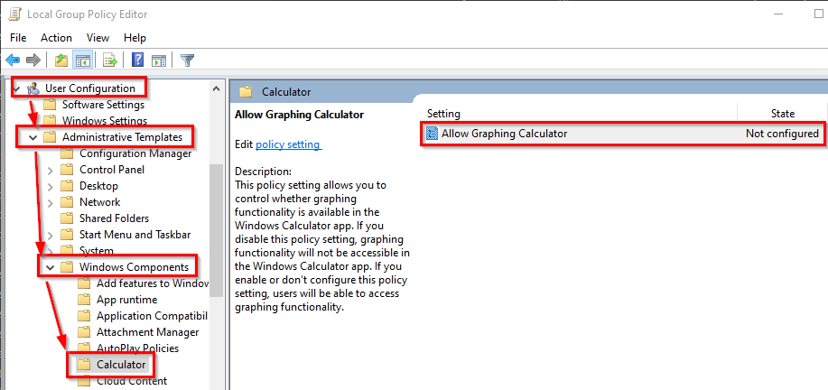
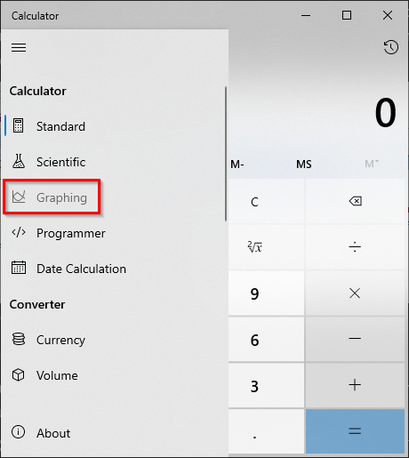

= Windows Group Policy

Group Policy is a feature used in Windows Pro. Organizations use Group Policy to enable or disable features on Windows computers. Policy is typically stored centrally in Active Directory.

== Learning Objectives

You should be able to:

* Describe the purpose of Group Policy
* Use the Group Policy editor
* Evaluate Group Policy Changes

== The Group Policy Editor

The following exercise will only work in Windows Pro versions. 

. In the start menu, search for *gpedit.msc*. Launch the Group Policy editor.
+
.Group Policy Editor in the Start Menu

. Notice that the application title says, *"Local" Group Policy Editor*. The changes you make here will only be applied to the local computer. It is possible that you could edit group policy for an entire organization, but that would require that you be connected to Active Directory.
+
.Local Group Policy Editor

. Note that there are 2 cateries within the local policy:
.. *Computer Configuraiton*. These settings will apply to everybody who uses the computer, even if they use different user accounts.
.. *User Configuration*. These settings apply to an individual account. 
This should be a couple of pages of text and screenshots.
. As a slight detour, launch the Windows Calculator from the Start Menu. (This will make sense in a minute.)
. In the calculator mode, choose *Graphing*.
+
.Select the Calculator Graphing Mode

. In the Group Policy Editor, expand *User Configuration* > *Administrative Templates* > *Windows Components* > *Calculator*.
+
.Graphic Calculator Group Policy Option

. There will be a single option to *Allow Graphing Calcuator*. If the policy is *Not configured* it has neither been excplitly allowed or explicitly denied.
. Double-click on the *Allow Graphing Calculator* setting.
. Read the help message, select the *Disabled* option, then click *OK*.
. Switch over to the calculator. Graphing mode is still enabled.
. Close the calculator.
. Start the calculator again.
. Notice that the *Graphing* mode is unavailable. Group Policy is enforcing the user policy that has been defined.
+
.Graphing Mode Unavailable

. Close the calculator app.
. In the Group Policy Editor, change the *Allow Graphic Calculator* setting back to *Not Configured*.
. Launch the calculator app again.
. The graphing mode should now be available.

== Challenge

. Explore the Group Policy settings available in the Group Policy editor. 
. Make a list of 5 settings you would apply to help keep an organization's computers secure.
. Check out https://public.cyber.mil/stigs/gpo/. They provide preconfigured Group Policy. What do you think about their offering?

== Reflection

* What kinds of policies would you enable on a shared computer at a public library?
* What kinds of problems would occur if your computer policies were too restrictive?

