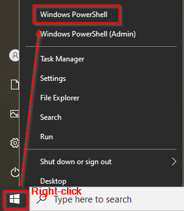
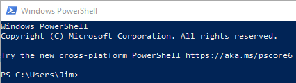
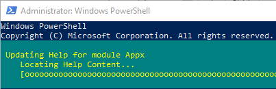
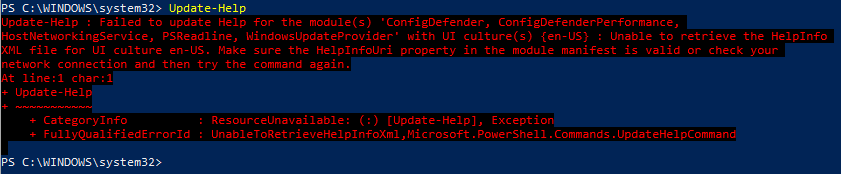
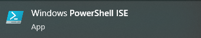
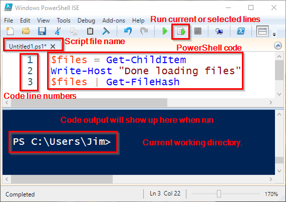
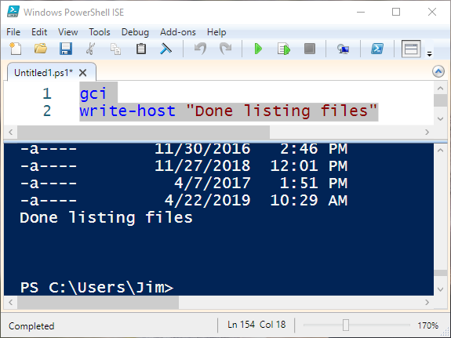

= Windows Powershell: Cmdlets

Author: Dr. Jim Marquardson

Changelog

* 2022-08-15 Initial Version

PowerShell is the scripting language developed by Microsoft for administering computers. PowerShell was originally available only on Windows, but Microsoft now supports PowerShell on Linux. This chapter will walk you through some basic uses of PowerShell.

== Learning Objectives

You should be able to:

* Describe the PowerShell design philosophy
* Launch the PowerShell prompt
* Launch the PowerShell Integrated Script Editor (ISE)
* Run basic cmdlets

== PowerShell Design

Historically, Microsoft took a graphical user interface (GUI) approach to system administration. Users and administrators would use a mouse to navigate menus, check boxes, select items from lists, etc. Graphical interfaces are explorable and sometimes you can navigate a new graphical interface with little training.

One downside of graphical interfaces is that they are hard to automate. It can be tedious to click around a graphical interface for the 1,000th time to do the same task. As the number of systems increased, Microsoft realized that it needed a scripting solution to help automate tasks. PowerShell is becoming a requirement for Windows system administrators, but it is useful for regular users to know as well.

Example case: I had to produce a single PDF with my documents for promotion and tenure. I had to print Excel documents to PDFs, print Word documents to PDFs, combine cover sheets, and then put all of those files in order in a single PDF document. Doing this process manually would have been painful. One change to the order of documents, or an update to a single file would cause me to have to start the whole process from scratch. Instead, I created a PowerShell script that would automate this process. If I changed any document, I just had to re-run the PowerShell script and it would create a single PDF ready for submission. Taking 1 hour to write the PowerShell script probably saved 10 hours of tedious work.

Whereas Linux was designed by many independent developers, Microsoft had sole control over PowerShell's design. One of the design goals was to create a scripting language that was consistent. One of the results was the *verb-noun* syntax for PowerShell commands. Below are a few sample PowerShell commands:

* Get-ChildItem
* Remove-Computer
* Write-Host
* Get-FileHash
* Get-Help
* Revoke-FileShareAccess

The consistent naming scheme can be easier to learn than the mix of program names on Linux (e.g., cat, grep, ls, mkdir).

Some of the commands in PowerShell are called cmdlets (pronounced commandlets), and some are functions. The distinction is not important for people dipping their toes into PowerShell. These exercises will use command and cmdlet interchangeably, though sometimes they might actually be referring to a function. So if it does not matter, why am I writing this? Well, somebody with deep technical experience with a chip on their shoulder might claim I have no idea what I'm talking about because the terminology lacks precision, and I preemptively want to tell that person that I have a reason for describing things the way I do.

Enough reading. Now doing.

== PowerShell Console

There are two main ways to run PowerShell code:

. Type it in the console line by line
. Run small programs in the PowerShell Integrated Script Editor (ISE).

We will start with the console.

. Right-click on the start menu to open the (not) super-secret menu options.
. Run Windows PowerShell.
+
.PowerShell on the (not) secret menu

. You could also just search for PowerShell in the start menu, but that would not be very hackerish.
. You should now see the PowerShell prompt.
+
.PowerShell prompt

+
You are now ready to start running PowerShell code.
. Run `Get-ChildItem` to list files and folders in your current folder.
+
[source,powershell]
----
PS C:\users\Jim> Get-ChildItem
----
+
Congratulations! You just ran some PowerShell code. Note that you essentially ran a 1-line program.
+
Notice that the Get-ChildItem output is similar to the Linux `ls` command.
. Run the following commands to see if Windows is case-sensitive.
+
[source,powershell]
----
PS C:\users\Jim> get-childitem
PS C:\users\Jim> GET-CHILDITEM
PS C:\users\Jim> get-CHILDitem
----
+
All of the commands should work. Unlike Linux, Windows does not care about the case of your commands, files, or folder names.
. Run the following command to print something to the console.
+
[source,powershell]
----
PS C:\users\Jim> Write-Host "Hello world"
----
+
The text "Hello world" should appear in the console. Writing to the host is often useful when writing long scripts to give status updates and debug scripts.
. Several commands have *aliases* to make scripts more compact. For example, `dir` is an alias for `Get-ChildItem`. Run the following code.
+
[source,powershell]
----
PS C:\users\Jim> dir
----
+
You should see the same output as `Get-ChildItem` because the `Get-ChildItem` command was the command that Windows ran.
. `gci` is another alias for `Get-ChildItem`.
. PowerShell commands often accept parameters. For example, the `gci` command can be used to filter. Run the following code to see if there are any text files in the directory.
+
[source,powershell]
----
PS C:\users\Jim> gci *.txt
----
+
If you do not have any text files in the directory, the list will be empty.
. Run the following code to see if there are any files or folders that start with the letter "d."
+
[source,powershell]
----
PS C:\users\Jim> gci D*
----
+
You should have a few, including *Desktop*, *Documents*, and *Downloads*.
. Close your PowerShell console.

== Getting Help

PowerShell has built-in help. But sometimes your system will not come with all of the help documentation downloaded. Updating the help documentation must be done with administrative rights.

. Right-click the start menu and launch *Windows PowerShell (Admin)*. It is important to launch the option that has "(Admin)" in the name.
. Windows will launch a User Account Control prompt asking you to verify that you really want to launch PowerShell in administrative mode. Confirm that you do.
. Run `update-help` to start the update process.
+
----
PS C:\WINDOWS\system32> Update-Help
----
. You will see progress bars like the following.
+
.Help updating

. Do not worry if PowerShell tells you that it cannot update help for certain modules.
+
.Ignore these kinds of errors

. Close the PowerShell console. The next steps do not require administrative access, so it is best to open a new console without administrative access. This partly demonstrates the principle of *least privilege*. To save ourselves from accidentally breaking things, we will only elevate our permissions to administrative permissions when needed.
. Open a new Windows PowerShell console--*not* in administrative mode.
. Run the following command to read help about the `Get-ChildItem` cmdlet.
+
[source,powershell]
----
PS C:\users\Jim> get-help get-childitem
----
+
The help will display the syntax for using the command, a description, and places to get more information.
. Sometimes it is helpful to look at examples of how the cmdlets can be run. Every PowerShell cmdlet has help documentation that shows examples. Look at the Get-ChildItem examples with the following command.
+
[source,powershell]
----
PS C:\users\Jim> get-help gci -examples
----
+
Many examples will be listed and described.
. Close the console.

== PowerShell ISE

The PowerShell console is great for 1-line scripts. The PowerShell ISE is used for writing multi-line scripts.

. In the start menu, search for "powershell ise" and launch the app.
+
.PowerShell ISE in the start menu

. The ISE interface can seem overwhelming at first. The following screenshot highlights some important features.
+
.ISE Features

.. The ISE is split into two sections. The top portion contains the PowerShell code. The bottom portion is a console where the code output will appear when it is run.
.. Lines of code are automatically numbered. Line number
.. The working directory is shown in the console.
.. There are icons to run the current line of code or selected lines of code.
.. The script file name appears on that file's tab. Multiple files can be open at the same time--each in their own tab.
. Add the following code to the file.
+
[source,powershell]
----
gci
write-host "Done listing files"
----
. Select all of the text in lines 1 and 2.
. Click the "Run Selection" button (the green play button with the document behind it).
. Notice that the script is output in the console.
. Your results should look similar to the following.
+
.Result of running a simple multiline script

. Close the PowerShell ISE. You do not need to save the script file.

== Challenge

Write a 1-line script in the PowerShell ISE that searches for all files with .txt extensions in your home folder *and* all subfolders. You may need to use `get-help gci` and `get-help gci -examples`.

== Reflection

* Which design approach results in better software--a distributed approach (like Linux) or a centralized approach (like Windows).
* Which method for writing PowerShell code appeals to you more--in the console or in the ISE?

