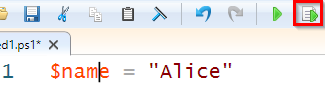
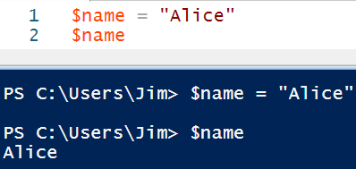
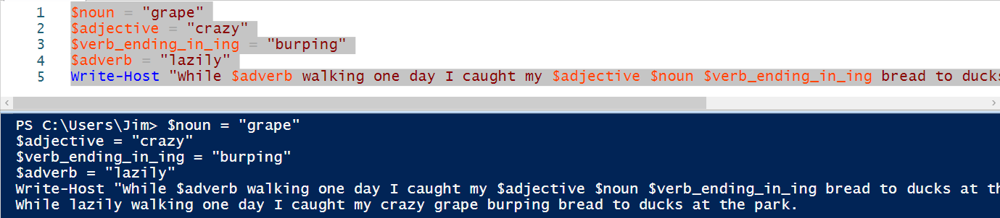

= Windows Powershell: Variables

Variables hold data. Variables are common in every programming language, including PowerShell.

== Learning Objectives

You should be able to:

* Store data in variables
* Use variables in commands

== PowerShell Variables

. Launch the PowerShell ISE.
. Write the following code in line 1.
+
[source,powershell]
----
$name = "Alice"
----
. In the above code `$name` is a variable. PowerShell variable names always start with the dollar sign.
. The value of the variable $name is set to the text string "Alice." The equals sign *assigns* the value of "Alice" to the $name variable.
. With your cursor somewhere in line 1 (nothing highlighted), click the "Run Selection" button (or press the F8 shortcut key)
+
.Run the line of code

+
Note that the cursor in this example is between the "m" and "e" in name. Multiple characters are *not* selected. The *Run Selection* option can be used to run parts of 1 line of code, so if you want to run the entire line, either select the entire line, or put the cursor in the line with nothing selected.
. Put the code `$name` on line 2.
. Run line 2.
. Notice that the name *Alice* will be output in the console.
+
.Value of $name is retrieved

== Simple MadLib

. Delete the code in the ISE.
. On lines 1-4, create 4 variables with the names:
.. $noun
.. $adjective
.. $verb_ending_in_ing
.. $adverb
. Assign a text value to the variables.
. In line 5, write a short MadLib, such as:
+
[source,powershell]
----
Write-Host "While $adverb walking one day I caught my $adjective $noun $verb_ending_in_ing bread to ducks at the park."
----
. Select all 5 lines of code and run them.
. You should see something similar to the following in the output.
+
.Complete MadLib code and output

. If there were problems with your script, check the following:
.. Did you put quotation marks around the variable values?
.. Did you spell the variable names consistently? $noun will not match $nown, for example.

== Other Variable Types

Variables do not just have to be text. Look at the following code.

[source,powershell]
----
$favorite_number = 3
$files = gci
$pi = 3.14
$fruits = @("apple", "banana")
----

== Reflection

* How can using variables help people write programs?
* Why is it important to understand a variable's data type?

