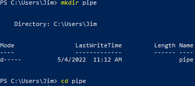
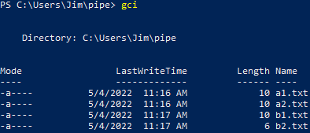
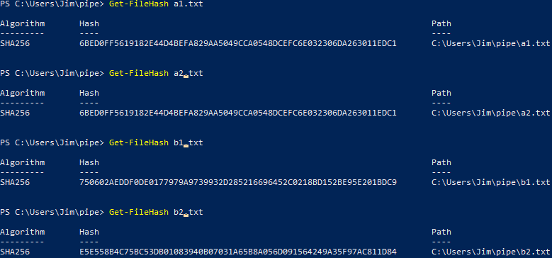
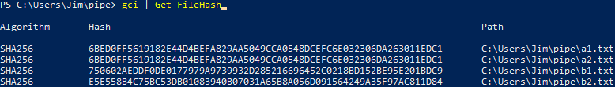
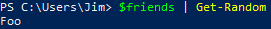

= Windows Powershell: Piping

Author: Dr. Jim Marquardson

Changelog

* 2022-08-15 Initial Version

*Piping* is a way to send the output of one command into another command. Piping is a technique possible in Linux and Windows scripting. In this section, you will learn to pipe commands into each other to perform complex operations with fairly simple scripts.

== Learning Objectives

You should be able to:

* Know the pipe character in PowerShell: |
* Be able to pipe one command into another

== How Piping Works

PowerShell commands can be run one at a time. For example, the PowerShell cmdlet `Get-ChildItems` will list files and folders. The PowerShell cmdlet `Get-FileHash` will compute the cryptographic hash of a file. But with piping, the two commands can be connected so that all of the files listed can have their hashes computed. This is done through piping.

PowerShell, like Linux scripting, uses the vertical bar symbol for piping: `|`.  The following code shows a demonstration of how the commands might look.

[source,powershell]
----
PS C:\Users\Jim> command1 | command2
----

In this example, command1 would run, and it would send its output to command2. This will be demonstrated in the following exercise.

== Exercise 1: First Pipe

The first part of this exercise will have you set up a folder and create some files. In the second part, you will list the files and create hashes.

. Launch PowerShell.
. Run `mkdir pipe` and press enter to create the "pipe" folder in your home directory. (You can delete this folder at the end of the exercise.)
. Run `cd pipe` and press enter. This will change your working directory to the new "pipe" folder.
+
.Create the folder and change directories to the new folder

. Run the following commands to create 4 files.
+
[source,powershell]
```
PS C:\Users\Jim\pipe> Set-Content a1.txt -Value "aaaaaaaa"
PS C:\Users\Jim\pipe> Set-Content a2.txt -Value "aaaaaaaa"
PS C:\Users\Jim\pipe> Set-Content b1.txt -Value "bbbbbbbb"
PS C:\Users\Jim\pipe> Set-Content b2.txt -Value "bbbb"
```
+
Note that the file contents of a1.txt and a2.txt are identical.


The exercise is set up. Now it is time to run the Get-ChildItems (gci) and Get-FileHash cmdlets with and without piping.

. Run the following code to list the files.
+
[source,powershell]
```
PS C:\Users\Jim\pipe> gci
```
+
.Output of the gci command

. Run the following code to calculate the hash of each file individually. (The expected output will be shown in the screenshot below.)
+
[source,powershell]
```
PS C:\Users\Jim\pipe> Get-FileHash a1.txt
PS C:\Users\Jim\pipe> Get-FileHash a2.txt
PS C:\Users\Jim\pipe> Get-FileHash b1.txt
PS C:\Users\Jim\pipe> Get-FileHash b2.txt
```
+
.Result of hashing files individually


So far so good. The hashes of all files were calculated, but this process does not scale well. What if you wanted to calculate the hashes for 10 files, 100 files, or 1,000 files? It would be cumbersome to type each Get-FileHash command manually. This is where piping can be useful.

. Run the following command to pipe the gci output into the Get-FileHash cmdlet.
+
[source,powershell]
```
PS C:\Users\Jim\pipe> gci | Get-FileHash
```
+
.Gci piped into Get-FileHash


Notice that you did not have to specify the name of a file to hash in the Get-FileHash cmdlet. Instead, the pipe character basically told the Get-FileHash cmdlet to use each of the files from the gci cmdlet.

== Exercise 2: New Pipes

Run the following code to see how different commands can be piped. Take time to read the code and think about what is happening.

[source,powershell]
```
PS C:\Users\Jim\pipe> gci | Sort-Object -Property Length
PS C:\Users\Jim\pipe> gci | Sort-Object -Property Name
PS C:\Users\Jim\pipe> gci | Get-Content | Sort-Object
```

Notice that in the last example, there are two pipes. Many pipes can be used in a single line of code.

== Random Choice

Suppose you and your friends are deciding on a restaurant. Nobody wants to pick. You do the only reasonable thing a person could do in this situation and open a PowerShell console and write some code.

[source,powershell]
----
$friends = @("Alice", "Bob", "Eve", "Foo", "Bar")
----

The $friends variable now contains a list of all of the friends. To randomly select one of the friends.

----
$friends | Get-Random
----

Looks like *Foo* gets to choose. 

.Result of piping into Get-Random


Run `$friends | Get-Random` multiple times. A different name will be displayed most times, but occasionally the same name will appear twice or three times in a row. It's all chance.

== Challenge

. Write the code that will compute the hashes of all files in the pipes directory and sort them by hash. Do all of this in a single line of code.
// Answer: gci | get-filehash | sort-object
. The Out-File cmdlet writes output to a file. Create a line of PowerShell code that writes the output of gci to a file called files.txt.
// Answer: gci | out-file files.txt

== Cleanup

Run the following code to delete the files and the pipe folder.

[source,powershell]
```
PS C:\Users\Jim\pipe> rm *.txt
PS C:\Users\Jim\pipe> cd ..
PS C:\Users\Jim> rm pipe
```

== Reflection

* Why would piping make writing code more efficient?
* Why would it be useful to sort hashes?
* What other cmdlets might be useful to combine using piping?
